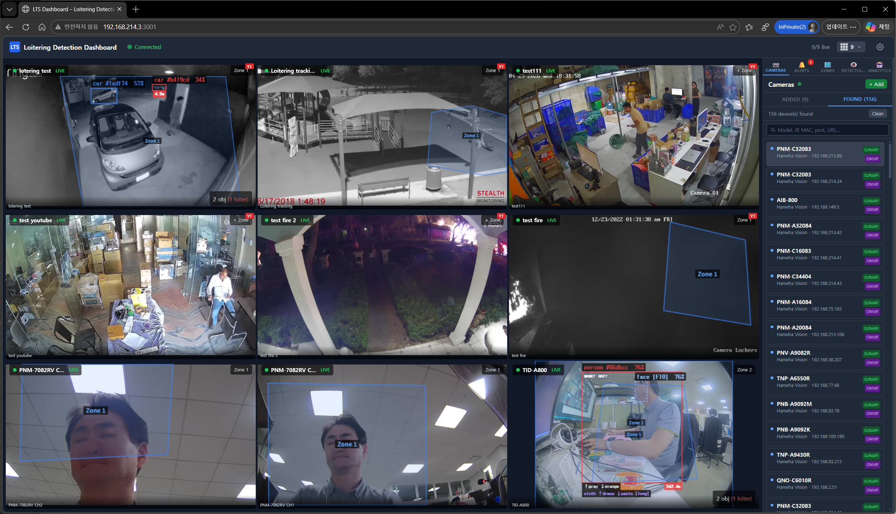
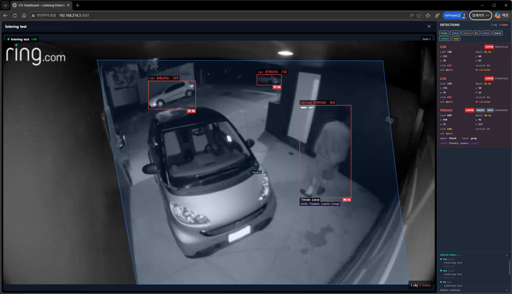

# Loitering Detection & Tracking System (LTS-2026)

[](https://nodejs.org/)
[](https://react.dev/)
[](LICENSE)
[](https://github.com/melchi45/loitering_tracking)

> **RFP Reference:** LTS-2026-001 | **Issue Date:** May 14, 2026 | **Repository:** [github.com/melchi45/loitering_tracking](https://github.com/melchi45/loitering_tracking)

---

## Table of Contents

1. [Project Overview](#1-project-overview) — [Quick Commands](#14-quick-commands) · [ICE Candidate Test](#15-ice-candidate-test)
2. [System Architecture](#2-system-architecture)
3. [Technology Stack](#3-technology-stack)
4. [IP Camera Discovery (UDP Broadcast)](#4-ip-camera-discovery-udp-broadcast)
5. [RTSP Video Ingestion & Frame Capture](#5-rtsp-video-ingestion--frame-capture)
6. [AI Models & Inference Pipeline](#6-ai-models--inference-pipeline)
7. [Per-Channel AI Module Selection](#7-per-channel-ai-module-selection)
8. [Loitering Detection Logic](#8-loitering-detection-logic)
9. [React Web UI](#9-react-web-ui)
10. [Submodules](#10-submodules)
11. [Technical Requirements](#11-technical-requirements)
12. [Functional Requirements](#12-functional-requirements)
13. [Non-Functional Requirements](#13-non-functional-requirements)
14. [Project Milestones & Deliverables](#14-project-milestones--deliverables)
15. [Getting Started](#15-getting-started)
16. [API Reference](#16-api-reference)
17. [Appendix](#17-appendix)

---

## 1. Project Overview



### 1.1 Purpose

An AI-powered **Loitering Detection and Tracking System** built on **Node.js + React**. The system ingests RTSP video streams from WiseNet/ONVIF IP cameras, performs real-time person detection and tracking using AI models, and delivers bounding-box-annotated live video to a React web UI with loitering behavior alerts.

### 1.2 Background

Traditional CCTV monitoring is reactive and prone to human error. This system automates surveillance by:

- Discovering IP cameras on the network via UDP broadcast (ported from [WiseNetChromeIPInstaller](https://github.com/melchi45/WiseNetChromeIPInstaller))
- Connecting to cameras over RTSP and capturing frames at **10 FPS**
- Running on-server AI inference to detect persons and assign persistent object IDs
- Streaming annotated frames (bounding boxes + track IDs + confidence) to a React web UI in real-time

### 1.3 Scope of Work

| Component | Description |
|---|---|
| UDP Camera Discovery | Node.js dgram port of Chrome UDP broadcast (send: 7701, recv: 7711) |
| RTSP Ingestion | FFmpeg/fluent-ffmpeg capture at 10 FPS per channel |
| AI Pipeline | YOLOv8n (ONNX) detection + ByteTrack MOT on Node.js server |
| WebSocket Streaming | Annotated JPEG frames pushed to React via Socket.IO |
| React Dashboard | Live multi-camera grid, bounding boxes, loitering alerts |
| Zone Management | Polygon-based inclusion/exclusion zones drawn on canvas |
| Alert Service | In-app + webhook notifications |

### 1.4 Quick Commands

#### Server Start / Stop

```bash
# Development mode (auto-restart on file changes — requires nodemon)
cd server && npm run dev

# Production mode
cd server && npm start

# Stop server (kills process on port 3001)
cd server && npm stop

# Restart server (stop → start)
cd server && npm run restart

# Stop: Ctrl+C  (when running in foreground)
```

> **배경 실행(Background) 환경에서는** `npm stop` 또는 `fuser -k 3001/tcp` 를 사용합니다.
>
> nodemon이 없는 환경에서는 아래 명령으로 서버를 백그라운드 실행합니다:
> ```bash
> cd server && nohup npm start > /tmp/server.log 2>&1 &
> ```

#### Web UI Start / Stop

```bash
# Development mode (Vite dev server — http://localhost:5173)
cd client && npm run dev

# Production build (creates dist/ folder)
cd client && npm run build

# Stop: Ctrl+C
```

#### Server Status Check (Health Check)

Checks the camera pipeline, WebRTC ICE settings, AI modules, and mediasoup UDP ports in one step.

```bash
# Local server check (default: http://localhost:3001)
cd server && npm run health

# Specify remote server
node server/src/scripts/healthCheck.js http://192.168.214.3:3001
```

Output example:
```
=== LTS Server Health Check ===
  Target: http://localhost:3001

[1] Cameras & Pipeline Status
  ✓ 1 camera(s) in database
  · TID-A800 (80d658eb) — running — WebRTC ON

[2] WebRTC ICE Config
  ✓ 4 STUN server(s)
  ✓ 2 TURN server(s)

[3] AI Capabilities
  ✓ 30 AI module(s) — loaded:6 builtin:3 available:19 pending:2 missing:0

[4] mediasoup UDP Ports (40000-49999)
  ✓ 9 UDP port(s) open: 40490, 41688, …

=== Result ===
  All checks passed.
```

#### ICE / STUN / TURN Configuration Check

Retrieves the ICE server list sent by the server to the browser.

```bash
# Retrieve ICE config JSON (reflects STUN/TURN values from server/.env)
node -e "
const http = require('http');
http.get('http://localhost:3001/api/webrtc/ice-config', res => {
  let b = '';
  res.on('data', c => b += c);
  res.on('end', () => console.log(JSON.stringify(JSON.parse(b), null, 2)));
});
"
```

#### TURN Server UDP Connection Test

```bash
# Check coturn service status
systemctl status coturn

# Verify TURN port (3478) UDP response — local
node -e "
const dgram = require('dgram');
const s = dgram.createSocket('udp4');
// STUN Binding Request (20 bytes)
const req = Buffer.from('000100002112a44200000000000000000000000000000000', 'hex');
s.send(req, 3478, '127.0.0.1', err => {
  if (err) { console.error('Send failed:', err.message); s.close(); return; }
  console.log('STUN request sent to 127.0.0.1:3478');
});
s.on('message', msg => {
  console.log('STUN response received (' + msg.length + ' bytes) — TURN reachable');
  s.close();
});
s.on('error', err => { console.error('UDP error:', err.message); });
setTimeout(() => { console.warn('Timeout — no response (TURN may be down or blocked)'); s.close(); }, 3000);
"

# Check mediasoup WebRTC UDP port range (listening)
ss -u -l -n | awk -F: '{print $NF}' | sort -n | awk '$1>=40000 && $1<=49999'
```

### 1.5 ICE Candidate Test

This describes how to check which path (LAN direct / STUN / TURN) the WebRTC connection is using.

#### Method 0 — Automated Script (full check at once)

Automatically launches a browser and outputs ICE connection path, traffic, and event logs.

```bash
# Run while server + Web UI are running
cd server && npm run ice-test

# Specify remote server
node src/scripts/iceTest.js http://192.168.214.3:3001 http://192.168.214.3:5173

# Without browser window (CI/headless environment)
npm run ice-test:headless
```

**Operation sequence:**

```
Phase 1 — Server pre-check
  ✓ 1 camera(s) (WebRTC enabled: 1)
  · TID-A800 (80d658eb) — running
  ✓ STUN 4  TURN 2
  ✓ STUN UDP ping → 192.168.214.3:3478 responded

Phase 2 — Browser automation
  · Using system Chrome: /usr/bin/google-chrome
  · Mode: browser window visible (headed)
  ✓ Chromium started
  ✓ Page loaded: http://localhost:5173
  · Waiting for ICE connection… (up to 35 seconds)
  · [browser] [useWebRTC][80d658eb] connection state: connected
  ✓ ICE connection successful (connectionState = connected)
  · ICE event log:
    PC#1 iceGatheringState→gathering
    PC#1 candidate: host udp 192.168.214.3:42351
    PC#1 iceGatheringState→complete
    PC#1 connectionState→connected
  ✓ Screenshot saved: /tmp/lts-ice-test-ok.png

Phase 3 — ICE Candidate report
  Local  candidate: [host]  UDP  192.168.214.3:42351
    └ Direct LAN — optimal path
  Remote candidate: [host]  192.168.214.32:56712

  Traffic:
    ↑ Sent total     : 12.3 KB
    ↓ Received total : 45.8 MB
    ↓ Receive speed  : ~3200 kbps (5 × 2s)

=== Final result ===
  PASS — ICE connection verified, video data flow normal
```

**Screenshot on failure:** `/tmp/lts-ice-test-fail.png`  
**Screenshot on success:** `/tmp/lts-ice-test-ok.png`

#### Method 1 — Web UI ICE Panel (recommended)

While the camera is connected via WebRTC, click the **ICE** button in the top-right corner.

```
┌─────────────────────────────────────────────────┐
│  [Camera Name]  live    WebRTC  [ICE]  + Zone   │
│                         ┌──────────────────────┐│
│                         │ ─ local               ││
│                         │ [host] UDP            ││
│                         │ 192.168.214.3:42351   ││
│  (live video)           │   host (LAN)          ││
│                         │ ─ remote              ││
│                         │ [host] 192.168.214.32 ││
│                         │        :51234         ││
│                         │ ↑ 1.2 MB  ↓ 45.3 MB  ││
│                         └──────────────────────┘│
└─────────────────────────────────────────────────┘
```

**ICE Button Color Meaning (local candidate type):**

| Indicator | Type | Meaning | Status |
|:---:|---|---|:---:|
| `[host]` | host | Direct LAN connection (optimal) | 🟢 |
| `[srflx]` | srflx | Public IP obtained via STUN, NAT traversal | 🟡 |
| `[relay]` | relay | Via TURN relay (firewall/internet environment) | 🟠 |

> **Panel refresh interval**: `RTCPeerConnection.getStats()` called every 3 seconds — byte counter allows verification of actual data flow

#### Method 2 — Browser built-in WebRTC Diagnostics

Open in a new tab at any time during connection to view the full ICE negotiation process and stats.

**Chrome / Edge:**
```
chrome://webrtc-internals
```

**Firefox:**
```
about:webrtc
```

Check points:
- **ICE candidate grid** — List of all collected candidates (host / srflx / relay)
- **candidatepairchanged** — Selected pair change history
- **Selected Candidate Pair** — Currently active local↔remote path
- **inbound-rtp** — Received packet count / loss rate (jitter, packetsLost)
- **connection-state** → Whether `connected` is maintained

#### Method 3 — Server command line

Directly verify ICE-related settings and ports from the server.

```bash
# ① Retrieve STUN/TURN list sent by the server to the browser
node -e "
const http = require('http');
http.get('http://localhost:3001/api/webrtc/ice-config', res => {
  let b = '';
  res.on('data', c => b += c);
  res.on('end', () => console.log(JSON.stringify(JSON.parse(b), null, 2)));
});
"

# ② Verify coturn UDP 3478 port response via STUN Binding Request
node -e "
const dgram = require('dgram');
const HOST  = process.argv[1] || '127.0.0.1';
const s = dgram.createSocket('udp4');
const req = Buffer.from('000100002112a44200000000000000000000000000000000', 'hex');
s.send(req, 3478, HOST, err => {
  if (err) { console.error('Send failed:', err.message); s.close(); return; }
  console.log('STUN Binding Request → ' + HOST + ':3478');
});
s.on('message', msg => {
  console.log('✓ Response ' + msg.length + ' bytes — TURN/STUN reachable');
  s.close();
});
setTimeout(() => { console.warn('✗ Timeout — no response'); s.close(); }, 3000);
" -- 127.0.0.1

# ③ Check mediasoup WebRTC UDP ports (created after browser connects)
ss -u -l -n | awk -F: '{print $NF}' | sort -n | awk '$1>=40000 && $1<=49999'

# ④ Full health check (cameras + ICE config + AI + mediasoup ports)
cd server && npm run health
```

#### ICE Connection Problem Diagnosis Flow

```
Connection failed / Video frozen
       │
       ▼
[Web UI ICE Panel] Open
       │
       ├─ local: relay → TURN relay path in use
       │    └─ Check coturn config: systemctl status coturn
       │       Check if allowed-peer-ip=192.168.214.3 addition needed
       │
       ├─ local: srflx → Via STUN public IP
       │    └─ Hairpin NAT may be the problem
       │       Check server/.env: SERVER_IP=<LAN IP> setting
       │
       ├─ local: host → Direct LAN, but failed
       │    └─ Check mediasoup UDP port firewall
       │       sudo ufw allow 40000:49999/udp
       │
       └─ Panel does not appear (no ICE button)
            └─ WebRTC connection itself failed → check server status with npm run health
```

---

## 2. System Architecture

```
[WiseNet IP Cameras]
        │  UDP Broadcast Discovery (port 7701/7711)
        │  RTSP Stream (rtsp://<ip>:<port>/...)
        ▼
┌─────────────────────────────────────────┐
│         Node.js Backend Server          │
│                                         │
│  ┌──────────────┐  ┌─────────────────┐  │
│  │ UDP Discovery│  │  RTSP Capture   │  │
│  │  (dgram)     │  │ (FFmpeg 10 FPS) │  │
│  └──────────────┘  └────────┬────────┘  │
│                             │ raw frame  │
│                    ┌────────▼────────┐  │
│                    │  AI Inference   │  │
│                    │  YOLOv8n ONNX   │  │
│                    │  + ByteTrack    │  │
│                    └────────┬────────┘  │
│                             │ detections │
│                    ┌────────▼────────┐  │
│                    │ Behavior Engine │  │
│                    │ (Loitering Logic│  │
│                    │  Zone Manager)  │  │
│                    └────────┬────────┘  │
│            ┌────────────────┼────────┐  │
│            ▼                ▼        ▼  │
│      [Alert Svc]     [REST API]  [WS]  │
│      [Storage]       [Express]  [IO]   │
└─────────────────────────────────────────┘
                             │ Socket.IO
                             │ (annotated JPEG + detections JSON)
                    ┌────────▼────────┐
                    │  React Web UI   │
                    │  Live Grid View │
                    │  BBox Overlay   │
                    │  Alert Panel    │
                    └─────────────────┘
```

### 2.1 Core Components

| # | Component | Technology | Role |
|---|---|---|---|
| 1 | UDP Discovery Service | Node.js `dgram` | Discover WiseNet cameras on LAN |
| 2 | RTSP Capture Service | FFmpeg + fluent-ffmpeg | Decode RTSP stream, extract 10 FPS |
| 3 | Detection Engine | ONNX Runtime + YOLOv8n | Person bounding box inference |
| 4 | Tracking Engine | ByteTrack (JS/Python bridge) | Persistent object ID across frames |
| 5 | Behavior Analysis Engine | Custom JS | Loitering dwell-time logic |
| 6 | Zone Manager | GeoJSON polygons | Per-camera zone configuration |
| 7 | WebSocket Server | Socket.IO | Push annotated frames to React |
| 8 | REST API | Express.js | Camera/zone/alert management |
| 9 | React Dashboard | React 18 + TypeScript | Live video + bounding box UI |
| 10 | Alert Service | EventEmitter + webhook | Loitering event notifications |

---

## 3. Technology Stack

### 3.1 Backend (Node.js)

| Layer | Technology | Version | Purpose |
|---|---|---|---|
| Runtime | Node.js | 18+ LTS | Server runtime |
| HTTP/API | Express.js | 4.x | REST API + static serving |
| WebSocket | Socket.IO | 4.x | Real-time frame streaming |
| RTSP Capture | fluent-ffmpeg | 2.x | RTSP decode + frame extract |
| AI Inference | onnxruntime-node | 1.17+ | YOLOv8n ONNX inference |
| Image Processing | sharp | 0.33+ | Frame resize/crop/encode |
| UDP Discovery | Node.js built-in `dgram` | — | Camera broadcast discovery |
| Database | better-sqlite3 | 9.x | Event/alert storage |
| Process Manager | PM2 | 5.x | Production process management |

### 3.2 Frontend (React)

| Layer | Technology | Version | Purpose |
|---|---|---|---|
| Framework | React | 18+ | Web UI |
| Language | TypeScript | 5.x | Type safety |
| Build | Vite | 5.x | Fast dev server + bundler |
| UI Library | shadcn/ui + Tailwind CSS | — | Component system |
| Video Display | HTML5 `` / Canvas | — | MJPEG-over-Socket.IO |
| BBox Overlay | HTML5 Canvas API | — | Bounding box + track ID |
| State | Zustand | 4.x | Client state management |
| Charts | Recharts | 2.x | Analytics & heatmaps |

### 3.3 AI Models

| Model | Format | Task | Classes | Size | Latency* |
|---|---|---|---|---|---|
| YOLOv8n | ONNX | Multi-class detection (primary) | COCO 80-class (person, vehicle, indoor, accessories, …) | 13MB | ~15ms |
| YOLOv8s | ONNX | Multi-class detection (higher accuracy) | same as above | ~22MB | ~30ms |
| ByteTrack | JS implementation | Multi-object tracking (8-dim KF + multi-cue) | — | — | ~5ms |
| SCRFD-2.5G | ONNX | Face detection | face | 3.2MB | ~10ms |
| ArcFace ResNet50 | ONNX | Face Re-ID / appearance embedding (512-dim) | — | 249MB | ~15ms/crop |
| YOLOv8m PPE | ONNX | Mask / Helmet / PPE detection | mask, hardhat | 99MB | ~30ms |
| YOLOv8s Fire/Smoke | ONNX | Fire and smoke detection | fire, smoke, both | 43MB | ~25ms |
| OpenPAR | ONNX | Clothing type classification | cloth types | 94MB | ~20ms/crop |

> \* Latency measured on Intel Core i7 CPU. GPU via NVIDIA CUDA reduces by 3–5×.

#### Enabled COCO Classes (YOLOv8n)

The detection service supports all **80 COCO class IDs** in `ENABLED_CLASSES`. Class-level filtering is applied by `analyticsConfig.isClassEnabled()` — not at the detection layer. Zones with `targetClasses: []` (empty) monitor all enabled classes.

| Zone Target Key | Mapped COCO Classes |
|---|---|
| `human` | person (0) |
| `vehicle` | bicycle (1), car (2), motorcycle (3), bus (5), truck (7) |
| `face` | detected via SCRFD face model (not YOLO class) |
| `accessories` | backpack (24), umbrella (25), handbag (26), tie (27), suitcase (28) |
| `furniture` | chair (56), couch (57), dining table (60), bed (59) |
| `computer` | laptop (63), tv (62), keyboard (66), mouse (64), cell phone (67) |
| `fire` / `smoke` | detected via YOLOv8s fire/smoke model (not YOLO 80-class) |

Full 80-class breakdown: see **Section 7** and `RFP_Object_Tracking.md §3.2.2`.

#### Required AI Model Files

Place model files in `server/models/`:

```
server/models/
├── yolov8n.onnx                # 13MB  — Primary COCO 80-class detection (required)
├── yolov8s.onnx                # ~22MB — Higher accuracy detection (optional)
├── scrfd_2.5g.onnx             # 3.2MB — Face detection SCRFD-2.5G (AI-03)
├── arcface_w600k_r50.onnx      # 249MB — Face Re-ID ArcFace ResNet50 (AI-03)
├── yolov8m_ppe.onnx            # 99MB  — Mask / helmet PPE (AI-04/07)
├── yolov8s_fire_smoke.onnx     # 43MB  — Fire & smoke detection (AI-09)
└── openpar.onnx                # 94MB  — Cloth type classifier (AI-06, Phase-2 active)
```

**Download commands:**
```bash
# YOLOv8n ONNX (Ultralytics — ONNX IR v9, requires onnxruntime-node ≥ 1.16)
python3 -c "from ultralytics import YOLO; YOLO('yolov8n.pt').export(format='onnx')"

# SCRFD face detection (JackCui/facefusion via HuggingFace)
# ArcFace ResNet50 (FoivosPar/Arc2Face via HuggingFace)
# YOLOv8m PPE (keremberke/yolov8m-protective-equipment-detection)
# YOLOv8s Fire/Smoke (Abonia1/YOLOv8-Fire-and-Smoke-Detection)
# Download details: see Section 7.5 (installed model status table)
```

---

## 4. IP Camera Discovery

> Full specification moved to **[RFP_Camera_Discovery.md](RFP_Camera_Discovery.md)** (Document ID: LTS-2026-002).

The system supports two parallel discovery mechanisms:

| Mechanism | Scope | Detail |
|---|---|---|
| WiseNet UDP Broadcast | Hanwha / WiseNet cameras | Send port 7701, receive port 7711, 255.255.255.255 |
| ONVIF WS-Discovery | All ONVIF-compliant cameras | UDP multicast 239.255.255.250:3702 |

Both mechanisms run concurrently and merge results deduplicated by MAC address. See [RFP_Camera_Discovery.md](RFP_Camera_Discovery.md) for protocol specification, packet format, and implementation details.

---

## 5. RTSP Video Ingestion & Frame Capture

### 5.1 Overview

The Node.js server connects to each discovered (or manually configured) camera via RTSP and extracts frames at **10 FPS** using FFmpeg. Frames are converted to JPEG and passed to the AI inference pipeline.

### 5.2 RTSP Connection

```
rtsp://<username>:<password>@<camera-ip>:<port>/profile1/media.smp
```

Supported RTSP URL formats:
- WiseNet/Hanwha: `rtsp://<ip>/profile1/media.smp` (ONVIF Profile S)
- Generic ONVIF: `rtsp://<ip>/onvif/media`
- Manual URL: configurable per camera

### 5.3 Frame Capture Pipeline

```
RTSP Stream (H.264/H.265)
    │
    ▼ FFmpeg (fluent-ffmpeg)
    │  -vf fps=10 -f image2pipe -vcodec mjpeg
    │
    ▼ Node.js Buffer (JPEG)
    │
    ▼ sharp (resize to 640×384 for inference)
    │
    ▼ Float32Array (normalized [0,1] RGB)
    │
    ▼ ONNX Runtime (YOLOv8n inference)
    │
    ▼ Detection Results [{bbox, confidence, classId}]
    │
    ▼ ByteTrack (assign/maintain objectId)
    │
    ▼ Annotated frame + [{objectId, bbox, confidence}]
    │
    ▼ Socket.IO → React UI
```

### 5.4 Performance Targets

| Metric | Target | Notes |
|---|---|---|
| Capture frame rate | 10 FPS | Per channel |
| Inference latency | ≤ 50ms/frame | CPU; ≤ 15ms GPU |
| End-to-end latency | ≤ 500ms | Capture → UI |
| Concurrent channels | ≥ 4 (CPU) | ≥ 16 (GPU) |

---

## 6. AI Models & Inference Pipeline

### 6.1 Detection: YOLOv8n (ONNX)

- Input: 640×640 normalized RGB tensor `[1, 3, 640, 640]` (letterbox padding, grey border)
- Output: `[1, 84, 8400]` — 4 bbox coords + 80 class scores per anchor
- Enabled classes: **all 80 COCO classes** (class-level gating via `analyticsConfig.isClassEnabled()`)
- Confidence threshold: **0.30** (configurable via `CONFIDENCE_THRESHOLD` env)
- NMS IoU threshold: **0.5** (configurable via `NMS_IOU_THRESHOLD` env)
- Post-processing: NMS → filter enabled classes → scale boxes back to original frame coordinates
- Pre-processing: letterbox resize with sharp; coordinate unpadding in `_postprocess()`

### 6.2 Multi-Object Tracking: ByteTrack

ByteTrack operates on detection outputs and maintains persistent `objectId` across frames:

- **8-dim Kalman Filter**: state = `[x, y, w, h, vx, vy, vw, vh]`; adaptive process noise Q (stationary / normal / fast)
- **High-confidence detections**: matched to all tracks via multi-cue score
- **Low-confidence detections**: matched to unmatched Lost tracks via IoU-only (occlusion recovery)
- **Multi-cue association**: `λ_iou × IoU + λ_app × IoU × appConf`; λ_iou=0.7, λ_app=0.3
- **Track states**: `Tracked` → `Lost` → `Removed`; score threshold = 0.25
- **Max track age**: **90 frames** (9 seconds at 10 FPS; was 30 frames)
- **KF predict freeze**: `framesWithoutHit > 1` skips predict to prevent P-matrix covariance blowup
- **NaN guard**: non-finite KF output falls back to YOLO bbox; P matrix reset on blowup
- **Appearance Re-ID**: ArcFace 512-dim embedding per track with EMA update (α = 0.9)

### 6.3 Detection Output Schema

Each frame produces a JSON array of detections:

```json
{
  "frameId": 12345,
  "timestamp": 1715678901234,
  "cameraId": "cam-01",
  "frameWidth": 1920,
  "frameHeight": 1080,
  "detections": [
    {
      "objectId": 7,
      "confidence": 0.891,
      "bbox": { "x": 120, "y": 85, "width": 65, "height": 190 },
      "className": "person",
      "isLoitering": false,
      "dwellTime": 12.4,
      "zoneId": "zone-uuid-or-null"
    },
    {
      "objectId": 12,
      "confidence": 0.762,
      "bbox": { "x": 400, "y": 200, "width": 180, "height": 120 },
      "className": "car",
      "isLoitering": false,
      "dwellTime": 0,
      "zoneId": null
    }
  ]
}
```

### 6.4 Loitering Condition

An `objectId` is flagged as loitering when:

```
dwellTime > threshold  AND  displacement < minDisplacement
```

| Parameter | Default | Configurable |
|---|---|---|
| Dwell time threshold | 30 seconds | Per zone (5s–600s) |
| Min displacement | 50 pixels | Per zone |
| Re-entry window | 120 seconds | Per zone |
| Crowd density filter | 5 persons | Auto-adjust |

---

## 7. Per-Channel AI Module Selection

Each camera zone can independently activate one or more AI analysis modules via the `targetClasses` checkbox array in the Zone Editor. Modules are applied only to objects detected within that zone.

### 7.1 Available AI Modules (per Zone)

| # | Checkbox | Zone Key | RFP | Status | Description |
|:---:|---|---|---|:---:|---|
| 1 | ☑ **Human** | `human` | [AI-01](RFP_AI_Human_Detection.md) | ✅ Implemented | Person detection — YOLOv8n COCO class 0 (person) |
| 2 | ☑ **Vehicle** | `vehicle` | [AI-02](RFP_AI_Vehicle_Detection.md) | ✅ Implemented | Vehicle detection — bicycle/car/motorcycle/bus/truck |
| 3 | ☑ **Face** | `face` | [AI-03](RFP_AI_Face_Recognition.md) | ✅ Implemented | Face detection — SCRFD-2.5G (3.2MB) + ArcFace ResNet50 Re-ID (249MB) |
| 4 | ☑ **Mask** | `mask` | [AI-04](RFP_AI_Mask_Detection.md) | ✅ Implemented | Mask detection — YOLOv8m PPE (99MB), mask/no_mask 2-class |
| 5 | ☑ **Color** | `color` | [AI-05](RFP_AI_Color_Analysis.md) | ✅ Implemented | Upper/lower body color analysis — Phase-1 pixel average, 11-color classification (no model required) |
| 6 | ☑ **Cloth** | `cloth` | [AI-06](RFP_AI_Cloth_Analysis.md) | ✅ Implemented | Clothing type classification — OpenPAR (openpar.onnx 94MB), upper/lower garment + sleeve length |
| 7 | ☑ **Hat** | `hat` | [AI-07](RFP_AI_Hat_Detection.md) | ✅ Implemented | Helmet/hat detection — YOLOv8m PPE (99MB), hardhat/no_hardhat classification |
| 8 | ☑ **Accessories** | `accessories` | [AI-08](RFP_AI_Accessories_Detection.md) | ✅ Implemented | Accessories detection — YOLOv8n COCO (backpack/umbrella/handbag/tie/suitcase) |
| 9 | ☑ **Fire** | `fire` | [AI-09](RFP_AI_Fire_Smoke_Detection.md) | ✅ Implemented | Fire detection — YOLOv8s 3-class (yolov8s_fire_smoke.onnx 43MB, Abonia1/GitHub) |
| 10 | ☑ **Smoke** | `smoke` | [AI-09](RFP_AI_Fire_Smoke_Detection.md) | ✅ Implemented | Smoke detection — YOLOv8s 3-class (yolov8s_fire_smoke.onnx 43MB, Abonia1/GitHub) |

> **Implemented** modules: checkbox is enabled when editing a Zone. **Pending** modules: checkbox is shown in gray and automatically activated when the corresponding ONNX model file is placed in `server/models/`.
>
> Checkbox availability is queried in real-time from the server `/api/capabilities` endpoint.

### 7.2 Zone Editor UI — AI Detection Target Checkboxes

At the bottom of the edit screen in the **"AI Detection Targets"** section, select the AI modules to apply to this zone.

```
┌─────────────────────────────────┐
│ AI Detection Targets  (All if none selected)   │
├────────────────┬────────────────┤
│ ☑ Human        │ ☑ Vehicle      │
│ ☑ Face         │ ☑ Mask         │
│ ☑ Color        │ ☑ Cloth        │
│ ☑ Hat          │ ☑ Accessories  │
│ ☑ Fire         │ ☑ Smoke        │
└────────────────┴────────────────┘
```

- **Checkbox selected**: Blue background + check icon, immediately saved via API (PUT `/api/cameras/:id/zones/:zoneId`)
- **If not selected**: `targetClasses: []` → detect all active classes (default behavior)
- **Dynamic availability query**: `/api/capabilities` called when Zone Editor opens → reflects model file existence
- **Fire/smoke alert**: upon detection after checking fire/smoke in a Zone, `fire:alert` Socket event triggered (10-second cooldown)

### 7.3 `targetClasses` Behavior Rules

```javascript
// behaviorEngine.js — classMatchesZone()
const TARGET_CLASS_MAP = {
  human:   ['person'],
  vehicle: ['bicycle', 'car', 'motorcycle', 'bus', 'truck'],
  // future additions: face, mask, color, cloth, hat, accessories
};

// empty means all classes allowed
if (!targetClasses || targetClasses.length === 0) return true;
```

| `targetClasses` Setting | Detection Targets | Use Case |
|---|---|---|
| `[]` (default) | All active classes | General surveillance |
| `["human"]` | Persons only | Access-controlled area |
| `["vehicle"]` | Vehicles only | Parking lot management |
| `["human", "vehicle"]` | Persons + Vehicles | Mixed area |
| `["human", "hat"]` | Persons + Safety helmet check | Construction site compliance *(Pending)* |
| `["human", "mask"]` | Persons + Mask | Quarantine zone *(Pending)* |

### 7.4 Bounding Box Color Codes (Screen Display)

| Class | Normal color | Loitering color |
|---|---|---|
| person | 🟢 Green `rgba(34,197,94)` | 🔴 Red `rgba(239,68,68)` |
| bicycle | 🟡 Yellow `rgba(250,204,21)` | 🔴 Red |
| car | 🔵 Blue `rgba(59,130,246)` | 🔴 Red |
| motorcycle | 🟠 Orange `rgba(249,115,22)` | 🔴 Red |
| bus | 🟣 Purple `rgba(168,85,247)` | 🔴 Red |
| truck | 🩵 Teal `rgba(20,184,166)` | 🔴 Red |

Label format: `person #3  94%` (className + objectId + confidence)

### 7.5 Installed AI Model File Status

> Verification environment: **onnxruntime-node 1.26.0** (Node.js, 2026-05-18)  
> Python onnxruntime 1.14.1 does not support `yolov8n.onnx` (ONNX IR v9) — works only with Node.js runtime

| File | Size | Node.js Load | Responsible AI module | Source |
|---|---:|:---:|---|---|
| `yolov8n.onnx` | 13 MB | ✅ Working | AI-01 Human · AI-02 Vehicle · AI-08 Accessories · All indoor objects | Ultralytics YOLOv8n COCO (ONNX IR v9) |
| `scrfd_2.5g.onnx` | 3.2 MB | ✅ Working | AI-03 Face Detection | JackCui/facefusion @ HuggingFace |
| `arcface_w600k_r50.onnx` | 249 MB | ✅ Working | AI-03 Face Re-ID | FoivosPar/Arc2Face @ HuggingFace |
| `yolov8m_ppe.onnx` | 99 MB | ✅ Working | AI-04 Mask Detection · AI-07 Helmet Detection | keremberke/yolov8m-protective-equipment-detection |
| `yolov8s_fire_smoke.onnx` | 43 MB | ✅ Working | AI-09 Fire & Smoke Detection (3-class) | Abonia1/YOLOv8-Fire-and-Smoke-Detection @ GitHub |
| `openpar.onnx` | 94 MB | ✅ Working | AI-06 Cloth Analysis Phase-2 (Clothing type: tshirt/shirt/jacket/hoodie/vest/dress + pants/jeans/shorts/skirt + sleeve) | Event-AHU/OpenPAR |

**Total models**: 6 installed · Total approximately 501 MB

```
server/models/                       Size    Status  Module
├── yolov8n.onnx                     13 MB  ✅     Human/Vehicle/Indoor/Accessories (COCO 80-class)
├── scrfd_2.5g.onnx                 3.2 MB  ✅     Face detection SCRFD-2.5G (AI-03)
├── arcface_w600k_r50.onnx          249 MB  ✅     Face Re-ID ArcFace ResNet50 (AI-03)
├── yolov8m_ppe.onnx                 99 MB  ✅     Mask/Helmet YOLOv8m PPE (AI-04/07)
├── yolov8s_fire_smoke.onnx          43 MB  ✅     Fire/Smoke YOLOv8s 3-class (AI-09)
│                                             Source: Abonia1/YOLOv8-Fire-and-Smoke-Detection
└── openpar.onnx                     94 MB  ✅     Clothing type PAR (AI-06 Phase-2)
                                              Source: Event-AHU/OpenPAR
                                              Classes: tshirt/shirt/jacket/hoodie/vest/dress + pants/jeans/shorts/skirt + sleeve short/long
```

For detailed spec for each AI module, refer to `RFP_AI_Human_Detection.md` through `RFP_AI_Fire_Smoke_Detection.md`.

### 7.6 ONNX Runtime Thread Configuration

Each `InferenceSession` created by the ONNX Runtime spawns **intra-op worker threads** (default: one per logical CPU core). With 5 active models and a high core-count server, this can result in hundreds of idle threads. The server controls thread count via `server/src/utils/onnxOptions.js`, driven by three environment variables in `server/.env`.

#### Thread Count Policy

| Mode | Condition | `intraOpNumThreads` | `executionProviders` |
|------|-----------|:-------------------:|----------------------|
| **Development** | `NODE_ENV=development` | `ONNX_THREADS_DEV` (default: **1**) | `['cpu']` |
| **CUDA** | `ONNX_CUDA=1` | `ONNX_THREADS_CUDA` (default: **1**) | `['cuda', 'cpu']` |
| **Production** | default | `ONNX_THREADS_PROD` (default: **0 = auto**) | `['cpu']` |

`ONNX_THREADS_PROD=0` → auto: `max(2, min(8, floor(CPU_cores / 2)))`

#### Startup Log

```
[onnxOptions] mode=dev   threads=1   cores=32  providers=["cpu"]
[onnxOptions] mode=cuda  threads=1   cores=32  providers=["cuda","cpu"]
[onnxOptions] mode=prod  threads=8   cores=32  providers=["cpu"]
```

#### Active Models (thread consumers)

| Service file | Model | InferenceSession |
|---|---|:---:|
| `detection.js` | `yolov8n.onnx` | 1 |
| `faceService.js` | `scrfd_2.5g.onnx` | 1 |
| `faceService.js` | `arcface_w600k_r50.onnx` | 1 |
| `fireSmokeService.js` | `yolov8s_fire_smoke.onnx` | 1 |
| `protectiveEquipService.js` | `yolov8m_ppe.onnx` | 1 |
| `colorClothService.js` | `openpar.onnx` | 1 |

Total threads in dev mode = 5 sessions × 1 thread = **5 threads**.  
Total threads in prod mode (32-core server) = 5 sessions × 8 threads = **40 threads**.

#### CUDA Enablement

```bash
# In server/.env
ONNX_CUDA=1          # enable CUDA provider
ONNX_THREADS_CUDA=1  # GPU handles parallelism; 1 CPU thread sufficient
```

Requires a CUDA-enabled build of `onnxruntime-node`. If CUDA is unavailable at runtime, the provider list `['cuda', 'cpu']` automatically falls back to CPU.

---

## 8. Loitering Detection Logic

### 8.1 Behavioral Analysis Engine

```
For each tracked object per frame:
  1. Update position history (circular buffer, 300 frames)
  2. Zone entry/exit: point-in-polygon test (ray casting)
  3. Cross-ID state transfer: zone appearance gallery match
     → ArcFace cosine ≥ 0.45 OR clothing colour (upper+lower both match)
     → dwell time, trajectory, revisit count transferred to new ID
  4. Sliding-window displacement: max bbox-center distance over last 10 s
  5. Pacing score: x-direction reversal count (saturates at 10 reversals)
  6. Composite risk score (5-factor):
     dwellRatio×0.35 + revisitRatio×0.30 + lowVeloRatio×0.15
     + pacingScore×0.12 + circScore×0.08
  7. Loitering declared: dwellTime ≥ threshold AND displacement < minDisplacement
     → emit LOITERING_ALERT event if riskScore ≥ minRiskScore (per zone)
```

### 8.2 Zone-Based Analysis

- Zones defined as polygons in pixel coordinates (actual JPEG frame space)
- Point-in-polygon test (ray casting) per detection per frame
- Up to **50 zones** per camera feed
- Zone types: `MONITOR` (trigger alerts), `EXCLUDE` (suppress alerts)
- Time-based activation: cron-style schedule per zone
- **Per-zone AI target class filtering** via `targetClasses` field:
  - `[]` or omitted → monitor all enabled detection classes
  - `['human']` → monitor persons only
  - `['vehicle']` → monitor bicycle/car/motorcycle/bus/truck
  - `['human', 'vehicle']` → monitor both
- Filter is applied per frame in the behavior engine — no restart required

---

## 9. React Web UI

### 9.1 Live Video with Bounding Box Overlay

The React UI receives annotated data from the Node.js server via Socket.IO:

1. **Video stream**: JPEG frames sent as `frame` events (base64)
2. **Detection data**: JSON detections sent as `detections` event (same timestamp)
3. **Rendering**: `` tag for video frame + `<canvas>` overlay for bounding boxes

**Bounding Box Rendering:**
```
<div style="position:relative">
  
  <canvas id="bbox-overlay"
          style="position:absolute; top:0; left:0"
          width={frameWidth} height={frameHeight} />
</div>
```

Each detection renders:
- **Rectangle**: bbox outline (green = normal, red = loitering)
- **Label**: `ID:7  0.89` (objectId + confidence, top-left of bbox)
- **Dwell timer**: seconds counter (bottom-right, appears when dwell > 5s)

### 9.2 Dashboard Layout

```
┌─────────────────────────────────────────────────────┐
│  LTS Dashboard          [Camera: cam-01 ▼]  [⚙️]   │
├──────────────────────────────┬──────────────────────┤
│                              │  Alert Panel         │
│   Live Video Feed            │  ┌────────────────┐  │
│   [ + <canvas> overlay] │  │ ⚠️ ID:7 Cam01  │  │
│                              │  │ Loitering 42s  │  │
│   ID:3  0.91  [bbox]         │  └────────────────┘  │
│   ID:7  0.89  [bbox] 🔴42s   │                      │
│                              │  Camera List         │
├──────────────────────────────│  ○ cam-01 (live)     │
│  Camera Grid (1/4/9/16 view) │  ○ cam-02 (live)     │
│  [cam-01][cam-02][cam-03]... │  + Add Camera        │
└──────────────────────────────┴──────────────────────┘
```

### 9.3 Zone Editor

The Zone Editor opens as a full-viewport overlay when the **+ Zone** button is clicked on any camera view.

**Key implementation details:**

| Feature | Implementation |
|---|---|
| Full-screen vertex drag | Global `document.addEventListener('mousemove/mouseup')` — drag works even when cursor leaves the canvas |
| Coordinate system | All hit-testing uses frame pixel space; hit radius dynamically converted from screen pixels via `fwEff/fhEff` |
| Frame dimensions | Background image `naturalWidth/naturalHeight` (read via `onLoad`) replaces JPEG SOF defaults — matches `` layout exactly |
| Vertex delete | Right-click on vertex → context menu shows "Delete vertex N"; auto-saves after deletion; minimum 3 vertices enforced |
| AI target classes | Checkbox grid (Human, Vehicle, + 6 planned attributes) auto-saves per toggle via PUT API |

**Zone polygon storage:** coordinates are in actual JPEG frame pixel space (e.g. 1920×1080), not normalized. The ZoneEditor reads `img.naturalWidth/naturalHeight` so the canvas overlay always aligns with the displayed video regardless of container size.

### 9.4 Camera Management

- Auto-populate discovered cameras from UDP broadcast
- Manual RTSP URL entry
- Per-camera: start/stop stream, zone configuration, sensitivity settings

### 9.5 Fullscreen Camera View with Real-Time Detection Panel

Double-clicking any camera cell in the grid opens a fullscreen overlay with a dedicated left-side detection panel.

**Trigger:** Double-click on any camera cell in the multi-camera grid  
**Exit:** Click the × button, press `Escape`, or click the dimmed background

**Layout:**

```
┌──────────────────────────────────────────────────────────────────┐
│                         [Camera Name]                     [✕]   │
├─────────────────┬────────────────────────────────────────────────┤
│  Detections  3  │                                                │
│  1 loiter       │                                                │
├─────────────────┤                                                │
│ PERSON  #a3b2c1 │         Live Video (fullscreen)               │
│ [LOITER]        │          + <canvas> overlay               │
│ conf  89%       │                                                │
│ dwell  42.3s    │         Bounding boxes drawn with              │
│ x 320  y 180    │         class colors + loitering               │
│ w  65  h 190    │         highlight (same as grid view)          │
├─────────────────┤                                                │
│ CAR     #f1e2d3 │                                                │
│ conf  74%       │                                                │
│ dwell   2.1s    │                                                │
│ x 800  y 400    │                                                │
│ w 120  h  80    │                                                │
├─────────────────┤                                                │
│ ■ person  ■ car │                                                │
│ ■ bicycle ■ bus │                                                │
└─────────────────┴────────────────────────────────────────────────┘
```

**Detection Panel fields (per object):**

| Field | Description |
|---|---|
| `className` | Object class (person, car, bicycle, …) — color-coded |
| `objectId` | Persistent track ID (8-char hex prefix) |
| `[LOITER]` badge | Shown in red when `isLoitering = true` |
| `conf` | Detection confidence (%) |
| `dwell` | Seconds the object has been in a monitored zone; yellow when > 5 s |
| `x, y` | Bounding box top-left in frame pixel coordinates |
| `w, h` | Bounding box width / height in pixels |

Objects are sorted: loitering first, then by descending dwell time.

**Socket.IO subscription reference counting:**

The fullscreen view renders an additional `useCamera(cameraId)` hook for the same camera.  
A module-level `subscriptionCounts` map ensures `camera:subscribe` is emitted only on the **first** subscriber and `camera:unsubscribe` only when the **last** subscriber unmounts — preventing the grid cell from losing its stream when the fullscreen modal closes.



---

## 10. Submodules

### 10.1 WiseNetChromeIPInstaller (Node.js UDP branch)

```bash
# Initialize after cloning loitering_tracking
git submodule update --init --recursive
```

| Path | Repository | Branch |
|---|---|---|
| `submodules/WiseNetChromeIPInstaller` | [github.com/melchi45/WiseNetChromeIPInstaller](https://github.com/melchi45/WiseNetChromeIPInstaller) | `nodejs-udp-discovery` |

The `nodejs-udp-discovery` branch adds:
- `nodejs/udpDiscovery.js` — Node.js `dgram` port of Chrome `sockets.udp` discovery
- `nodejs/utils.js` — `ntohs`/`ntohl`/`bytes2int` helpers
- `nodejs/package.json` — Node.js module config
- `nodejs/README.md` — Usage instructions

---

## 11. Technical Requirements

### 11.1 Video Input & Ingestion

- Support RTSP, RTMP, HTTP(S) input via FFmpeg
- Compatible with ONVIF-compliant IP cameras (WiseNet/Hanwha)
- Frame capture: **10 FPS** (configurable: 1–30 FPS)
- Resolution support: 720p, 1080p (inference at 640×640)
- Hardware-accelerated decoding: NVDEC (NVIDIA), QSV (Intel), VA-API

### 11.2 Object Detection

| Metric | Minimum | Target |
|---|---|---|
| Detection Model | YOLOv8n ONNX | YOLOv8s ONNX |
| Person mAP@0.5 | ≥ 85% | ≥ 92% |
| Inference Latency | ≤ 50ms/frame (CPU) | ≤ 15ms/frame (GPU) |
| False Positive Rate | ≤ 5% | ≤ 2% |

### 11.3 Multi-Object Tracking

- Algorithm: ByteTrack (JS implementation) with 8-dim Kalman Filter + ArcFace multi-cue association
- Persistent `objectId` assignment across frames; class hard-reject prevents cross-class ID inheritance
- Track re-identification after occlusion (up to **90 frames** = 9 s at 10 FPS)
- Tracking accuracy target: HOTA ≥ 60, MOTA ≥ 70 on MOT17 (benchmark pending)

### 11.4 WebSocket Streaming

- Protocol: Socket.IO over WebSocket
- Frame delivery: JPEG base64, target ≤ 100KB/frame at 10 FPS
- Detection data: JSON, delivered with each frame event
- Reconnect: automatic with exponential backoff

---

## 12. Functional Requirements

### 12.1 Dashboard & UI

- Live multi-camera grid view (1/4/9/16 layout)
- Per-frame bounding boxes with `objectId` and `confidence` score
- Loitering indicator: color change (green→yellow→red) with dwell timer
- Real-time loitering event log with camera thumbnail
- Zone drawing: polygon tool on canvas
- Alert history: filterable by camera, zone, time, severity
- Heatmap: dwell-time visualization per zone

### 12.2 Alerting & Notifications

- In-app alert with visual highlight and audio cue
- Webhook POST to configurable endpoint
- Email notification (nodemailer)
- Alert cool-down: configurable per zone (default 60s)

### 12.3 Camera Discovery & Management

- **UDP broadcast discovery** of WiseNet cameras on LAN (one-click scan)
- Manual camera entry: RTSP URL, credentials
- Per-camera: stream start/stop, resolution, FPS override
- Connection status indicator (live/offline/error)

### 12.4 Video Evidence

- Automatic clip save on loitering event (±30s buffer)
- H.264 MP4 stored in `storage/clips/`
- Event log with metadata: cameraId, objectId, startTime, duration, clip path

---

## 13. Non-Functional Requirements

### 13.1 Security

- TLS 1.3 for all WebSocket and REST connections in production
- OWASP Top 10 compliance for web interface
- JWT Bearer token authentication for API and Socket.IO
- GDPR/PDPA: video retention policy, right-to-erasure API

### 13.2 Scalability & Reliability

- Minimum 4 concurrent channels on CPU-only server
- Minimum 16 concurrent channels with NVIDIA GPU
- Graceful degradation: alerting continues if UI disconnects
- Health check endpoint: `GET /api/health`

### 13.3 Maintainability

- ESLint + Prettier code style enforcement
- Jest unit tests (≥ 70% coverage for core pipeline)
- GitHub Actions CI: lint → test → build
- Docker Compose for single-command local deployment

---

## 14. Project Milestones & Deliverables

| Phase | Milestone | Deliverables | Status | Date |
|:---:|---|---|:---:|:---:|
| 1 | Project Setup | Repo structure, submodule (WiseNetChromeIPInstaller), Docker Compose skeleton, CI | ✅ Done | Mar 31, 2026 |
| 2 | UDP Discovery | Node.js UDP/ONVIF discovery, WS-Discovery, camera list UI | ✅ Done | Apr 7, 2026 |
| 3 | RTSP Capture | FFmpeg RTSP ingestion, 10 FPS frame pipeline, JPEG buffer | ✅ Done | Apr 14, 2026 |
| 4 | AI Detection | YOLOv8n ONNX, letterbox pre-process, NMS, COCO 80-class support | ✅ Done | Apr 28, 2026 |
| 5 | MOT Tracking | ByteTracker (8-dim KF, adaptive Q, NaN guard, maxAge=90, ArcFace EMA) | ✅ Done | May 5, 2026 |
| 6 | React UI | Live video + bbox overlay, fullscreen view, zone editor, detection panel | ✅ Done | May 12, 2026 |
| 7 | Loitering Logic | Sliding-window displacement, pacing score, 5-factor risk score, cross-ID transfer | ✅ Done | May 19, 2026 |
| 8 | Attribute Pipeline | SCRFD face, ArcFace Re-ID, PPE (mask/hat), HSV colour, fire/smoke | ✅ Done | May 19, 2026 |
| 9 | Integration | Full E2E pipeline, ONVIF discovery, runtime tracker config API, perf tuning | 🔲 Target | Jun 2, 2026 |
| 10 | UAT & QA | HOTA/MOTA benchmarks, regression tests (KF/IoU/NaN), security audit | 🔲 Target | Jun 16, 2026 |
| 11 | Deployment | Docker Compose image, OpenAPI docs, Prometheus metrics, production SLA | 🔲 Target | Jun 30, 2026 |

---

## 15. Getting Started

### 15.1 Prerequisites

```bash
# System
Node.js 18+ LTS
FFmpeg 6.x (with libx264, libx265)
Python 3.10+ (for ONNX model export only)

# Optional (GPU acceleration)
NVIDIA GPU + CUDA 12.x + cuDNN 8.x
```

### 15.2 Installation

```bash
# Clone with submodules
git clone --recurse-submodules https://github.com/melchi45/loitering_tracking.git
cd loitering_tracking

# Install backend dependencies
cd server && npm install

# Install frontend dependencies
cd ../client && npm install

# Download AI models
cd ../server
mkdir -p models
wget https://github.com/ultralytics/assets/releases/download/v0.0.0/yolov8n.onnx \
     -O models/yolov8n.onnx
```

### 15.3 Configuration

```bash
cp server/.env.example server/.env
# Edit server/.env:
# PORT=3001
# RTSP_DEFAULT_USERNAME=admin
# RTSP_DEFAULT_PASSWORD=
# YOLO_MODEL=models/yolov8n.onnx
# CONFIDENCE_THRESHOLD=0.30
# LOITERING_THRESHOLD_SEC=30
# JWT_SECRET=your-secret-key
```

#### ONNX Runtime Thread Count (server/.env)

```dotenv
# Server mode — affects ONNX thread count
# development : 1 intra-op thread per session (minimal CPU usage)
# production  : auto (max(2, min(8, CPU_cores / 2)))
NODE_ENV=development

# CUDA execution provider
# 0 = CPU-only  |  1 = cuda+cpu (requires CUDA-enabled onnxruntime-node)
ONNX_CUDA=0

# Per-mode intra-op thread count (0 = auto)
ONNX_THREADS_DEV=1      # when NODE_ENV=development
ONNX_THREADS_CUDA=1     # when ONNX_CUDA=1  (GPU handles parallelism)
ONNX_THREADS_PROD=0     # production: 0 → max(2, min(8, CPU_cores/2))
```

`nodemon` (`npm run dev`) automatically sets `NODE_ENV=development` via `nodemon.json` — no manual export needed.

### 15.4 Running

```bash
# Development
cd server && npm run dev      # Node.js server on :3001
cd client && npm run dev      # React dev server on :5173

# Production (Docker)
docker-compose up -d
# → React UI:  http://localhost:3000
# → API:       http://localhost:3001/api
```

---

## 16. API Reference

### 16.1 REST Endpoints

| Method | Path | Description |
|---|---|---|
| `GET` | `/api/health` | System health check |
| `GET` | `/api/cameras` | List all cameras |
| `POST` | `/api/cameras/discover` | Trigger UDP broadcast discovery |
| `POST` | `/api/cameras` | Add camera (manual RTSP URL) |
| `DELETE` | `/api/cameras/:id` | Remove camera |
| `POST` | `/api/cameras/:id/stream/start` | Start RTSP capture |
| `POST` | `/api/cameras/:id/stream/stop` | Stop RTSP capture |
| `GET` | `/api/cameras/:id/zones` | Get zones for camera |
| `POST` | `/api/cameras/:id/zones` | Create zone |
| `PUT` | `/api/cameras/:id/zones/:zoneId` | Update zone (polygon, name, targetClasses, etc.) |
| `DELETE` | `/api/cameras/:id/zones/:zoneId` | Delete zone |
| `GET` | `/api/events` | List loitering events |
| `GET` | `/api/events/:id/clip` | Download event video clip |

### 16.2 Zone Schema

```json
{
  "id": "uuid",
  "cameraId": "cam-01",
  "name": "Entry Zone",
  "type": "MONITOR",
  "polygon": [{"x": 100, "y": 150}, {"x": 400, "y": 150}, {"x": 400, "y": 500}, {"x": 100, "y": 500}],
  "dwellThreshold": 30,
  "minDisplacement": 50,
  "reentryWindow": 120,
  "targetClasses": ["human"],
  "active": true
}
```

`targetClasses` values: `"human"` (person), `"vehicle"` (bicycle/car/motorcycle/bus/truck). Empty array `[]` = all classes.

### 16.3 Socket.IO Events

| Event | Direction | Payload | Description |
|---|---|---|---|
| `frame` | Server→Client | `{ cameraId, frameId, timestamp, data: base64jpeg }` | Raw annotated frame |
| `detections` | Server→Client | `{ cameraId, frameId, timestamp, detections: [...] }` | Detection + tracking results |
| `alert` | Server→Client | `{ cameraId, objectId, zone, dwellTime, timestamp }` | Loitering alert |
| `camera:status` | Server→Client | `{ cameraId, status: 'live'|'offline'|'error' }` | Camera status change |
| `camera:subscribe` | Client→Server | `{ cameraId }` | Subscribe to camera stream |
| `camera:unsubscribe` | Client→Server | `{ cameraId }` | Unsubscribe |
| `discovery:start` | Client→Server | `{}` | Trigger UDP camera discovery |
| `discovery:result` | Server→Client | `{ cameras: [...] }` | Discovery results |

---

## 17. Appendix

### Appendix A: Glossary

| Term | Definition |
|---|---|
| **Loitering** | Remaining in a location longer than a configured threshold without apparent purpose |
| **ObjectId** | Persistent UUID assigned to a tracked object across frames by ByteTrack |
| **Confidence** | Detection confidence score (0.0–1.0) from YOLOv8n for each bounding box |
| **Bounding Box** | Rectangle `{x, y, width, height}` in pixel coordinates enclosing a detected object |
| **ByteTrack** | Multi-object tracking algorithm using low-confidence detections for occlusion recovery |
| **RTSP** | Real Time Streaming Protocol — standard for IP camera video streaming |
| **ONVIF** | Open Network Video Interface Forum — IP camera interoperability standard |
| **WiseNet** | Hanwha Vision brand for IP cameras and surveillance equipment |
| **SUNAPI** | Samsung/Hanwha camera HTTP API for camera control |
| **UDP Broadcast** | Network broadcast to 255.255.255.255 for device discovery on LAN |
| **MOT** | Multi-Object Tracking — tracking multiple objects simultaneously across frames |
| **NMS** | Non-Maximum Suppression — removes duplicate detection boxes |
| **ONNX** | Open Neural Network Exchange — cross-platform AI model format |
| **targetClasses** | Per-zone array of AI detection targets: `human`, `vehicle`, and planned attributes |
| **JPEG SOF** | Start-of-Frame JPEG marker — used to extract image dimensions without full decode |
| **fwEff / fhEff** | Effective frame width/height in ZoneEditor — read from `img.naturalWidth/Height` to match `object-contain` layout |

### Appendix B: Directory Structure

```
loitering_tracking/
├── README.md                        # This file
├── docker-compose.yml               # Full stack deployment
├── .gitmodules                      # Submodule configuration
├── submodules/
│   └── WiseNetChromeIPInstaller/    # branch: nodejs-udp-discovery
│       └── nodejs/
│           ├── udpDiscovery.js
│           ├── utils.js
│           └── package.json
├── server/                          # Node.js backend
│   ├── package.json
│   ├── src/
│   │   ├── index.js                 # Entry point (Express + Socket.IO)
│   │   ├── services/
│   │   │   ├── udpDiscovery.js      # Camera discovery (uses submodule)
│   │   │   ├── rtspCapture.js       # FFmpeg RTSP → 10 FPS frames
│   │   │   ├── detection.js         # YOLOv8n ONNX inference
│   │   │   ├── tracking.js          # ByteTrack MOT
│   │   │   ├── behaviorEngine.js    # Loitering dwell-time logic
│   │   │   ├── zoneManager.js       # Polygon zone management
│   │   │   └── alertService.js      # Alert generation + webhook
│   │   ├── api/
│   │   │   ├── cameras.js           # Camera CRUD routes
│   │   │   ├── events.js            # Event log routes
│   │   │   └── zones.js             # Zone config routes
│   │   └── socket/
│   │       └── streamHandler.js     # Socket.IO frame/detection push
│   ├── models/                      # ONNX model files (gitignored)
│   │   ├── yolov8n.onnx             # 13MB  — COCO 80-class detection (AI-01/02/08)
│   │   ├── scrfd_2.5g.onnx          # 3.2MB — face detection SCRFD-2.5G (AI-03)
│   │   ├── arcface_w600k_r50.onnx   # 249MB — face Re-ID ArcFace ResNet50 (AI-03)
│   │   ├── yolov8m_ppe.onnx         # 99MB  — mask/helmet PPE (AI-04/07)
│   │   ├── yolov8s_fire_smoke.onnx  # 43MB  — fire/smoke 3-class (AI-09)
│   │   └── openpar.onnx             # 94MB  — cloth type PAR (AI-06 Phase-2, active)
│   └── storage/                     # Event clips + DB (gitignored)
│       ├── events.db
│       └── clips/
├── client/                          # React frontend
│   ├── package.json
│   ├── vite.config.ts
│   └── src/
│       ├── main.tsx
│       ├── App.tsx
│       ├── components/
│       │   ├── CameraView.tsx       #  + <canvas> bbox overlay
│       │   ├── CameraGrid.tsx       # 1/4/9/16 grid layout
│       │   ├── AlertPanel.tsx       # Real-time loitering alerts
│       │   ├── ZoneEditor.tsx       # Polygon zone drawing canvas
│       │   └── CameraList.tsx       # Camera management sidebar
│       ├── hooks/
│       │   ├── useSocket.ts         # Socket.IO connection hook
│       │   └── useCamera.ts         # Camera stream state
│       └── stores/
│           ├── cameraStore.ts       # Zustand camera state
│           └── alertStore.ts        # Zustand alert state
└── .github/
    └── workflows/
        └── ci.yml                   # Lint + test + build
```

### Appendix C: Related RFP Documents

| Document | Reference | Description |
|---|---|---|
| `RFP_LTS2026_Loitering_Tracking_System.md` | LTS-2026-001 | System-level RFP: full loitering detection system |
| `RFP_Object_Tracking.md` | OTS-2026-001 | Object tracking sub-RFP: ID stability, KF, multi-cue association |
| `RFP_LTS2026_Camera_Discovery.md` | LTS-2026-002 | Camera discovery: UDP broadcast + ONVIF WS-Discovery |
| `RFP_AI_Human_Detection.md` ~ `RFP_AI_Fire_Smoke_Detection.md` | AI-01–09 | Per-module AI specification documents |

> **END OF DOCUMENT — LTS-2026-001**
>
> *For enquiries, open an issue at [github.com/melchi45/loitering_tracking](https://github.com/melchi45/loitering_tracking)*

---

*CONFIDENTIAL | melchi45/loitering_tracking*
