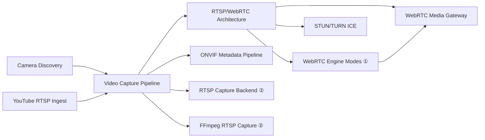
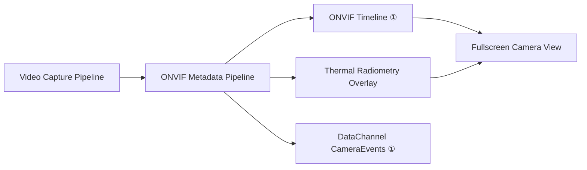
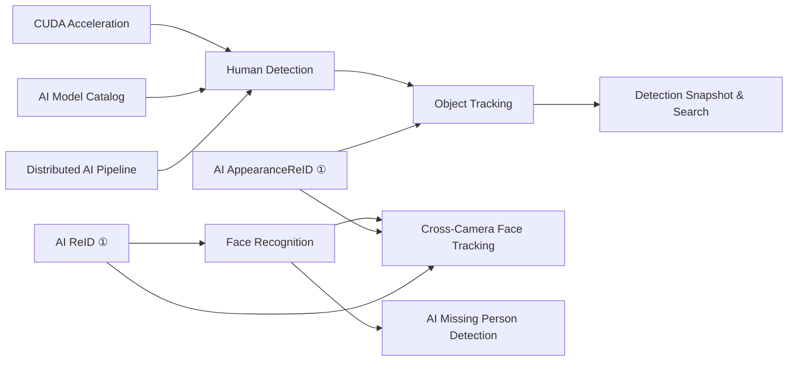
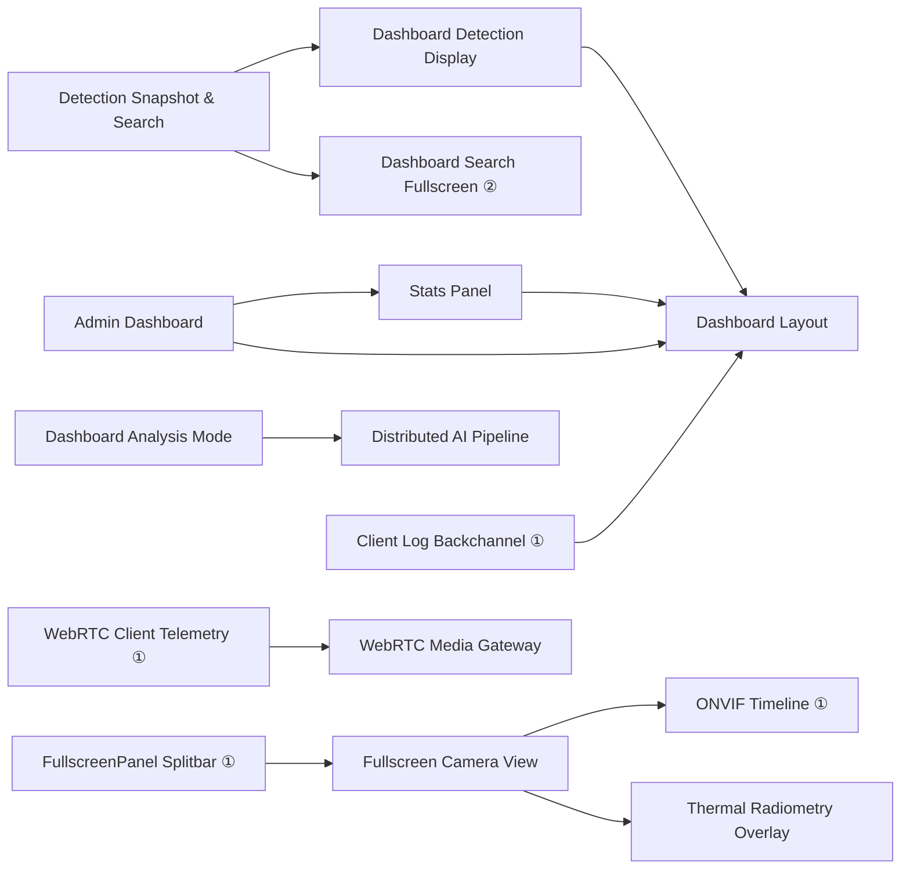

# LTS-2026 Documentation Index

## Development Process Overview

The project follows a gated stage-gate lifecycle. Each phase produces specific deliverables that serve as inputs to the next.

```
MRD → DIA → DV → DVR → PIA → PV → PVR → PR → PRA → SR → SRA
```

| Stage | Full Name | Description | Key Deliverables |
|---|---|---|---|
| **MRD** | Market Requirements | Define market/customer needs — *what* to build | MRD, draft RFP |
| **DIA** | Design Input Approval | Translate requirements into actionable development items | PRD, formal RFP, draft SRS |
| **DV** | Design Verification | Define and verify architecture and design | SRS, Design documents (HLD/LLD), TC design |
| **DVR** | Design Verification Report | Report design verification results | Design verification report, partial test results |
| **PIA** | Production Input Approval | Prepare for production/deployment | Deployment/operations design, environment setup docs |
| **PV** | Production Verification | Execute tests in production-equivalent environment | TC execution results, integration/performance/UAT reports, defect list |
| **PVR** | Production Validation Report | Consolidate test results and quality assessment | PVR report, consolidated test report, residual issue list, quality assessment |
| **PR** | Production Release | Release approval stage | Release plan, approval documents |
| **PRA** | Production Release Approval | Final release sign-off | Final approval document |
| **SR** | Service Release | Execute actual service deployment | Release notes, deployment plan, rollback plan, deployment checklist |
| **SRA** | Service Release Approval | Post-deployment stability confirmation and operations sign-off | Release validation report, smoke test results, operations stability report, go-live approval |

**Core document flow:** MRD → PRD → SRS → Design → TC → Test Results → Release Notes

> **MRD for this project:** [docs/mrd/MRD_LTS2026.md](mrd/MRD_LTS2026.md) — market problem, target segments, competitive landscape, module inventory, business requirements, success KPIs

---

## SDLC Document Hierarchy

```
RFP (Feature Overview)
  ↓
PRD (Product Requirements — Technical Approach)
  ↓
SRS (Software Requirements — Functional Specification)
  ↓
Design (Architecture & Code Structure)
  ↓
Code (Implementation)
  ↓
TC (Test Cases)  →  test/ (Test Scripts)
```

### Document Role Definitions

| Stage | Document | Role | Authored When |
|---|---|---|---|
| **RFP** | Request for Proposal | Feature definition · scope · schedule · acceptance criteria | Before project start |
| **PRD** | Product Requirements Document | Technology choices · methodology · implementation priorities | Planning phase |
| **SRS** | Software Requirements Specification | Per-feature specification · I/O contracts · non-functional requirements | Before design |
| **Design** | Design Document | Architecture · file structure · class/API design · sequence diagrams | Before implementation |
| **TC** | Test Cases | SRS-based test items · execution order · edge cases · pass criteria | After implementation |
| **Ops** | Operations Guide | Installation · configuration · troubleshooting runbook | At deployment / PIA stage |

---

## Directory Structure

```
docs/
├── mrd/           Market Requirements Document
├── rfp/           RFP documents (feature definition + schedule)
├── prd/           PRD documents (technical approach + methodology)
├── srs/           SRS documents (detailed functional specification)
├── design/        Design documents (architecture + code structure)
│                  Includes cross-cutting architectural references (①)
├── tc/            Test cases
└── ops/           Operations guides (setup, configuration, troubleshooting)

test/              Test scripts (TC-based automation)
├── api/           REST API tests
├── integration/   Integration tests (Phase-2)
├── e2e/           E2E tests (Phase-3, Playwright)
└── fixtures/      Test image files
```

**Legend used throughout this document:**
- ✓ Document exists · — Not authored · ① Design-only (no SRS/RFP) · ② Partial SDLC chain

---

## Module Documentation Status

### ✅ Fully Documented Modules (RFP + PRD + SRS + Design + TC)

| Module | RFP | PRD | SRS | Design | TC |
|---|---|---|---|---|---|
| LTS-2026 Main System | [rfp/](rfp/RFP_LTS2026_Loitering_Tracking_System.md) | [prd/](prd/PRD_LTS2026_Loitering_Tracking_System.md) | [srs/](srs/SRS_LTS2026_Loitering_Tracking_System.md) | [design/](design/Design_LTS2026_Loitering_Tracking_System.md) | [tc/](tc/TC_LTS2026_Loitering_Tracking_System.md) |
| Face Recognition | [rfp/](rfp/RFP_AI_Face_Recognition.md) | [prd/](prd/PRD_AI_Face_Recognition.md) | [srs/](srs/SRS_AI_Face_Recognition.md) | [design/](design/Design_AI_Face_Recognition.md) | [tc/](tc/TC_AI_Face_Recognition.md) |
| CUDA Acceleration (AI Inference) | [rfp/](rfp/RFP_AI_CUDA_Acceleration.md) | [prd/](prd/PRD_AI_CUDA_Acceleration.md) | [srs/](srs/SRS_AI_CUDA_Acceleration.md) | [design/](design/Design_AI_CUDA_Acceleration.md) | [tc/](tc/TC_AI_CUDA_Acceleration.md) |
| Human Detection | [rfp/](rfp/RFP_AI_Human_Detection.md) | [prd/](prd/PRD_AI_Human_Detection.md) | [srs/](srs/SRS_AI_Human_Detection.md) | [design/](design/Design_AI_Human_Detection.md) | [tc/](tc/TC_AI_Human_Detection.md) |
| Vehicle Detection | [rfp/](rfp/RFP_AI_Vehicle_Detection.md) | [prd/](prd/PRD_AI_Vehicle_Detection.md) | [srs/](srs/SRS_AI_Vehicle_Detection.md) | [design/](design/Design_AI_Vehicle_Detection.md) | [tc/](tc/TC_AI_Vehicle_Detection.md) |
| Fire & Smoke Detection | [rfp/](rfp/RFP_AI_Fire_Smoke_Detection.md) | [prd/](prd/PRD_AI_Fire_Smoke_Detection.md) | [srs/](srs/SRS_AI_Fire_Smoke_Detection.md) | [design/](design/Design_AI_Fire_Smoke_Detection.md) | [tc/](tc/TC_AI_Fire_Smoke_Detection.md) |
| Mask Detection | [rfp/](rfp/RFP_AI_Mask_Detection.md) | [prd/](prd/PRD_AI_Mask_Detection.md) | [srs/](srs/SRS_AI_Mask_Detection.md) | [design/](design/Design_AI_Mask_Detection.md) | [tc/](tc/TC_AI_Mask_Detection.md) |
| Hard Hat Detection | [rfp/](rfp/RFP_AI_Hat_Detection.md) | [prd/](prd/PRD_AI_Hat_Detection.md) | [srs/](srs/SRS_AI_Hat_Detection.md) | [design/](design/Design_AI_Hat_Detection.md) | [tc/](tc/TC_AI_Hat_Detection.md) |
| Color Analysis | [rfp/](rfp/RFP_AI_Color_Analysis.md) | [prd/](prd/PRD_AI_Color_Analysis.md) | [srs/](srs/SRS_AI_Color_Analysis.md) | [design/](design/Design_AI_Color_Analysis.md) | [tc/](tc/TC_AI_Color_Analysis.md) |
| Clothing Analysis | [rfp/](rfp/RFP_AI_Cloth_Analysis.md) | [prd/](prd/PRD_AI_Cloth_Analysis.md) | [srs/](srs/SRS_AI_Cloth_Analysis.md) | [design/](design/Design_AI_Cloth_Analysis.md) | [tc/](tc/TC_AI_Cloth_Analysis.md) |
| Accessories Detection | [rfp/](rfp/RFP_AI_Accessories_Detection.md) | [prd/](prd/PRD_AI_Accessories_Detection.md) | [srs/](srs/SRS_AI_Accessories_Detection.md) | [design/](design/Design_AI_Accessories_Detection.md) | [tc/](tc/TC_AI_Accessories_Detection.md) |
| Animal Detection | [rfp/](rfp/RFP_AI_Animal_Detection.md) | [prd/](prd/PRD_AI_Animal_Detection.md) | [srs/](srs/SRS_AI_Animal_Detection.md) | [design/](design/Design_AI_Animal_Detection.md) | [tc/](tc/TC_AI_Animal_Detection.md) |
| **AI Missing Person Detection** | [rfp/](rfp/RFP_AI_Missing_Person_Detection.md) | [prd/](prd/PRD_AI_Missing_Person_Detection.md) | [srs/](srs/SRS_AI_Missing_Person_Detection.md) | [design/](design/Design_AI_Missing_Person_Detection.md) | [tc/](tc/TC_AI_Missing_Person_Detection.md) |
| **AI Model Catalog** | [rfp/](rfp/RFP_AI_Model_Catalog.md) | [prd/](prd/PRD_AI_Model_Catalog.md) | [srs/](srs/SRS_AI_Model_Catalog.md) | [design/](design/Design_AI_Model_Catalog.md) | [tc/](tc/TC_AI_Model_Catalog.md) |
| Object Tracking | [rfp/](rfp/RFP_Object_Tracking.md) | [prd/](prd/PRD_Object_Tracking.md) | [srs/](srs/SRS_Object_Tracking.md) | [design/](design/Design_Object_Tracking.md) | [tc/](tc/TC_Object_Tracking.md) |
| Cross-Camera Face Tracking | [rfp/](rfp/RFP_CrossCamera_Face_Tracking.md) | [prd/](prd/PRD_CrossCamera_Face_Tracking.md) | [srs/](srs/SRS_CrossCamera_Face_Tracking.md) | [design/](design/Design_CrossCamera_Face_Tracking.md) | [tc/](tc/TC_CrossCamera_Face_Tracking.md) |
| YouTube RTSP Ingest | [rfp/](rfp/RFP_YouTube_RTSP_Ingest.md) | [prd/](prd/PRD_YouTube_RTSP_Ingest.md) | [srs/](srs/SRS_YouTube_RTSP_Ingest.md) | [design/](design/Design_YouTube_RTSP_Ingest.md) | [tc/](tc/TC_YouTube_RTSP_Ingest.md) |
| YouTube RTSP Ingest (LTS-2026) | — | [prd/](prd/PRD_LTS2026_YouTube_RTSP_Ingest.md) | [srs/](srs/SRS_LTS2026_YouTube_RTSP_Ingest.md) | [design/](design/Design_LTS2026_YouTube_RTSP_Ingest.md) | [tc/](tc/TC_LTS2026_YouTube_RTSP_Ingest.md) |
| WebRTC Media Gateway | [rfp/](rfp/RFP_WebRTC_Media_Gateway.md) | [prd/](prd/PRD_WebRTC_Media_Gateway.md) | [srs/](srs/SRS_WebRTC_Media_Gateway.md) | [design/](design/Design_WebRTC_Media_Gateway.md) | [tc/](tc/TC_WebRTC_Media_Gateway.md) |
| STUN/TURN ICE | [rfp/](rfp/RFP_STUN_TURN_ICE.md) | [prd/](prd/PRD_STUN_TURN_ICE.md) | [srs/](srs/SRS_STUN_TURN_ICE.md) | [design/](design/Design_STUN_TURN_ICE.md) | [tc/](tc/TC_STUN_TURN_ICE.md) |
| Camera Discovery | [rfp/](rfp/RFP_Camera_Discovery.md) | [prd/](prd/PRD_Camera_Discovery.md) | [srs/](srs/SRS_Camera_Discovery.md) | [design/](design/Design_Camera_Discovery.md) | [tc/](tc/TC_Camera_Discovery.md) |
| Dashboard Layout | [rfp/](rfp/RFP_Dashboard_Layout.md) | [prd/](prd/PRD_Dashboard_Layout.md) | [srs/](srs/SRS_Dashboard_Layout.md) | [design/](design/Design_Dashboard_Layout.md) | [tc/](tc/TC_Dashboard_Layout.md) |
| Dashboard Detection Display | [rfp/](rfp/RFP_Dashboard_Detection_Display.md) | [prd/](prd/PRD_Dashboard_Detection_Display.md) | [srs/](srs/SRS_Dashboard_Detection_Display.md) | [design/](design/Design_Dashboard_Detection_Display.md) | [tc/](tc/TC_Dashboard_Detection_Display.md) |
| Dashboard Sidebar — Cameras | [rfp/](rfp/RFP_Dashboard_Sidebar_Cameras.md) | [prd/](prd/PRD_Dashboard_Sidebar_Cameras.md) | [srs/](srs/SRS_Dashboard_Sidebar_Cameras.md) | [design/](design/Design_Dashboard_Sidebar_Cameras.md) | [tc/](tc/TC_Dashboard_Sidebar_Cameras.md) |
| Dashboard Sidebar — Alerts & Zones | [rfp/](rfp/RFP_Dashboard_Sidebar_Alerts_Zones.md) | [prd/](prd/PRD_Dashboard_Sidebar_Alerts_Zones.md) | [srs/](srs/SRS_Dashboard_Sidebar_Alerts_Zones.md) | [design/](design/Design_Dashboard_Sidebar_Alerts_Zones.md) | [tc/](tc/TC_Dashboard_Sidebar_Alerts_Zones.md) |
| Dashboard Sidebar — Face ID | [rfp/](rfp/RFP_Dashboard_Sidebar_Face_ID.md) | [prd/](prd/PRD_Dashboard_Sidebar_Face_ID.md) | [srs/](srs/SRS_Dashboard_Sidebar_Face_ID.md) | [design/](design/Design_Dashboard_Sidebar_Face_ID.md) | [tc/](tc/TC_Dashboard_Sidebar_Face_ID.md) |
| Mobile Layout | [rfp/](rfp/RFP_Mobile_Layout.md) | [prd/](prd/PRD_Mobile_Layout.md) | [srs/](srs/SRS_Mobile_Layout.md) | [design/](design/Design_Mobile_Layout.md) | [tc/](tc/TC_Mobile_Layout.md) |
| LLM / MCP Integration | [rfp/](rfp/RFP_LLM_MCP_Integration.md) | [prd/](prd/PRD_LLM_MCP_Server.md) | [srs/](srs/SRS_LLM_MCP_Server.md) | [design/](design/Design_LLM_MCP_Server.md) | [tc/](tc/TC_LLM_MCP_Server.md) |
| Storage — JSON / MongoDB | [rfp/](rfp/RFP_DB_Layer.md) | [prd/](prd/PRD_DB_Layer.md) | [srs/](srs/SRS_DB_Layer.md) | [design/](design/Design_DB_Layer.md) | [tc/](tc/TC_DB_Layer.md) |
| HTTPS / TLS Server | [rfp/](rfp/RFP_HTTPS_TLS.md) | [prd/](prd/PRD_HTTPS_TLS.md) | [srs/](srs/SRS_HTTPS_TLS.md) | [design/](design/Design_HTTPS_TLS.md) | [tc/](tc/TC_HTTPS_TLS.md) |
| Detection Snapshot & Search | [rfp/](rfp/RFP_Detection_Snapshot_Search.md) | [prd/](prd/PRD_Detection_Snapshot_Search.md) | [srs/](srs/SRS_Detection_Snapshot_Search.md) | [design/](design/Design_Detection_Snapshot_Search.md) | [tc/](tc/TC_Detection_Snapshot_Search.md) |
| Stats Dashboard Panel | [rfp/](rfp/RFP_Stats_Panel.md) | [prd/](prd/PRD_Stats_Panel.md) | [srs/](srs/SRS_Stats_Panel.md) | [design/](design/Design_Stats_Panel.md) | [tc/](tc/TC_Stats_Panel.md) |
| User Authentication | [rfp/](rfp/RFP_User_Authentication.md) | [prd/](prd/PRD_User_Authentication.md) | [srs/](srs/SRS_User_Authentication.md) | [design/](design/Design_User_Authentication.md) | [tc/](tc/TC_User_Authentication.md) |
| **User Profile** | [rfp/](rfp/RFP_User_Profile.md) | [prd/](prd/PRD_User_Profile.md) | [srs/](srs/SRS_User_Profile.md) | [design/](design/Design_User_Profile.md) | [tc/](tc/TC_User_Profile.md) |
| Video Capture Pipeline | [rfp/](rfp/RFP_Video_Capture_Pipeline.md) | [prd/](prd/PRD_Video_Capture_Pipeline.md) | [srs/](srs/SRS_Video_Capture_Pipeline.md) | [design/](design/Design_Video_Capture_Pipeline.md) | [tc/](tc/TC_Video_Capture_Pipeline.md) |
| **Distributed AI Pipeline** | [rfp/](rfp/RFP_Distributed_AI_Pipeline.md) | [prd/](prd/PRD_Distributed_AI_Pipeline.md) | [srs/](srs/SRS_Distributed_AI_Pipeline.md) | [design/](design/Design_Distributed_AI_Pipeline.md) | [tc/](tc/TC_Distributed_AI_Pipeline.md) |
| **Fullscreen Camera View** | [rfp/](rfp/RFP_Fullscreen_Camera_View.md) | [prd/](prd/PRD_Fullscreen_Camera_View.md) | [srs/](srs/SRS_Fullscreen_Camera_View.md) | [design/](design/Design_Fullscreen_Camera_View.md) | [tc/](tc/TC_Fullscreen_Camera_View.md) |
| **ONVIF Metadata Pipeline** | [rfp/](rfp/RFP_ONVIF_Metadata_Pipeline.md) | [prd/](prd/PRD_ONVIF_Metadata_Pipeline.md) | [srs/](srs/SRS_ONVIF_Metadata_Pipeline.md) | [design/](design/Design_ONVIF_Metadata_Pipeline.md) | [tc/](tc/TC_ONVIF_Metadata_Pipeline.md) |
| **RTSP / WebRTC Architecture** | [rfp/](rfp/RFP_RTSP_WebRTC_Architecture.md) | [prd/](prd/PRD_RTSP_WebRTC_Architecture.md) | [srs/](srs/SRS_RTSP_WebRTC_Architecture.md) | [design/](design/Design_RTSP_WebRTC_Architecture.md) | [tc/](tc/TC_RTSP_WebRTC_Architecture.md) |

---

### 🟡 Partially Documented Modules (Some SDLC stages missing)

| Module | RFP | PRD | SRS | Design | TC | Notes |
|---|---|---|---|---|---|---|
| Admin Dashboard | — | — | [srs/](srs/SRS_Admin_Dashboard.md) | [design/](design/Design_Admin_Dashboard.md) | [tc/](tc/TC_Admin_Dashboard.md) | Internal system admin; no external feature contract needed |
| Dashboard Analysis Mode | — | [prd/](prd/PRD_Dashboard_Analysis_Mode.md) | [srs/](srs/SRS_Dashboard_Analysis_Mode.md) | [design/](design/Design_Dashboard_Analysis_Mode.md) | [tc/](tc/TC_Dashboard_Analysis_Mode.md) | `SERVER_MODE=analysis` UI; RFP merged into main system RFP |
| Dashboard Search Fullscreen | — | [prd/](prd/PRD_Dashboard_Search_Fullscreen.md) | — | [design/](design/Design_Dashboard_Search_Fullscreen.md) | — | UI-only enhancement; SRS/TC folded into Detection Snapshot & Search |
| FFmpeg RTSP Capture | — | — | — | [design/](design/Design_FFmpeg_RTSP_Capture.md) | [tc/](tc/TC_FFmpeg_RTSP_Capture.md) | Legacy capture backend; superseded by ingest-daemon |
| ICE Test UI | — | [prd/](prd/PRD_ICE_Test_UI.md) | [srs/](srs/SRS_ICE_Test_UI.md) | [design/](design/Design_ICE_Test_UI.md) | [tc/](tc/TC_ICE_Test_UI.md) | Admin ICE diagnostics tool; RFP folded into STUN/TURN ICE RFP |
| RTSP Capture Backend | — | — | — | [design/](design/Design_RTSP_Capture_Backend.md) | [tc/](tc/TC_RTSP_Capture_Backend.md) | `CAPTURE_BACKEND` selector; design covered in Video Capture Pipeline |
| Thermal Radiometry Overlay | — | — | [srs/](srs/SRS_Thermal_Radiometry_Overlay.md) | [design/](design/Design_Thermal_Radiometry_Overlay.md) | [tc/](tc/TC_Thermal_Radiometry_Overlay.md) | Thermal camera UI; PRD/RFP folded into ONVIF Metadata Pipeline |
| Streaming Model Load Policy | — | — | — | — | [tc/](tc/TC_Streaming_Model_Load_Policy.md) | `SERVER_MODE=streaming` model-skip contract; TC authored ad hoc |

---

## Design-Only / Architectural Reference Documents

These documents capture cross-cutting design decisions or narrow implementation patterns that do not warrant a full RFP→TC SDLC chain. They are authored when the design decision arises and are reference-only.

| Document | Description | Related SDLC Modules |
|---|---|---|
| [Design_Server_Architecture.md](design/Design_Server_Architecture.md) | Central architecture reference — `SERVER_MODE`, DB backends, port layout, 5 deployment topologies, Mermaid diagrams | All server-side modules (root reference) |
| [Design_WebRTC_Engine_Modes.md](design/Design_WebRTC_Engine_Modes.md) | `WEBRTC_ENGINE=mediamtx` vs `mediasoup` engine selection, capability negotiation, RTP fan-out | RTSP/WebRTC Architecture, WebRTC Media Gateway |
| [Design_WebRTC_Client_Telemetry.md](design/Design_WebRTC_Client_Telemetry.md) | `client:webrtc-stats` Socket.IO event relay — PeerConnection `getStats()` polling, DB persistence | WebRTC Media Gateway, RTSP/WebRTC Architecture |
| [Design_ONVIF_Timeline.md](design/Design_ONVIF_Timeline.md) | `OnvifTimelineOverlay` / `OnvifTimelineInline` — interval building, Gantt rendering, zoom/pan, raw XML panel | ONVIF Metadata Pipeline, Fullscreen Camera View |
| [Design_AI_AppearanceReID.md](design/Design_AI_AppearanceReID.md) | Appearance-based Re-ID (clothing color embedding) — feature extraction, cross-camera matching threshold | Object Tracking, Cross-Camera Face Tracking |
| [Design_AI_ReID.md](design/Design_AI_ReID.md) | Generic Re-ID framework — embedding architecture, gallery update, distance metrics | Face Recognition, Cross-Camera Face Tracking |
| [Design_Client_Log_Backchannel.md](design/Design_Client_Log_Backchannel.md) | `clientLogger` — browser console → Socket.IO `client:log` → DB `client_logs` table relay | Dashboard Layout, Design_Server_Architecture |
| [Design_DataChannel_CameraEvents.md](design/Design_DataChannel_CameraEvents.md) | WebRTC DataChannel for per-camera event push (mediasoup mode) | ONVIF Metadata Pipeline, Camera Discovery |
| [Design_FullscreenPanel_Splitbar.md](design/Design_FullscreenPanel_Splitbar.md) | Drag-resizable split panel for fullscreen view — pixel position persistence, min/max clamp | Fullscreen Camera View, Dashboard Layout |

> **Legacy:** `docs/rtsp_webrtc_architecture.md` — superseded by `docs/design/Design_RTSP_WebRTC_Architecture.md` and `docs/design/Design_Server_Architecture.md`. Retained for historical reference only.

---

## Operations Guides

Operations guides are authored at the **PIA stage** (Production Input Approval). Each guide links to one or more SDLC Design documents that define the system being deployed.

| Guide | Description | Related Design / SRS |
|---|---|---|
| [ops/MongoDB_Setup.md](ops/MongoDB_Setup.md) | MongoDB 5.0 installation (Ubuntu 18.04), collection/index creation, `mongoimport` migration, replica set config | [Design_DB_Layer](design/Design_DB_Layer.md) · [SRS_DB_Layer](srs/SRS_DB_Layer.md) |
| [ops/HTTPS_TLS_Setup.md](ops/HTTPS_TLS_Setup.md) | Self-signed / CA-signed TLS certificate setup, `server/.env` HTTPS variables, HTTP→HTTPS redirect, HSTS | [Design_HTTPS_TLS](design/Design_HTTPS_TLS.md) · [SRS_HTTPS_TLS](srs/SRS_HTTPS_TLS.md) |
| [ops/MCP_Server_Setup.md](ops/MCP_Server_Setup.md) | MCP server startup (stdio vs HTTP+SSE modes), Claude Code integration, `npm run mcp:*` scripts | [Design_LLM_MCP_Server](design/Design_LLM_MCP_Server.md) · [SRS_LLM_MCP_Server](srs/SRS_LLM_MCP_Server.md) |
| [ops/Distributed_AI_Pipeline_Setup.md](ops/Distributed_AI_Pipeline_Setup.md) | streaming + analysis server pair setup, `ANALYSIS_SERVER_URL`, circuit-breaker tuning, health-check endpoints | [Design_Distributed_AI_Pipeline](design/Design_Distributed_AI_Pipeline.md) · [SRS_Distributed_AI_Pipeline](srs/SRS_Distributed_AI_Pipeline.md) |
| [ops/RTSP_Capture_Backend_Setup.md](ops/RTSP_Capture_Backend_Setup.md) | `CAPTURE_BACKEND` selection guide — ingest-daemon vs GStreamer vs PyAV, dependency installation | [Design_RTSP_Capture_Backend](design/Design_RTSP_Capture_Backend.md) ② · [Design_Video_Capture_Pipeline](design/Design_Video_Capture_Pipeline.md) |
| [ops/RTSP_WebRTC_Architecture_Setup.md](ops/RTSP_WebRTC_Architecture_Setup.md) | MediaMTX + mediasoup engine setup, STUN/TURN configuration, `SERVER_IP` / `ICE_SERVERS` env vars | [Design_RTSP_WebRTC_Architecture](design/Design_RTSP_WebRTC_Architecture.md) · [Design_WebRTC_Engine_Modes](design/Design_WebRTC_Engine_Modes.md) ① |
| [ops/Logging_Guide.md](ops/Logging_Guide.md) | `LOG_LEVEL` / `LOG_TO_FILE` / `LOG_DIR` / `LOG_FILTER_PATTERNS` env vars, log file rotation, `makeLineRelay` child-process relay | [Design_Server_Architecture](design/Design_Server_Architecture.md) ① |
| [ops/Process_Management.md](ops/Process_Management.md) | `npm run start/stop/restart` scripts, PID file management, graceful shutdown (SIGTERM / `flushNow()`), `pm2` integration | [Design_Server_Architecture](design/Design_Server_Architecture.md) ① |
| [ops/FFmpeg_Installation_Compatibility.md](ops/FFmpeg_Installation_Compatibility.md) | FFmpeg version matrix, glibc compatibility, static build vs apt install, PATH setup for ingest-daemon | [Design_FFmpeg_RTSP_Capture](design/Design_FFmpeg_RTSP_Capture.md) ② · [Design_Video_Capture_Pipeline](design/Design_Video_Capture_Pipeline.md) |
| [ops/ONNX_Runtime_Provider_Diagnostics.md](ops/ONNX_Runtime_Provider_Diagnostics.md) | ONNX EP startup diagnostics, CUDA/TensorRT/DML provider selection, `onnxOptions.js` pre-disable behavior | [Design_AI_CUDA_Acceleration](design/Design_AI_CUDA_Acceleration.md) · [SRS_AI_CUDA_Acceleration](srs/SRS_AI_CUDA_Acceleration.md) |
| [ops/ONNX_Runtime_Source_Build_CUDA13.md](ops/ONNX_Runtime_Source_Build_CUDA13.md) | ONNX Runtime source build automation for CUDA 13.3 on Linux/Windows — CMake flags, npm install workaround, verification | [Design_AI_CUDA_Acceleration](design/Design_AI_CUDA_Acceleration.md) |

> ① = design-only document (no SRS chain) · ② = partial SDLC document

---

## Document Cross-Reference Map

This section shows inter-document dependencies — which design/SRS documents depend on or feed into each other.

### High-Level Architecture

```
┌─────────────────────────────────────────────────────────────────────────────┐
│  Design_Server_Architecture ①  ←  root reference for all server modules    │
└──────────────────────────────────────┬──────────────────────────────────────┘
                                       │ defines SERVER_MODE, ports, DB
        ┌──────────────────────────────┼───────────────────────────────┐
        ▼                              ▼                               ▼
   DB Layer                     HTTPS/TLS                    User Authentication
        │                                                            │
        │ storage backend                                            ▼
        └──────────► all AI, ONVIF, WebRTC, Dashboard         User Profile
```

### Video Ingestion Layer



### ONVIF Layer



### AI Pipeline Layer



### Dashboard / UI Layer



### Cross-Domain Data Flow

| Consumer | Produces / Provides |
|---|---|
| Human Detection → Object Tracking | Detection bounding boxes feed tracker |
| Object Tracking → Detection Snapshot & Search | Track IDs + crops stored as snapshots |
| Object Tracking → Dashboard Detection Display | Live overlay annotations |
| Face Recognition → Cross-Camera Face Tracking | Face embeddings for inter-camera Re-ID |
| Face Recognition → AI Missing Person Detection | Embedding comparison against registered faces |
| ONVIF Metadata Pipeline → ONVIF Timeline | Event state-changes drive timeline intervals |
| ONVIF Metadata Pipeline → Thermal Radiometry Overlay | BoxTemperatureReading real-time stream |
| Distributed AI Pipeline → Dashboard Analysis Mode | `analysis` SERVER_MODE metrics + live feed |
| DB Layer → Stats Panel | Aggregated event/alert/camera counts |
| DB Layer → LLM/MCP Integration | All 22 tables queryable via MCP tools |
| Video Capture Pipeline → ONVIF Metadata Pipeline | App RTP frames from ingest-daemon |

### Operations Guide ↔ Design Cross-Reference

| Ops Guide | Phase | Related Design (①=design-only, ②=partial) |
|---|---|---|
| MongoDB_Setup | PIA | DB Layer Design+SRS |
| HTTPS_TLS_Setup | PIA | HTTPS/TLS Design+SRS |
| MCP_Server_Setup | PIA | LLM/MCP Design+SRS |
| Distributed_AI_Pipeline_Setup | PIA | Distributed AI Pipeline Design+SRS |
| RTSP_Capture_Backend_Setup | PIA | RTSP Capture Backend ②, Video Capture Pipeline |
| RTSP_WebRTC_Architecture_Setup | PIA | RTSP/WebRTC Architecture, WebRTC Engine Modes ① |
| Logging_Guide | PIA | Server Architecture ① |
| Process_Management | PIA | Server Architecture ① |
| FFmpeg_Installation_Compatibility | PIA | FFmpeg RTSP Capture ②, Video Capture Pipeline |
| ONNX_Runtime_Provider_Diagnostics | PIA | CUDA Acceleration Design+SRS |
| ONNX_Runtime_Source_Build_CUDA13 | PIA | CUDA Acceleration Design |

---

## Test Script Status

> Icon legend: ✅ file exists · 📋 planned (not yet created) · 🕐 Phase-2 (integration, planned) · 🖥 Phase-3 (E2E Playwright, planned)

### Phase-1 — REST API Tests (`test/api/`)

| Script | Target TC Document(s) | Groups Covered | Run Command |
|---|---|---|---|
| ✅ `test/api/main_system.test.js` | [TC_LTS2026_Loitering_Tracking_System](tc/TC_LTS2026_Loitering_Tracking_System.md) | A–G (23 cases) | `node test/api/main_system.test.js` |
| ✅ `test/api/analytics_config.test.js` | [TC_AI_Animal_Detection](tc/TC_AI_Animal_Detection.md) · [TC_AI_Hat_Detection](tc/TC_AI_Hat_Detection.md) · [TC_AI_Mask_Detection](tc/TC_AI_Mask_Detection.md) · [TC_AI_Human_Detection](tc/TC_AI_Human_Detection.md) — Group C | Config toggle (15 cases) | `node test/api/analytics_config.test.js` |
| ✅ `test/api/ai_detection_modules.test.js` | [TC_AI_Accessories_Detection](tc/TC_AI_Accessories_Detection.md) · [TC_AI_Animal_Detection](tc/TC_AI_Animal_Detection.md) · [TC_AI_Cloth_Analysis](tc/TC_AI_Cloth_Analysis.md) · [TC_AI_Color_Analysis](tc/TC_AI_Color_Analysis.md) · [TC_AI_Fire_Smoke_Detection](tc/TC_AI_Fire_Smoke_Detection.md) · [TC_AI_Hat_Detection](tc/TC_AI_Hat_Detection.md) · [TC_AI_Mask_Detection](tc/TC_AI_Mask_Detection.md) · [TC_AI_Vehicle_Detection](tc/TC_AI_Vehicle_Detection.md) | Groups A, B, D, F (61 cases) | `node test/api/ai_detection_modules.test.js` |
| ✅ `test/api/human_detection.test.js` | [TC_AI_Human_Detection](tc/TC_AI_Human_Detection.md) | A–D (graceful skip if model absent) | `node test/api/human_detection.test.js` |
| ✅ `test/api/model_catalog.test.js` | [TC_AI_Model_Catalog](tc/TC_AI_Model_Catalog.md) | TC-MC-001,002,005,007,008 (download tests: `INTEGRATION_DOWNLOAD=1`) | `node test/api/model_catalog.test.js` |
| ✅ `test/api/object_tracking.test.js` | [TC_Object_Tracking](tc/TC_Object_Tracking.md) | A (Zone CRUD), B (Tracker Config), G (22 cases) | `node test/api/object_tracking.test.js` |
| ✅ `test/api/camera_discovery.test.js` | [TC_Camera_Discovery](tc/TC_Camera_Discovery.md) | A (Discovery), B (Registration), G (15 cases) | `node test/api/camera_discovery.test.js` |
| ✅ `test/api/nvr_channel_discovery.test.js` | [TC_Camera_Discovery](tc/TC_Camera_Discovery.md) | Group H — NVR MaxChannel (TC-H-001~013) | `node test/api/nvr_channel_discovery.test.js` |
| ✅ `test/api/capture-backend.test.js` | [TC_RTSP_Capture_Backend](tc/TC_RTSP_Capture_Backend.md) | CaptureFactory, RTSP/GStreamer/PyAV backend selection | `node test/api/capture-backend.test.js` |
| ✅ `test/api/face_gallery.test.js` | [TC_AI_Face_Recognition](tc/TC_AI_Face_Recognition.md) · [TC_Dashboard_Sidebar_Face_ID](tc/TC_Dashboard_Sidebar_Face_ID.md) | Group A (Gallery CRUD), E (15 cases) | `node test/api/face_gallery.test.js` |
| ✅ `test/api/face_enrollment.test.js` | [TC_AI_Face_Recognition](tc/TC_AI_Face_Recognition.md) · [TC_Dashboard_Sidebar_Face_ID](tc/TC_Dashboard_Sidebar_Face_ID.md) | Group B (Enrollment), G (8 cases) | `node test/api/face_enrollment.test.js` |
| ✅ `test/api/missing_persons.test.js` | [TC_AI_Face_Recognition](tc/TC_AI_Face_Recognition.md) · [TC_Dashboard_Sidebar_Face_ID](tc/TC_Dashboard_Sidebar_Face_ID.md) | Groups C, D (2 pass + 4 skip) | `node test/api/missing_persons.test.js` |
| ✅ `test/api/missing-person.test.js` | [TC_AI_Missing_Person_Detection](tc/TC_AI_Missing_Person_Detection.md) | TC-U001/U002/U005, TC-I001~I004, TC-R001 (register/search/update/status flow) | `node test/api/missing-person.test.js` |
| ✅ `test/api/cross_camera_tracking.test.js` | [TC_CrossCamera_Face_Tracking](tc/TC_CrossCamera_Face_Tracking.md) | A (Trajectory), B (Stats), C (Persons), G (15 cases) | `node test/api/cross_camera_tracking.test.js` |
| ✅ `test/api/youtube_streams.test.js` | [TC_YouTube_RTSP_Ingest](tc/TC_YouTube_RTSP_Ingest.md) | A–G (14 cases) | `node test/api/youtube_streams.test.js` |
| ✅ `test/api/youtube_streams_lts2026.test.js` | [TC_LTS2026_YouTube_RTSP_Ingest](tc/TC_LTS2026_YouTube_RTSP_Ingest.md) | A–C (8 cases) | `node test/api/youtube_streams_lts2026.test.js` |
| ✅ `test/api/stats_panel.test.js` | [TC_Stats_Panel](tc/TC_Stats_Panel.md) | A–K (aggregation accuracy, drill-down nav, hourly breakdown, items API) | `node test/api/stats_panel.test.js` |
| ✅ `test/api/webrtc.test.js` | [TC_WebRTC_Media_Gateway](tc/TC_WebRTC_Media_Gateway.md) | A–C (7 cases) | `node test/api/webrtc.test.js` |
| ✅ `test/api/webrtc_ice.test.js` | [TC_STUN_TURN_ICE](tc/TC_STUN_TURN_ICE.md) | A–B (7 cases) | `node test/api/webrtc_ice.test.js` |
| ✅ `test/api/webrtc_stability.test.js` | [TC_WebRTC_Media_Gateway](tc/TC_WebRTC_Media_Gateway.md) | Group H — stability post-patch (TC-H-001~004) | `node test/api/webrtc_stability.test.js` |
| ✅ `test/api/webrtc_telemetry.test.js` | [TC_WebRTC_Media_Gateway](tc/TC_WebRTC_Media_Gateway.md) | Group I — Client Telemetry relay (TC-I-001~004) | `node test/api/webrtc_telemetry.test.js` |
| ✅ `test/api/https_tls.test.js` | [TC_HTTPS_TLS](tc/TC_HTTPS_TLS.md) | A, B, D, G (6 pass; HTTPS cases skip in HTTP-only mode) | `node test/api/https_tls.test.js` |
| ✅ `test/api/mcp_server.test.js` | [TC_LLM_MCP_Server](tc/TC_LLM_MCP_Server.md) | A–E (29 cases) | `node test/api/mcp_server.test.js` |
| ✅ `test/api/mcp_server_extended.test.js` | [TC_LLM_MCP_Server](tc/TC_LLM_MCP_Server.md) | Groups J–O (FR-MCP-070~110) | `node test/api/mcp_server_extended.test.js` |
| ✅ `test/api/sidebar_cameras.test.js` | [TC_Dashboard_Sidebar_Cameras](tc/TC_Dashboard_Sidebar_Cameras.md) | B (Cameras REST), C (Add Camera), D (Search), G (13 pass + 4 skip) | `node test/api/sidebar_cameras.test.js` |
| ✅ `test/api/sidebar_alerts_zones.test.js` | [TC_Dashboard_Sidebar_Alerts_Zones](tc/TC_Dashboard_Sidebar_Alerts_Zones.md) | B (Alert Ack REST), D (Zone REST) (11 pass + 8 skip) | `node test/api/sidebar_alerts_zones.test.js` |
| ✅ `test/api/detection_snapshot_search.test.js` | [TC_Detection_Snapshot_Search](tc/TC_Detection_Snapshot_Search.md) | B, C, F, I (REST API + search + regression + filter chip tooltips, 26 cases) | `node test/api/detection_snapshot_search.test.js` |
| ✅ `test/api/auth.test.js` | [TC_User_Authentication](tc/TC_User_Authentication.md) | A–G (registration, sign-in, JWT, logout, admin, RBAC, regression) | `node test/api/auth.test.js` |
| ✅ `test/api/user_profile.test.js` | [TC_User_Profile](tc/TC_User_Profile.md) | Group A (Profile Read), Group B (Profile Update — PATCH /auth/me) | `node test/api/user_profile.test.js` |
| ✅ `test/api/db_layer.test.js` | [TC_DB_Layer](tc/TC_DB_Layer.md) | Groups A+B+H+I+J (REST-testable CRUD, persistence, security, durability) | `node test/api/db_layer.test.js` |
| ✅ `test/api/onvif_metadata_pipeline.test.js` | [TC_ONVIF_Metadata_Pipeline](tc/TC_ONVIF_Metadata_Pipeline.md) | Parser unit tests — TC-PARSER-001~003 (payload → array conversion, multi-message) | `node test/api/onvif_metadata_pipeline.test.js` |
| ✅ `test/api/onvif_apprtp.test.js` | [TC_ONVIF_Metadata_Pipeline](tc/TC_ONVIF_Metadata_Pipeline.md) | TC-APPRTP-007~014 — Socket.IO broadcast, DB save, `onvif:event` event | `node test/api/onvif_apprtp.test.js` |
| ✅ `test/api/timeline_range.test.js` | [TC_ONVIF_Metadata_Pipeline](tc/TC_ONVIF_Metadata_Pipeline.md) | TC-TIMELINE-RANGE-001~008 — ONVIF/Detection timeline 1H `from` parameter handling | `node test/api/timeline_range.test.js` |
| ✅ `test/api/thermal_radiometry_overlay.test.js` | [TC_Thermal_Radiometry_Overlay](tc/TC_Thermal_Radiometry_Overlay.md) | Group A (parser unit, TC-A-001~008), Group B (Socket.IO/HTTP API, TC-B-001~003) | `node test/api/thermal_radiometry_overlay.test.js` |
| ✅ `test/api/distributed_pipeline.test.js` | [TC_Distributed_AI_Pipeline](tc/TC_Distributed_AI_Pipeline.md) | Distributed AI pipeline endpoint and circuit-breaker tests | `node test/api/distributed_pipeline.test.js` |
| ✅ `test/api/streaming_mode_model_skip.test.js` | [TC_Streaming_Model_Load_Policy](tc/TC_Streaming_Model_Load_Policy.md) | `SERVER_MODE=streaming` model-skip contract — unit tests | `node test/api/streaming_mode_model_skip.test.js` |
| ✅ `test/api/streaming_without_analysis_url.test.js` | [TC_Distributed_AI_Pipeline](tc/TC_Distributed_AI_Pipeline.md) | Streaming mode fallback when `ANALYSIS_SERVER_URL` unset | `node test/api/streaming_without_analysis_url.test.js` |
| 📋 `test/api/face_match_history.test.js` | [TC_Dashboard_Sidebar_Face_ID](tc/TC_Dashboard_Sidebar_Face_ID.md) | Group E (Match History CRUD) | `node test/api/face_match_history.test.js` |

### Phase-2 — Integration Tests (`test/integration/`)

| Script | Target TC Document(s) | Groups Covered | Run Command |
|---|---|---|---|
| 🕐 `test/integration/storage_mongo.test.js` | [TC_DB_Layer](tc/TC_DB_Layer.md) | Groups C, D, E, F, G, H, I (MongoDB mode — requires live `mongod`) | `node test/integration/storage_mongo.test.js` |
| 🕐 `test/integration/face_pipeline.test.js` | [TC_AI_Face_Recognition](tc/TC_AI_Face_Recognition.md) | Groups D, F (Socket.IO `face_match` event) | `node test/integration/face_pipeline.test.js` |
| 🕐 `test/integration/main_pipeline.test.js` | [TC_LTS2026_Loitering_Tracking_System](tc/TC_LTS2026_Loitering_Tracking_System.md) | Groups G, H (Socket.IO events, pipeline E2E) | `node test/integration/main_pipeline.test.js` |

### Phase-3 — E2E Tests (`test/e2e/`)

| Script | Target TC Document(s) | Groups Covered | Run Command |
|---|---|---|---|
| 🖥 `test/e2e/dashboard_e2e.test.js` | [TC_Dashboard_Layout](tc/TC_Dashboard_Layout.md) · [TC_Dashboard_Detection_Display](tc/TC_Dashboard_Detection_Display.md) · [TC_Mobile_Layout](tc/TC_Mobile_Layout.md) | All groups (Playwright browser automation) | `node test/e2e/dashboard_e2e.test.js` |

### Utility Scripts

| Script | Purpose | Run Command |
|---|---|---|
| `test/generate_report.js` | Run full test suite and generate markdown report (`test/reports/report_YYYY-MM-DD_HH-MM.md`) | `node test/generate_report.js` |
| `test/run_all.js` | Run all Phase-1 suites at once; use `--skip e2e` to exclude Phase-3 | `node test/run_all.js --skip e2e` |

### Phase Coverage Summary

| Phase | Scope | Scripts | Status |
|---|---|---|---|
| Phase-1 (API) | REST API tests — 37 scripts (✅ exist) + 1 (📋 planned) | 38 | ✅ 350+ pass, 0 fail (existing) |
| Phase-2 (Integration) | Socket.IO / MongoDB integration tests — 3 scripts | 3 | 🕐 Planned |
| Phase-3 (E2E) | Playwright browser automation — 1 script (placeholder exists) | 1 | 🖥 Planned |

### Prerequisites

```bash
# 1. Verify server is running
curl https://localhost:3443/health

# 2. Place a real face photo for enrollment tests (TC-B-001)
cp /path/to/face_photo.jpg test/fixtures/face_clear.jpg

# 3. Run all Phase-1 tests
node test/run_all.js --skip e2e

# 4. Run a single suite
node test/api/camera_discovery.test.js

# 5. Generate test report (output: test/reports/report_YYYY-MM-DD_HH-MM.md)
node test/generate_report.js
```

### Test Fixture Files

| File | Purpose | Status |
|---|---|---|
| `test/fixtures/no_face.jpg` | Image with no human face (error path tests) | ✅ Auto-generated |
| `test/fixtures/face_clear.jpg` | Clear frontal face photo (enrollment success path) | ⚠ Manual placement required |
| `test/fixtures/face_side.jpg` | Side-angle face photo (angle filter test) | ⚠ Phase-2, manual |
| `test/fixtures/multi_face.jpg` | Photo with multiple faces (max-area selection test) | ⚠ Phase-2, manual |

---

## Changelog

| Date | Description |
|---|---|
| 2026-05-26 | Documentation hierarchy established — rfp/prd/srs/design/tc directories created |
| 2026-05-26 | Face Recognition module SRS, Design, TC authored |
| 2026-05-26 | test/ directory created + 3 initial API test scripts |
| 2026-05-27 | SDLC chain completed — missing Design (×4) and TC (×15) documents authored; all 25 modules fully covered |
| 2026-05-27 | Face ID Sidebar module extracted as standalone SDLC chain — RFP/PRD/SRS/Design/TC_Dashboard_Sidebar_Face_ID.md authored; pipelineManager.js face_tracking.json persistence implemented |
| 2026-05-27 | docs/README.md converted to English; test script status table updated with all 18 suites |
| 2026-05-27 | Storage — JSON/MongoDB module SDLC chain authored — RFP/PRD/SRS/Design/TC_DB_Layer.md; dual-mode db.js + mongoDbService.js specification, index strategy, migration script design |
| 2026-05-27 | HTTPS/TLS module SDLC chain authored — RFP/PRD/SRS/Design/TC_HTTPS_TLS.md; `server/src/index.js` updated with conditional https.createServer, HTTP→HTTPS redirect, HSTS middleware; `server/.env` HTTPS variables added; test script `test/api/https_tls.test.js` created |
| 2026-05-27 | Detection Snapshot & Search module SDLC chain authored — RFP/PRD/SRS/Design/TC_Detection_Snapshot_Search.md; `sharp`-based JPEG bbox crop design; `detectionSnapshots` DB table schema; `snapshotService.js`, `api/snapshots.js`, `api/search.js` specification; client `SearchBar.tsx` + `useSearch.ts` design; pipelineManager hook design; test script `test/api/detection_snapshot_search.test.js` |
| 2026-05-27 | Face ID Sidebar v1.1 SDLC amendment — RFP/PRD/SRS/Design/TC_Dashboard_Sidebar_Face_ID.md all updated to v1.1; added Live Match Crop feature, `faceMatchHistory` DB table persistence, `GET /api/search?types=matches` endpoint, SearchBar `match` result type, MatchLog dual-photo layout |
| 2026-05-27 | DB persistence hardening — `persistJson()` now debounced (2 s), `_flushJson()` uses atomic write (`writeFileSync` → `renameSync` via `lts.json.tmp`), `flushNow()` exported for graceful shutdown |
| 2026-05-27 | Search API improvements — `DEFAULT_TYPES` extended with `events`, events-table search branch added, `isLoitering=true` keyword detection, sort comparators fixed for Unix ms timestamps |
| 2026-05-27 | SDLC v1.1 amendments — Design/SRS/TC_Detection_Snapshot_Search.md updated (§11 + Groups G/H); Design/SRS/TC_DB_Layer.md updated (§15 atomic write + Group J TC-J-001~006) |
| 2026-05-27 | SearchFullscreen filter chip i18n + search API bug fix — 15 language translation files updated; `types=faces` false-positive fixed |
| 2026-05-28 | docs/README.md restored to English — all sections converted back from Korean to English |
| 2026-05-28 | User Authentication SDLC chain completed — `RFP_User_Authentication.md` authored; `test/api/auth.test.js` created (Groups A–G) |
| 2026-05-28 | Stats Dashboard Panel v1.2 — full-screen layout, drill-down navigation, `GET /api/stats/items` endpoint; Design/SRS/TC_Stats_Panel.md updated to v1.2 |
| 2026-05-28 | MongoDB 5.0 adopted as primary storage — installed on Ubuntu 18.04; `DB_TYPE=mongodb` set in `server/.env`; setup guide at `docs/ops/MongoDB_Setup.md` |
| 2026-06-05 | ONNX Runtime source build ops guide added — `docs/ops/ONNX_Runtime_Source_Build_CUDA13.md` authored for CUDA 13.3 |
| 2026-05-28 | `docs/development_process.md` integrated into `docs/README.md` — Development Process Overview section added (stage-gate table) |
| 2026-05-28 | `docs/mrd/MRD_LTS2026.md` created — Market Requirements Document (11 core + 11 AI modules, KPIs, roadmap) |
| 2026-06-05 | CUDA Acceleration SDLC v1.1 amendment — RFP/PRD/SRS/Design/TC updated with ONNX startup diagnostics; `docs/ops/ONNX_Runtime_Provider_Diagnostics.md` added |
| 2026-06-05 | Video Capture Pipeline SDLC chain authored — 5-document chain; 40 test cases in Groups A–G; 4-phase improvement roadmap |
| 2026-06-25 | **docs/README.md v2.0 — Comprehensive update**: (1) Added 7 fully documented modules missing from table (AI_Missing_Person_Detection, AI_Model_Catalog, Distributed_AI_Pipeline, Fullscreen_Camera_View, ONVIF_Metadata_Pipeline, RTSP_WebRTC_Architecture, User_Profile); (2) Added "Partially Documented Modules" section (Admin Dashboard, Dashboard Analysis Mode, ICE Test UI, Thermal Radiometry Overlay, RTSP Capture Backend, FFmpeg RTSP Capture, Streaming Model Load Policy); (3) Added "Design-Only / Architectural Reference Documents" section (9 docs: Server_Architecture, WebRTC_Engine_Modes, WebRTC_Client_Telemetry, ONVIF_Timeline, AI_AppearanceReID, AI_ReID, Client_Log_Backchannel, DataChannel_CameraEvents, FullscreenPanel_Splitbar); (4) Added "Operations Guides" section (11 docs with design cross-refs); (5) Added "Document Cross-Reference Map" section with layered Mermaid diagrams and inter-module dependency tables; (6) Updated Test Script Status — added 16 previously unlisted Phase-1 scripts; updated Phase Coverage Summary from 23→38 scripts |

---

## Document History

| Version | Date | Description |
|---|---|---|
| 1.0 | 2026-05-28 | Initial release |
| 2.0 | 2026-06-25 | Full documentation coverage — added partial/design-only/ops sections, cross-reference map, 16 missing test scripts |
