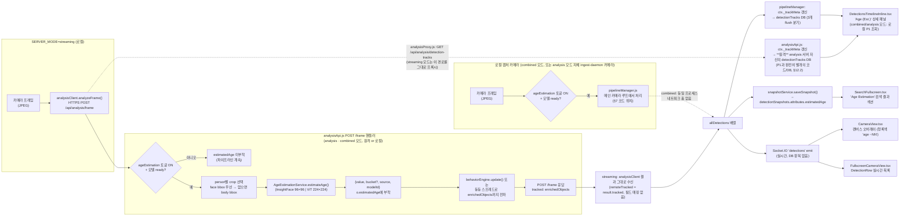

# DESIGN DOCUMENT
# AI Module — Age Estimation

| | |
|---|---|
| **Document ID** | DESIGN-LTS-AI-AGE-01 |
| **Version** | 1.8 |
| **Status** | Proposed (opt-in) |
| **Date** | 2026-07-14 |
| **Parent SRS** | [SRS_AI_Age_Estimation](../srs/SRS_AI_Age_Estimation.md) |
| **Related** | [Design_AI_Model_Catalog](Design_AI_Model_Catalog.md), [Design_AI_Cloth_Analysis](Design_AI_Cloth_Analysis.md) |

---

## 목차

1. [개요](#1-개요)
2. [아키텍처 개요](#2-아키텍처-개요)
3. [파일 구조](#3-파일-구조)
4. [모델 카탈로그 통합](#4-모델-카탈로그-통합)
5. [PT→ONNX 변환 — `hfOptimumExport`](#5-ptonnx-변환--hfoptimumexport)
6. [AgeEstimationService 설계](#6-ageestimationservice-설계)
7. [입력 소스 폴백 로직](#7-입력-소스-폴백-로직)
8. [Admin Dashboard 통합](#8-admin-dashboard-통합)
9. [데이터 모델](#9-데이터-모델)
10. [오류 처리 및 한계](#10-오류-처리-및-한계)
11. [검증 (Verification)](#11-검증-verification)
12. [라인 플로우 — 프레임에서 화면까지](#12-라인-플로우--프레임에서-화면까지)

---

## 1. 개요

Age Estimation은 추적된 person에 대해 정밀 연령 예측을 수행하는 opt-in AI 모듈이다. 기존 cloth-PAR(`colorClothService.js`)이 부산물로 내놓는 3단계 `ageGroup`과 독립적으로 동작하며, Admin Dashboard에서 두 모델(InsightFace GenderAge / ViT Age Classifier) 중 하나를 선택해 활성화한다 — cloth-PAR의 PromptPAR/OpenPAR 선택 패턴을 그대로 재사용한다.

## 2. 아키텍처 개요

```
┌──────────────────────────────────────────────────────────────────────────┐
│                       SERVER (analysis / combined mode)                   │
│                                                                            │
│  routes/analysisApi.js                                                    │
│   ├─ EXTENDED_CATALOG += age-estimation (2 entries)                       │
│   ├─ _activeFileForEntry()  — case 'age-estimation'                      │
│   ├─ /models/switch          — case 'age-estimation'                      │
│   └─ /models/download        — entry.hfOptimumExport branch (신규)       │
│                                                                            │
│  services/ageEstimationService.js (신규)                                  │
│   ├─ load()/reload()/ready/status                                        │
│   └─ estimateAge(jpegBuffer, bbox, {isFaceCrop}) → {value,bucket?,source} │
│                                                                            │
│  services/pipelineManager.js                                              │
│   ├─ this._ageEstimation = new AgeEstimationService()                    │
│   ├─ lazy-load in _doStartCamera()                                        │
│   └─ 감지 루프: face bbox 있으면 우선, 없으면 person bbox 폴백           │
│                                                                            │
│  services/tracking.js                                                     │
│   └─ sticky-attribute 목록에 'estimatedAge' 추가                         │
│                                                                            │
│  services/analyticsConfig.js                                              │
│   └─ DEFAULT_CONFIG.ageEstimation = false (opt-in)                        │
└──────────────────────────────┬─────────────────────────────────────────────┘
                                │ REST (/api/analysis/models*)
┌──────────────────────────────▼─────────────────────────────────────────────┐
│                   CLIENT — AdminUsersPage.tsx AiModelsSection()            │
│   제네릭 카탈로그 테이블이 age-estimation family를 자동 렌더링             │
│   (신규 컴포넌트 불필요 — 상수 4곳만 갱신)                                │
└─────────────────────────────────────────────────────────────────────────────┘
```

## 3. 파일 구조

```
loitering_tracking/
├── server/
│   ├── models/
│   │   ├── genderage.onnx              # InsightFace GenderAge (다운로드 시 생성)
│   │   └── vit_age_classifier.onnx     # ViT Age Classifier (hfOptimumExport 변환 시 생성)
│   └── src/
│       ├── routes/
│       │   └── analysisApi.js          # 카탈로그·switch·download 핸들러
│       └── services/
│           ├── ageEstimationService.js # 신규
│           ├── pipelineManager.js      # 감지 루프 연동
│           ├── tracking.js             # sticky-attribute 목록
│           └── analyticsConfig.js      # ageEstimation 토글
└── docs/
    ├── rfp/RFP_AI_Age_Estimation.md
    ├── prd/PRD_AI_Age_Estimation.md
    ├── srs/SRS_AI_Age_Estimation.md
    ├── design/Design_AI_Age_Estimation.md   # 이 문서
    └── tc/TC_AI_Age_Estimation.md
```

## 4. 모델 카탈로그 통합

**파일:** `server/src/routes/analysisApi.js` — `EXTENDED_CATALOG` 배열

```javascript
// Age Estimation (Proposed) — dedicated age prediction, independent of the
// PA100k cloth-PAR ageGroup byproduct (see RFP_AI_Age_Estimation.md §9).
{
  id: 'insightface-genderage', label: 'InsightFace GenderAge (buffalo_l)',
  family: 'age-estimation', series: 'Age Estimation',
  file: 'genderage.onnx', size: 96,
  url: 'https://huggingface.co/JackCui/facefusion/resolve/main/gender_age.onnx', // 구현 시 재검증 필요, §11
  license: 'InsightFace non-commercial research license (acceptable — non-commercial project)',
},
{
  id: 'vit-age-classifier', label: 'ViT Age Classifier (nateraw)',
  family: 'age-estimation', series: 'Age Estimation',
  file: 'vit_age_classifier.onnx', size: 224,
  hfOptimumExport: { repo: 'nateraw/vit-age-classifier' },
  license: 'See Hugging Face model card',
  classMap: VIT_AGE_BUCKET_CLASSES,
},
```

`_activeFileForEntry()`에 추가되는 분기 (기존 `appearance-reid` 케이스와 동일 구조):

```javascript
case 'age-estimation':
  return _ageEstimation?.ready ? path.basename(_ageEstimation.modelPath) : null;
```

## 5. PT→ONNX 변환 — `hfOptimumExport`

기존 `hfExport`(PPE/Fire-Smoke)는 `ultralytics.YOLO(pt).export(format="onnx")`만 지원하며, ViT 분류기 같은 non-YOLO HuggingFace Transformers 아키텍처는 변환할 수 없다. 이를 위해 **HuggingFace `optimum`** 라이브러리를 사용하는 새 소스 전략을 추가한다.

```
소스 전략 비교:
  url               → 순수 HTTP(S) ONNX 다운로드 (변환 없음)
  requiresConversion→ GitHub .pt 릴리스 → ultralytics export (YOLO26/12)
  hfExport          → HuggingFace .pt 다운로드 → ultralytics export (PPE, Fire-Smoke)
  hfOptimumExport   → HuggingFace 체크포인트 → optimum.exporters.onnx.main_export (신규 — ViT 등 non-YOLO)
  manualOnly        → 자동화 불가 — 수동 export 필요 (OpenPAR)
```

`/models/download` 핸들러 신규 분기:

```javascript
} else if (entry.hfOptimumExport) {
  const pyExec = await _findPythonWithOptimum();
  if (!pyExec) throw new Error('Python with optimum + transformers not found. Run: pip install -U optimum-onnx transformers');

  _downloadProgress.set(modelId, { status: 'converting', percent: 50, error: null });
  const tmpDir = path.join(modelsDir, `.${modelId}-export-tmp`);
  const script = [
    'from optimum.exporters.onnx import main_export',
    `main_export(model_name_or_path=${JSON.stringify(entry.hfOptimumExport.repo)}, output=${JSON.stringify(tmpDir)}, task="image-classification")`,
  ].join('; ');
  await new Promise((resolve, reject) => {
    execFile(pyExec, ['-c', script], { timeout: 300_000 }, (err, stdout, stderr) => {
      if (err) { console.error('[AnalysisAPI] optimum export stderr:', stderr); return reject(err); }
      resolve();
    });
  });
  fs.copyFileSync(path.join(tmpDir, 'model.onnx'), filePath);
  fs.rmSync(tmpDir, { recursive: true, force: true });
}
```

`_findPythonWithOptimum()` — `_findPythonWithUltralytics()` 바로 아래 추가, 동일한 후보 목록을 순회하되 `import optimum, transformers`를 체크한다.

## 6. AgeEstimationService 설계

**파일:** `server/src/services/ageEstimationService.js` (신규, `appearanceReidService.js` 템플릿)

```javascript
class AgeEstimationService {
  constructor({ modelPath } = {}) { /* status: not_started|missing|loaded|failed */ }
  async load() { /* fs.existsSync 체크 → createOnnxSession */ }
  async reload(filePath) { /* 모델 카탈로그 hot-swap */ }
  get ready() {}
  get status() {}
  async estimateAge(jpegBuffer, bbox, { isFaceCrop }) {
    // 활성 모델(this.modelPath 기준)에 따라 전처리/후처리 분기
    // InsightFace: 96×96 BGR → 회귀 age
    // ViT:        224×224 RGB, ImageNet 정규화 → 9-bucket softmax argmax → 중앙값
    // 반환: { value, bucket?, source: isFaceCrop ? 'face' : 'body', modelId }
  }
}
```

### 6.1 모델별 전처리 계약 (구현 시 실제 ONNX 메타데이터로 재검증 — §11)

| | InsightFace GenderAge | ViT Age Classifier |
|---|---|---|
| 입력 크기 | 96×96 | 224×224 |
| 채널 순서 | BGR (추정 — InsightFace 관례) | RGB |
| 정규화 | `(pixel - 127.5) / 127.5` (추정) | ImageNet mean/std |
| 출력 | `[1,3]` — gender 2채널 + age 1채널 (스케일 미확인) | `[1,9]` softmax logits |
| 후처리 | `age = round(output[2] * 100)` (추정) | `bucket = VIT_AGE_BUCKET_CLASSES[argmax(logits)]`, `value = midpoint(bucket)` |

`VIT_AGE_BUCKET_CLASSES`는 `colorClothService.js`의 `SCHP_LIP20_CLASS_MAP` export 패턴과 동일하게 `ageEstimationService.js`에서 export되어 `analysisApi.js`가 카탈로그 `classMap`으로 연결한다:

```javascript
const VIT_AGE_BUCKET_CLASSES = ['0-2','3-9','10-19','20-29','30-39','40-49','50-59','60-69','more than 70'];
```

## 7. 입력 소스 폴백 로직

> **주의 (2026-07-14 확정):** 이 로직은 프레임 처리 진입점이 **두 곳**이며, 각각 독립적으로 구현되어 있다 — 하나를 고치면 자동으로 둘 다 고쳐지지 않는다.
> 1. `pipelineManager.js`의 로컬 카메라 루프 — `combined` 모드, 또는 `analysis` 모드에 ingest-daemon 카메라가 직접 붙어있는 경우
> 2. `analysisApi.js`의 `POST /frame` HTTP 핸들러 — `SERVER_MODE=streaming` 서버가 위임한 프레임을 처리하는 경로 (2026-07-14 이전에는 이 경로에 Age Estimation이 아예 구현되어 있지 않았다 — §12.1 참고)

**파일 1 — `server/src/services/pipelineManager.js` 감지 루프**

```
For each person object in attrObjects (매 프레임, enrich() 이후):
  if analyticsConfig.ageEstimation !== true → skip
  if obj.face?.bbox 존재 (face 모듈 활성 시 attributePipeline이 부여)
    → _getAgeEstimate(jpegBuffer, obj.objectId, obj.face.bbox, isFaceCrop: true)
  else if obj.bbox (YOLO person bbox) 존재
    → _getAgeEstimate(jpegBuffer, obj.objectId, obj.bbox, isFaceCrop: false)
  else
    → skip (에러 없이 건너뜀)

  _getAgeEstimate()는 objectId별 4초 캐시(this._ageEstimateCache) 적용 — 매 프레임 재추론하지 않음
  결과 → obj.estimatedAge = { value, bucket?, source, modelId }
       → behaviorEngine.update()의 {...obj} 스프레드로 enrichedObjects까지 그대로 전파 (스냅샷·Socket.IO 노출)
       → 동시에 tracker.updateEstimatedAge(obj.objectId, obj.estimatedAge)로 track.estimatedAge에도 기록 (§6.1의 코드 정정 참고)
```

**파일 2 — `server/src/routes/analysisApi.js`의 `POST /frame` 핸들러 (2026-07-14 신규 추가)**

동일한 face-우선/body-폴백 로직을 독립적으로 재구현 — 클래스 인스턴스가 아니라 모듈-레벨 함수이므로 `this._ageEstimateCache` 대신 모듈-레벨 `_ageEstimateCache`(Map)와 `AGE_ESTIMATION_INTERVAL_MS`(4000, `pipelineManager.js`와 동일 값) 상수를 사용한다. `_attrPipeline.enrich()` 호출(face/color/cloth 부여) **직후**, Face Re-ID 블록 **이전**에 위치해야 `obj.face?.bbox`를 참조할 수 있다.

```javascript
// 4.4 Age Estimation (Proposed)
if (analyticsConfig.isEnabled('ageEstimation') && _ageEstimation?.ready) {
  const _ageNow = Date.now();
  await Promise.all(enrichedObjects
    .filter(o => o.className === 'person')
    .map(async (o) => {
      const bbox = o.face?.bbox || o.bbox;
      if (!bbox) return;
      const isFaceCrop = !!o.face?.bbox;
      const cacheKey = String(o.objectId);
      const cached = _ageEstimateCache.get(cacheKey);
      if (cached && (_ageNow - cached.ts) < AGE_ESTIMATION_INTERVAL_MS) {
        o.estimatedAge = cached.result;
        return;
      }
      const result = await _ageEstimation.estimateAge(jpegBuffer, bbox, { isFaceCrop });
      if (result) { o.estimatedAge = result; _ageEstimateCache.set(cacheKey, { ts: _ageNow, result }); }
    }));
}
```

`tracking.js`의 `Track` 클래스에 `estimatedAge` 필드와 `ByteTracker.updateEstimatedAge(objectId, estimatedAge)` 메서드를 추가 — 기존 `color`/`cloth`/`accessories`와 동일한 per-attribute 패턴(`updateColor`/`updateCloth`/`updateAccessories`)을 그대로 따른다. (이 Track 필드는 `pipelineManager.js` 로컬 루프 경로에서만 갱신되며, `analysisApi.js` 경로는 자체 트래커 인스턴스를 별도로 가지므로 무관하다.)

> **구현 중 발견 — 문서 정정**: 최초 설계 시 "`gender`/`ageGroup`/`lower`/`sleeve`를 관리하는 공용 sticky-attribute 목록에 추가"라고 서술했으나, 실제 코드를 확인한 결과 그런 공용 목록은 존재하지 않는다. 해당 4개 필드는 `cloth` 객체 내부에 중첩된 필드이며, `Track._clothSim()`(재식별 유사도 스코어러)에서만 읽힌다 — Track 필드 자체가 프레임 간 값을 화면에 "지속"시키는 메커니즘이 아니라, ByteTrack 재연결(Re-ID) 시 매칭 비용 함수가 참고하는 내부 메모리일 뿐이다. `color`/`cloth`/`accessories`와 마찬가지로 `estimatedAge`도 현재는 어떤 유사도 스코어러에서도 사용되지 않는다 — 기존 per-attribute 패턴과의 일관성을 위해 필드만 추가했으며, 향후 재식별 스코어링에 활용할 여지를 남겨둔 것이다. 클라이언트/스냅샷에 실제로 노출되는 `estimatedAge` 값은 `pipelineManager.js`가 매 프레임 `attrObjects`에 직접 부착하는 값(4초 캐시, §7)이며, `behaviorEngine.update()`의 스프레드(`{...obj}`)를 통해 `enrichedObjects`로 그대로 전파된다.

## 8. Admin Dashboard 통합

`client/src/pages/admin/AdminUsersPage.tsx`에 다음 4곳만 갱신 (신규 컴포넌트 없음):

1. `ModelCatalogEntry.family` 유니온에 `'age-estimation'` 추가
2. `EXTENDED_SERIES_ORDER` / `PROPOSED_SERIES`에 `'Age Estimation'` 추가
3. `ADMIN_MODULE_GROUPS`의 `attributes` 그룹에 `ageEstimation` 항목 추가
4. 나머지는 `AiModelsSection()`의 제네릭 테이블이 자동 처리 — cloth-par와 동일하게 두 항목이 독립 Activate/Download 버튼과 함께 렌더링됨

## 9. 데이터 모델

```typescript
// client/src/types/index.ts 확장 (선택, 표시가 필요할 때)
export interface EstimatedAge {
  value:    number;
  bucket?:  string;              // ViT 모델일 때만
  source:   'face' | 'body';
  modelId:  string;
}
```

## 10. 오류 처리 및 한계

| 상황 | 처리 방법 |
|---|---|
| 모델 파일 없음 | `status: 'missing'`, `estimateAge()` 호출 시 `null` 반환 — 파이프라인 정상 계속 |
| face bbox·person bbox 모두 없음 | 해당 프레임에서 조용히 skip |
| `analyticsConfig.ageEstimation === false` (기본값) | 크롭 추출·추론 자체가 발생하지 않음 — 성능 영향 0 |
| InsightFace 정확한 출력 텐서 계약 미검증 | §11 참조 — 프로덕션 반영 전 실제 모델로 검증 필요 |
| 두 모델의 `value` 스케일 차이 (회귀 vs. bucket 중앙값) | UI/검색에는 항상 `source`와 `modelId`를 함께 노출해 혼동 방지 |
| `insightface-genderage` 다운로드 URL이 HTTP 401 반환 (2026-07-14 관측 — 2026-07-12엔 정상 다운로드됨) | 저장소가 gated로 바뀌었거나 익명 접근이 제한된 것으로 추정. `server/.env`에 `HF_TOKEN`(https://huggingface.co/settings/tokens) 설정 시 `*.huggingface.co` 호스트에 한해 `Authorization: Bearer` 헤더가 자동 첨부됨(analysisApi.js `doDownload()`) |
| `torch`/`optimum`/`gdown` 등 Python 패키지 미설치로 모델 변환 실패 | 2026-07-14부터 자동 해결 — 최초 감지 실패 시 `_pipInstall()`이 해당 인터프리터에 필요 패키지를 자동 설치 후 재시도(비동기 실행이라 서버 이벤트 루프를 막지 않음). 그래도 실패하면 기존과 동일한 안내 에러 메시지 반환 |
| `SERVER_MODE=streaming`에서 `estimatedAge`가 화면/DB 어디에도 나타나지 않음 (2026-07-14 관측) | `getServiceStatus()`엔 있었으나 `getAnalysisMetrics()`(`/api/analysis/metrics`가 실제로 노출하는 함수)의 `services` 객체엔 `ageEstimation` 키가 누락되어 있어 원격 분석 서버의 모델 로드 여부를 진단할 방법이 없었음 — `services.ageEstimation` 필드 추가로 수정(§12.1 참고) |

## 11. 검증 (Verification)

- ~~`insightface-genderage`의 정확한 HuggingFace 미러 URL~~ — **검증 완료(2026-07-12)**: `POST /api/analysis/models/download`로 실제 다운로드해 `server/models/genderage.onnx`(1,322,532 bytes)가 정상 생성됨을 확인했고, 이어서 `POST /api/analysis/models/switch`로 활성화(`active: true`)까지 성공했다. **(2026-07-14 추가)** 같은 URL이 이후 HTTP 401을 반환하기 시작함이 사용자 보고로 확인됨 — 위 §10 표 및 HF_TOKEN 지원 참고, 재검증 필요.
- ONNX 세션의 `session.inputNames`/`outputNames`/shape를 실제로 로드해 §6.1 표의 전처리 계약을 재확인 — **미검증으로 남음**: 모델 로드 자체는 성공했으나, 실제 얼굴 이미지로 추론해 나온 `value`가 실제 나이와 부합하는지(출력 채널 순서·스케일 팩터 가정이 맞는지)는 아직 검증되지 않았다. 프로덕션 반영 전 알려진 나이의 샘플 얼굴로 end-to-end 정확도 확인 필요.
- `optimum.exporters.onnx.main_export(..., task="image-classification")`가 `nateraw/vit-age-classifier` 체크포인트에 대해 실제로 `model.onnx`를 생성하는지 확인 (모델 카드의 `task` 이름이 다를 경우 조정) — 미검증 (Python `optimum`/`transformers` 환경이 없는 개발 환경에서 테스트됨)

## 12. 라인 플로우 — 프레임에서 화면까지

프레임 1장이 들어와 `o.estimatedAge`가 결정되고, 그 값이 DB·화면까지 도달하는 전체 경로를 단일 라인(Line Flow)으로 표현한다. 분기(모델 종류, face/body 폴백)는 노드 하나로 접고 세부는 §6.1/§7을 참조한다.



> **중요 — 2026-07-14 근본 원인 확정**: 위 다이어그램의 `AM` 서브그래프(`analysisApi.js`의 `POST /frame` HTTP 핸들러)는 `pipelineManager.js`의 로컬 카메라 루프(`LOCAL` 서브그래프)와 **완전히 별개로 구현된 코드**다. `color`/`cloth`/`face`는 두 경로 모두에 존재하지만(`_attrPipeline.enrich()` 공용 호출), **Age Estimation(G1~G4)은 2026-07-14까지 `AM` 경로에는 전혀 구현되어 있지 않았다** — `_ageEstimation` 인스턴스는 모델 카탈로그(switch/download/deactivate)용으로만 쓰였을 뿐, 실제 프레임 처리 중 `estimateAge()`를 호출하는 코드가 없었다. 즉 **`SERVER_MODE=streaming` 배포에서는 토글·모델·연결 상태와 무관하게 `estimatedAge`가 100% 나타날 수 없는 구조적 결함**이었다(단순 미배포/재시작 문제가 아니었음). 2026-07-14 `analysisApi.js`에 G1~G4를 신규 추가해 수정 완료 — §12.1 참고.
>
> **추가 확정 (2026-07-14, 2차) — `analysisApi.js`는 영속화(P1) 코드도 `pipelineManager.js`와 별개로 자체 보유한다**: `SERVER_MODE=streaming` 배포에서 클라이언트가 호출하는 `GET /api/analysis/detection-tracks`는 로컬 `analysisProxy.js`가 **원격 analysis 서버**로 그대로 프록시한다 — 즉 `DetectionsTimelineInline.tsx`가 실제로 읽는 `detectionTracks` 레코드는 (로컬 `pipelineManager.js`가 아니라) **원격 서버의 `analysisApi.js`가 직접 `db.insert('detectionTracks', ...)`한 것**이다. `analysisApi.js`는 `ctx._trackMeta`(신규/갱신), 30초 주기 active-flush, 트랙 종료 시 완료 flush — 이렇게 **자체적으로 3곳**에서 `detectionTracks` 레코드를 구성하는데, G1~G4(§12.1 원 표)가 `o.estimatedAge`/`o.estimatedGender`를 부착한 뒤에도 이 3곳의 필드 목록에 `estimatedAge`/`estimatedGender`가 **누락**되어 있었다 — `color`/`cloth`만 옮겨 담고 있었다(`pipelineManager.js`의 동일 로직은 v1.5에서 이미 이 두 필드를 추가했었으나, `analysisApi.js`의 것은 완전히 별도 코드 사본이라 그 수정이 반영되지 않았음). 결과적으로 estimation 자체(G1~G4)는 정상 동작해도 **이력(Detections 타임라인)에는 절대 나타나지 않는** 2차 구조적 결함 — §12.2 참고, FR-AGE-034/TC-AGE-016으로 수정.

### 12.1 진단 포인트 (2026-07-14 운영 조사에서 확정, 근본 원인 발견 후 갱신)

| 단계 | 실패 시 증상 | 확인 방법 |
|---|---|---|
| G1 (게이트) | `estimatedAge`가 어디에도 없음 — `color`/`cloth`는 정상 | `GET /api/analytics/config` → `ageEstimation` 값 확인 |
| G1 (모델 미로드) | 게이트는 통과하나 `estimateAge()`가 항상 null | 해당 서버(분석 서버 본인 기준)의 `GET /api/analysis/metrics` → `services.ageEstimation`(`pipelineManager.js` `getAnalysisMetrics()` 필드, `not_started`/`missing`/`loaded`/`failed`) |
| **G1~G4 전체 미구현 (2026-07-14 근본 원인 1)** | 토글 ON + 모델 `loaded` + streaming↔analysis 연결 정상인데도 **모든** 카메라에서 `estimatedAge`가 0건 | `analysisApi.js`의 `POST /frame` 핸들러 코드에 `_ageEstimation.estimateAge(...)` 호출이 존재하는지 직접 확인(`grep -n "_ageEstimation.estimateAge" server/src/routes/analysisApi.js`) — 없다면 이 문서의 2026-07-14 이전 커밋을 배포 중인 것 |
| G6→H1 (streaming 전달) | 원격 분석 서버는 정상 부착했는데 streaming 서버 쪽 `detectionTracks`에 여전히 없음 | `remoteTracked`는 스프레드(`[...remoteTracked, ...]`)로 전달되므로 필드 매핑 손실은 구조적으로 불가능 — G1~G4가 원격에서 실제로 실행됐는지가 먼저 확인 대상 |
| P1 (영속화, combined/analysis 모드) | 실시간 화면(P3)엔 보이는데 이력(Detections 탭/검색)엔 없음 | `pipelineManager.js`의 `ctx._trackMeta` 3개 flush 분기 중 하나가 최신 커밋 이전 버전일 가능성 — `git log -- server/src/services/pipelineManager.js` 확인 |
| **P1B (영속화, streaming 모드 — 2026-07-14 근본 원인 2, §12.2)** | G1~G4는 정상(estimation 자체는 됨)인데 `GET /api/analysis/detection-tracks`(원격 analysis 서버 응답)에 `estimatedAge`가 여전히 0건 | 원격 analysis 서버에서 `grep -n "estimatedAge" server/src/routes/analysisApi.js`로 `_trackMeta`/`fields`/`_completedFields` 3곳 모두에 `estimatedAge`/`estimatedGender`가 있는지 직접 확인 — `analysisApi.js`는 `pipelineManager.js`와 완전히 별개 코드이므로 후자의 수정이 자동 반영되지 않음 |

**실사례 (2026-07-14, 근본 원인 1 확정)**: 로컬 streaming 서버의 `GET /api/analysis/detection-tracks` 200건 중 `estimatedAge` 보유 0건, 동일 레코드의 `color`/`cloth`는 정상 — 처음엔 원격 분석 서버의 코드 미배포/모델 미로드로 추정했으나, 실시간 진단 로그(`_processRemoteResult()`에 임시 추가, `remoteTracked` person 객체의 실제 키를 출력)로 재확인한 결과 `sampleKeys=objectId,bbox,confidence,state,className,firstSeenAt` — **`color`/`cloth`/`face`/`estimatedAge` 전부 원본 응답에 없음**이 확인됨. `analysisApi.js`의 `POST /frame` 핸들러 코드를 직접 읽어 `_ageEstimation`이 모델 카탈로그 엔드포인트에서만 쓰이고 프레임 처리 루프(`_attrPipeline.enrich()` 호출부 근처)에는 전혀 연동되어 있지 않음을 코드로 확정 — `pipelineManager.js`의 로컬 카메라 루프에만 구현되고 `analysisApi.js`의 HTTP 프레임 처리 경로엔 이식되지 않았던 것이 근본 원인 1. 2026-07-14 `analysisApi.js`에 동일한 face/body 폴백 + 4초 캐시 로직을 추가해 해결(§7 코드와 동일 패턴, 별도 모듈-레벨 `_ageEstimateCache`/`AGE_ESTIMATION_INTERVAL_MS` 사용 — `analysisApi.js`는 클래스 인스턴스가 아니므로 `this` 기반 캐시 재사용 불가).

### 12.2 근본 원인 2 — `analysisApi.js` 자체 영속화 코드의 필드 누락 (2026-07-14, Fullscreen Detections 타임라인 재보고)

근본 원인 1 수정(G1~G4 신규 추가) 이후에도 사용자가 Fullscreen Camera View의 **Detections 타임라인에서 person을 선택했을 때 나이 정보가 표시되지 않는다**고 재보고함. `estimatedAge`/`estimatedGender`는 §12.1의 G1~G4 코드로 `enrichedObjects` 배열의 각 `person` 객체에 정상적으로 부착되고 있었음(라이브 소켓 오버레이인 `CameraView.tsx`/`FullscreenCameraView.tsx`의 `DetectionRow`에는 실제로 나타남 — P3 경로는 정상). 그러나 **Detections 타임라인(`DetectionsTimelineInline.tsx`)이 조회하는 `GET /api/analysis/detection-tracks`는 `detectionTracks` DB 테이블에서 읽는데**, `analysisApi.js` 자신이 이 테이블에 쓰는 코드(파일 내 3곳 — ①`ctx._trackMeta` 신규/갱신 블록, ②30초 주기 active-flush의 `fields` 객체, ③트랙 종료 시 `_completedFields` 객체)는 `pipelineManager.js`의 동일 로직(§12.1 "P1")과는 **완전히 별개로 유지보수되는 코드 사본**이며, `color`/`cloth`/`face`/`zoneId` 등은 옮겨 담으면서 `estimatedAge`/`estimatedGender` 두 필드만 빠져 있었다. `pipelineManager.js` 쪽은 v1.5에서 이 두 필드를 이미 추가했지만, `analysisApi.js`는 별도 파일·별도 함수라 그 수정이 자동으로 적용되지 않았다.

이는 §7에서 이미 경고한 "진입점 2곳, 독립 구현" 패턴이 estimation 호출(G1~G4, 근본 원인 1)뿐 아니라 **영속화 코드 자체**에도 그대로 반복된 사례다. `SERVER_MODE=streaming` 배포에서 클라이언트가 `GET /api/analysis/detection-tracks`를 호출하면 `analysisProxy.js`가 이를 원격 analysis 서버로 그대로 프록시하므로, 사용자가 실제로 보는 타임라인 데이터는 (로컬 `pipelineManager.js`가 아니라) **원격 `analysisApi.js`가 직접 쓴 레코드**다 — 따라서 이 배포 형태에서는 근본 원인 1을 고쳐도 근본 원인 2를 함께 고치지 않으면 타임라인에 나이가 절대 나타나지 않는다.

**수정**: `analysisApi.js`의 3개 지점 모두에 `pipelineManager.js`와 동일한 패턴으로 `estimatedAge`/`estimatedGender`를 추가(§FR-AGE-034/TC-AGE-016). 부수적으로 `pipelineManager.js`의 완료-flush 블록(`_completedFields`)에 있던 `estimatedGender` 중복 키(오타로 두 번 선언됨, 기능적 영향은 없으나 코드 품질 저하)도 함께 정리.

---

## Revision History

| 버전 | 날짜 | 변경 내용 |
|---|---|---|
| 1.0 | 2026-07-12 | 초기 작성 — Age Estimation 설계, `hfOptimumExport` PT→ONNX 변환 신규 도입 |
| 1.1 | 2026-07-12 | 구현 중 발견된 오류 정정 — §7/§9 "sticky-attribute 목록" 서술이 실제 코드와 불일치함을 확인(그런 공용 목록은 존재하지 않으며, `gender`/`ageGroup`/`lower`/`sleeve`는 `cloth` 객체 내부 필드로 `Track._clothSim()` 재식별 스코어러에서만 사용됨). `estimatedAge`는 `color`/`cloth`/`accessories`와 동일한 per-attribute 패턴(Track 필드 + `updateEstimatedAge()`)으로 정정 반영 |
| 1.2 | 2026-07-12 | §11 갱신 — 실 서버 기동 테스트로 `insightface-genderage`의 HuggingFace 미러 URL이 실제로 다운로드·활성화(`active:true`)됨을 확인(1,322,532 bytes). ONNX 출력 텐서의 정확한 나이 스케일·채널 계약은 여전히 미검증(알려진 나이 샘플 얼굴 end-to-end 검증 필요)으로 명시 |
| 1.3 | 2026-07-14 | §10/§11 갱신 — `insightface-genderage` 다운로드 URL이 HTTP 401로 전환됨을 반영, `HF_TOKEN` 환경변수 지원 추가(`analysisApi.js` `doDownload()`가 `*.huggingface.co` 호스트에 한해 `Authorization: Bearer` 헤더 첨부; `huggingface_hub` 기반 Python 경로는 기존부터 자동 지원). 또한 `_findPythonWithUltralytics`/`_findPythonWithOptimum`/`_findPythonForPromptPAR`가 필요 패키지 누락 시 자동 `pip install` 후 재시도하도록 변경(비동기 실행으로 이벤트 루프 비차단) |
| 1.4 | 2026-07-14 | §5 코드 스니펫 정정 — ONNX export 기능이 `optimum[exporters]`에서 별도 패키지 `optimum-onnx`로 이전됨을 반영(base `optimum` extra는 더 이상 `optimum.exporters.onnx`를 제공하지 않음, 실제 프로덕션에서 "pip install 성공 + optimum.exporters.onnx는 여전히 없음"으로 재현됨). `_findPythonWithOptimum()`의 자동 설치 패키지명·`await` 누락도 함께 정정 |
| 1.5 | 2026-07-14 | **UI 미표시 갭 발견 및 수정** — `estimatedAge`가 `pipelineManager.js`에서 생성되고 실시간 `detections` 소켓 이벤트에는 포함되지만, 클라이언트 어디에도 렌더링되지 않고 `detectionTracks`/`detectionSnapshots` DB에도 저장되지 않고 있었음(사용자 보고로 발견). 수정: (1) `pipelineManager.js`의 `ctx._trackMeta` 3곳 + `snapshotService.js`의 `attributes` 객체에 `estimatedAge` 추가 → `detectionTracks`/`detectionSnapshots`(검색) 양쪽에 영속화, (2) `CameraView.tsx` 라이브 캔버스 오버레이, `FullscreenCameraView.tsx`의 `DetectionRow`, `DetectionsTimelineInline.tsx`의 상세 패널, `SearchFullscreen.tsx`의 검색 결과 상세에 각각 표시 추가 — `cloth.ageGroup`(PromptPAR 3단계 버킷)과 시각적으로 구분되도록 별도 라벨("Age (Est.)"/"Age Estimation") 사용 |
| 1.6 | 2026-07-14 | §12 신규 — 프레임→화면 전체 경로를 라인 플로우(Mermaid `flowchart LR`)로 문서화, streaming/analysis 서버 분리 구간(`analysisClient.analyzeFrame()` HTTP 왕복)과 3개 소비처(DB 영속화·스냅샷·Socket.IO 실시간)를 명시. §12.1에 실제 운영 조사(2026-07-14, Streaming 서버에서 `estimatedAge` 0/200 관측) 기반 진단 포인트 표 추가 — `getAnalysisMetrics()`의 `services.ageEstimation` 신규 필드(`pipelineManager.js` 커밋 `7f3c89e`) 반영 |
| 1.7 | 2026-07-14 | **실제 근본 원인 확정 및 수정** — v1.6의 "원격 서버 코드 미배포/모델 미로드" 추정은 불완전했음. `pipelineManager.js`에 임시 진단 로그를 추가해 실시간 확인한 결과, `analysisApi.js`의 `POST /frame` 핸들러(SERVER_MODE=streaming이 위임하는 실제 처리 경로)에는 Age Estimation(G1~G4)이 애초에 전혀 구현되어 있지 않았음이 코드로 확정됨(`_ageEstimation`은 모델 카탈로그 엔드포인트 전용으로만 쓰였음) — `pipelineManager.js`의 로컬 카메라 루프에만 구현되고 HTTP 프레임 위임 경로엔 이식되지 않았던 구조적 결함. `analysisApi.js`에 동일 face/body 폴백 + 4초 캐시(모듈-레벨 `_ageEstimateCache`/`AGE_ESTIMATION_INTERVAL_MS`) 로직을 신규 추가해 해결. §7에 "진입점 2곳, 독립 구현" 경고 추가, §12 다이어그램을 LOCAL/AM 두 서브그래프로 재작성, §12.1 표에 이 근본 원인 행 추가 |
| 1.8 | 2026-07-14 | **근본 원인 2 신규(§12.2) — Fullscreen Detections 타임라인 나이 미표시 재보고 대응** — v1.7로 estimation 호출(G1~G4)은 고쳐졌지만, `analysisApi.js`가 `pipelineManager.js`와 별개로 자체 보유한 `detectionTracks` 영속화 코드(`ctx._trackMeta` 갱신, 30초 active-flush, 트랙 종료 flush — 3곳)에는 `estimatedAge`/`estimatedGender`가 여전히 옮겨 담기지 않고 있었음을 확인. `SERVER_MODE=streaming`에서는 `analysisProxy.js`가 `GET /api/analysis/detection-tracks`를 원격 analysis 서버로 그대로 프록시하므로, `DetectionsTimelineInline.tsx`가 실제로 읽는 레코드는 이 (누락된) 원격 영속화 코드의 산출물이었음 — estimation 자체는 정상이어도 이력에는 절대 나타날 수 없는 2차 구조적 결함. `analysisApi.js`의 3개 지점 모두에 필드를 추가해 수정(FR-AGE-034/TC-AGE-016). §12 다이어그램에 `P1B` 노드(원격 `analysisApi.js` 자체 영속화, streaming 모드 전용) 추가. 부수 정리: `pipelineManager.js` 완료-flush 블록의 `estimatedGender` 중복 키 제거 |
