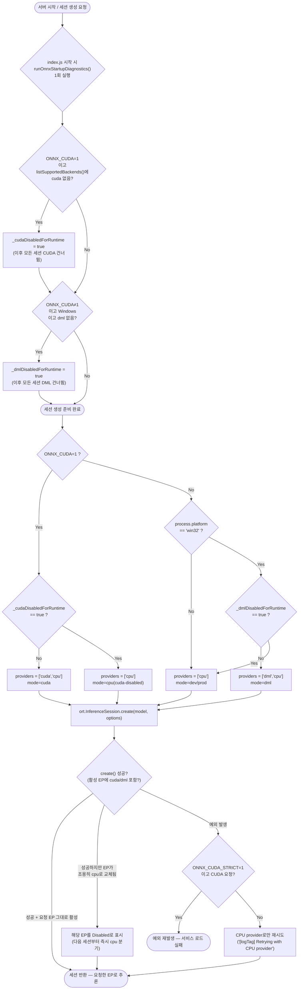

# DESIGN DOCUMENT
# AI Module - CUDA Acceleration for Video Analytics

| | |
|---|---|
| Document ID | DESIGN-LTS-AI-CUDA-01 |
| Version | 1.6 |
| Status | Active |
| Date | 2026-07-28 |
| Parent SRS | srs/SRS_AI_CUDA_Acceleration.md |

---

## 1. Architecture Overview

The CUDA support design introduces a shared ONNX session factory in utils layer and routes all AI model services through the same session creation policy.

```text
service/*.js
  -> utils/onnxOptions.getOnnxSessionOptions()
  -> utils/onnxOptions.createOnnxSession()
       -> try preferred providers [cuda,cpu] when ONNX_CUDA=1
  -> try preferred providers [dml,cpu] on Windows when ONNX_CUDA=0
       -> fallback providers [cpu] when allowed

server/src/index.js
  -> utils/onnxOptions.runOnnxStartupDiagnostics()
  -> enumerate listSupportedBackends once
  -> pre-disable unavailable CUDA/DML providers
```

### 1.1 Provider 선택 흐름도 (CPU / DML / CUDA) — v1.4

`getOnnxSessionOptions()` / `createOnnxSession()` (server/src/utils/onnxOptions.js)의 실제 분기 로직을 그대로 반영한 흐름도입니다.



**핵심 포인트**

- 백엔드 가용성 점검은 서버 시작 시 **1회**(`runOnnxStartupDiagnostics`)만 수행되고, 이후 모든 세션 생성은 그 결과(`_cudaDisabledForRuntime`/`_dmlDisabledForRuntime` 플래그)를 재사용한다 — 매 세션마다 반복 진단하지 않는다.
- `ONNX_CUDA=1`이 최우선이며, Windows에서 `ONNX_CUDA`가 설정되지 않은 경우에만 DML이 기본으로 선택된다. CUDA와 DML을 동시에 시도하지는 않는다.
- `InferenceSession.create()`가 예외 없이 성공해도 ORT 빌드에 따라 요청한 EP가 조용히 cpu로 대체될 수 있어, 활성 `session.executionProviders`를 확인해 실제로 EP가 적용됐는지 재검증한다.
- `ONNX_CUDA_STRICT=1`은 CUDA 요청이 실패했을 때만 의미가 있으며, 이 경우 CPU 폴백 없이 즉시 예외를 던져 운영자가 명시적으로 실패를 인지하도록 한다.

---

## 2. File-Level Design

- server/src/utils/onnxOptions.js
  - getOnnxSessionOptions(): mode-based provider/thread policy
  - createOnnxSession(): CUDA attempt + optional CPU fallback
  - runOnnxStartupDiagnostics(): one-time startup backend diagnostics and provider pre-disable
- server/src/utils/providerDiagnostics.js
  - getProviderDiagnostics(): CUDA/DML/CPU 가용성 상태 구조체 반환
  - getBatchInferenceInfo(): 배치 추론 환경변수(BATCH_MAX_SIZE, BATCH_MAX_WAIT_MS) 설정값 반환
- server/src/utils/onnxDllPath.js (v1.4)
  - ensureOnnxCudaDllPath(): Windows CUDA EP가 cudnn/cuda 런타임 dll을 LoadLibrary로 찾도록 addon bin 폴더를 PATH 맨 앞에 추가 (§12.3). server/src/index.js 최상단(dotenv 로드 직후)에서 1회 호출.
- server/src/services/detection.js
  - detectBatch(jpegBuffers[]): [B,3,640,640] 배치 텐서 단일 session.run()
  - supportsBatch getter: 배치 추론 지원 여부
- server/src/services/batchDetectionQueue.js
  - BatchDetectionQueue: 멀티카메라 프레임 배치 큐 (enqueue/flush/fallback)
- server/src/services/faceService.js
- server/src/services/protectiveEquipService.js
- server/src/services/fireSmokeService.js
- server/src/services/colorClothService.js
- server/src/scripts/checkGpuProviders.js — CLI 진단 스크립트 (npm run check:gpu)
- server/src/index.js (startup diagnostics invocation)

All listed services consume the shared session creation helper.

---

## 3. Runtime Policy

### 3.1 Environment Variables

- ONNX_CUDA=1 enables preferred CUDA provider chain.
- ONNX_CUDA_STRICT=1 enforces fail-fast when CUDA init fails.
- ONNX_THREADS_CUDA controls intra-op threads in CUDA mode.
- On Windows with ONNX_CUDA=0, provider preference is DirectML first.
- BATCH_MAX_SIZE: 배치 최대 크기 (기본값 4, 멀티카메라 배치 추론).
- BATCH_MAX_WAIT_MS: 배치 최대 대기 시간 ms (기본값 33, 30fps 기준).

### 3.2 Decision Matrix

- ONNX_CUDA=0: use cpu providers.
- ONNX_CUDA=0 + Windows + DML available: use dml providers.
- ONNX_CUDA=0 + Windows + DML unavailable: pre-disable DML and use cpu providers.
- ONNX_CUDA=1 + CUDA ready: use cuda providers.
- ONNX_CUDA=1 + CUDA unavailable + strict off: fallback to cpu.
- ONNX_CUDA=1 + CUDA unavailable + strict on: throw error.

---

## 4. Error Handling

- CUDA session create exceptions are caught centrally in createOnnxSession.
- CPU fallback path logs the original CUDA error message.
- Strict mode rethrows error to preserve explicit operator intent.

---

## 5. Operational Notes (Windows and Linux)

- Both OS paths use identical env controls and session policy.
- OS-specific differences are handled by CUDA driver/toolkit packaging, not by service code branching.

---

## 6. Verification Hooks

- onnxOptions startup log indicates selected mode/provider list.
- service load logs show per-model load result and fallback events.
- startup-check log indicates supported backend list and pre-disable decisions.

---

## 7. SDLC Amendment (v1.1)

- Added startup diagnostics control flow in `server/src/index.js`.
- Added provider pre-disable design to reduce repeated unavailable-provider noise.
- Added Windows DML-first runtime policy in decision matrix.

---

## 9. 멀티카메라 배치 추론 아키텍처 (v1.2)

여러 카메라에서 동시에 도착하는 JPEG 프레임을 단일 ONNX `session.run()` 호출로 처리합니다.

### 9.1 배치 큐 동작 원리

```text
카메라 A → enqueue(jpegA) ─┐
카메라 B → enqueue(jpegB) ─┤→ BatchDetectionQueue._flush()
카메라 C → enqueue(jpegC) ─┘       → detectBatch([jpegA, jpegB, jpegC])
                                          → session.run([B,3,640,640])
                                          → [resultA, resultB, resultC]
```

- `BATCH_MAX_SIZE` 개수가 채워지거나 `BATCH_MAX_WAIT_MS` 경과 시 즉시 플러시
- `detectBatch()` 실패 시 각 프레임을 개별 `detect()`로 fallback 처리

### 9.2 CUDA vs DML 배치 처리 차이

| 구분 | CUDA (Linux/Windows) | DirectML (Windows 전용) |
|---|---|---|
| SM 포화율 | 배치 단위 CUDA kernel launch → GPU SM 효율 극대화 | DML Command Queue 오버헤드 절감 |
| 배치 이점 | 고배치(B≥4)에서 현저한 속도 향상 | 중간 배치(B=2~4)에서 오버헤드 절감 |
| nvidia-smi | GPU 사용률 정상 표시 | GPU 사용률 0% (DirectML 특성) |
| 권장 모니터링 | nvidia-smi dmon | Windows 작업 관리자 → GPU |

### 9.3 배치 실패 Fallback 설계

- `detectBatch()` 예외 발생 시 `_supportsBatch` 플래그를 `false`로 전환
- 이후 모든 프레임은 단건 `detect()`로 우회하여 서비스 중단 없이 처리
- fallback 전환 로그: `[batchDetectionQueue] detectBatch failed — switching to single-frame fallback`

---

## 10. Provider 가용성 진단 (v1.2)

### 10.1 npm run check:gpu 사용법

```bash
cd server
npm run check:gpu
```

### 10.2 진단 항목

| 진단 항목 | 설명 |
|---|---|
| NVIDIA GPU 존재 여부 | nvidia-smi 실행 결과 파싱 |
| CUDA Toolkit 버전 | nvcc --version 확인 |
| cuDNN 라이브러리 | libcudnn 파일 존재 여부 (Linux) |
| ORT CUDA Provider | ort.listSupportedBackends() 내 cuda 존재 여부 |
| ORT DirectML Provider | ort.listSupportedBackends() 내 dml 존재 여부 |
| 배치 추론 설정 | BATCH_MAX_SIZE, BATCH_MAX_WAIT_MS 현재값 |
| 권장 Provider | 환경 기반 추천 (cuda/dml/cpu) |

### 10.3 진단 출력 예시

```
[LTS GPU Provider Diagnostics]
  nvidia-smi    : OK (NVIDIA GeForce RTX 3080, Driver 525.85.12)
  CUDA Toolkit  : OK (nvcc 12.1)
  cuDNN         : OK (/usr/lib/libcudnn.so.8)
  ORT CUDA      : AVAILABLE
  ORT DirectML  : NOT AVAILABLE
  Batch Config  : MAX_SIZE=4, MAX_WAIT=33ms
  Recommended   : cuda

→ ONNX_CUDA=1 설정 권장
```

---

## 8. Requirements Traceability Matrix

| SRS Requirement | Verification Test Case(s) | Verification Scope |
|---|---|---|
| FR-CUDA-001 | TC-CUDA-A-001, TC-CUDA-A-002 | ONNX_CUDA env-based provider selection |
| FR-CUDA-002 | TC-CUDA-A-002 | CUDA provider priority order |
| FR-CUDA-003 | TC-CUDA-A-003 | CUDA failure with CPU fallback |
| FR-CUDA-004 | TC-CUDA-A-004 | Strict mode fail-fast behavior |
| FR-CUDA-005 | TC-CUDA-B-001, TC-CUDA-B-002, TC-CUDA-B-003 | Shared session helper coverage by services |
| FR-CUDA-006 | TC-CUDA-C-001 | Startup mode/provider logging |
| FR-CUDA-007 | TC-CUDA-C-002 | Fallback reason and retry logging |
| FR-CUDA-008 | TC-CUDA-D-001, TC-CUDA-D-002 | Cross-OS env control compatibility |
| FR-CUDA-009 | TC-CUDA-A-001 | CPU-only path continuity |
| FR-CUDA-010 | TC-CUDA-E-001 | One-time startup diagnostics execution |
| FR-CUDA-011 | TC-CUDA-E-001 | listSupportedBackends visibility at boot |
| FR-CUDA-012 | TC-CUDA-E-003 | Windows DML-first provider policy |
| FR-CUDA-013 | TC-CUDA-E-004 | DML pre-disable + CPU fallback continuity |
| FR-CUDA-014 | TC-GPU-001, TC-GPU-002, TC-GPU-003 | Provider 가용성 진단 구조 검증 |
| FR-CUDA-015 | TC-GPU-004 | 배치 추론 환경변수 반영 |
| FR-CUDA-016 | TC-GPU-005 | checkGpuProviders CLI 스크립트 정상 실행 |
| FR-CUDA-017 | TC-BATCH-001, TC-BATCH-002, TC-BATCH-003 | BatchDetectionQueue enqueue/flush 동작 |
| FR-CUDA-018 | TC-BATCH-004 | BATCH_MAX_WAIT_MS 타임아웃 플러시 |
| FR-CUDA-019 | TC-BATCH-005 | detectBatch() 실패 시 단건 fallback |
| FR-CUDA-020 | TC-BATCH-006, TC-BATCH-007 | detectBatch() 배치 텐서 shape 및 결과 수 검증 |
| FR-CUDA-021 | TC-BATCH-008 | supportsBatch 초기값 |
| FR-CUDA-022 | TC-CUDA-H-002 | Windows CUDA 소스 빌드 파이프라인 (§12.2) |
| FR-CUDA-023 | TC-CUDA-H-001 | onnxDllPath.js 런타임 DLL 검색 경로 보정 (§12.3, §1.1) |

---

## 11. CUDA Toolkit 자동 설치 지원 (v1.3)

### 11.1 배경 및 문제

Windows에서 cuDNN을 EXE 인스톨러로 설치하면 **CUDA 버전별 서브디렉토리** 구조로 라이브러리가 배치됩니다.

```
C:\Program Files\NVIDIA\CUDNN\v9.23\
  ├── bin\12.9\x64\cudnn64_9.dll    ← CUDA 12.9 전용
  ├── include\12.9\cudnn.h
  └── lib\12.9\x64\cudnn.lib
```

이 경우 CUDA Toolkit 버전(예: 12.8)과 cuDNN이 지원하는 CUDA 버전(예: 12.9)이 다르면 ORT CUDA 소스 빌드가 링크 단계에서 실패합니다. 기존 `build-ort:auto` 는 이 불일치를 감지하지 못하고 빌드를 시작했다가 실패했습니다.

### 11.2 변경 사항

#### `providerDiagnostics.js` — `cudnnCudaVersion` 필드 추가

Windows EXE 설치 방식 cuDNN 감지 시 `bin/{cudaVer}/{arch}/` 경로에서 CUDA 버전을 추출하여 반환 구조체에 `cudnnCudaVersion` 필드로 추가합니다.

```js
// 변경 전
{ available: true, path: 'C:/..../bin/12.9/x64/cudnn64_9.dll', version: '9.x' }

// 변경 후
{ available: true, path: '...', version: '9.x', cudnnCudaVersion: '12.9' }
```

#### `buildOrtWithCuda.js` — 버전 불일치 감지 + `--ensure-cuda` 옵션

`getProviderDiagnostics()` 실행 후 cuDNN의 CUDA 버전과 설치된 Toolkit 버전을 비교합니다.

```
cuDNN cudnnCudaVersion   vs   CUDA Toolkit version
      "12.9"             vs         "12.8"         → ⚠️ 불일치 감지
```

불일치 감지 시 동작:

| 옵션 | 동작 |
|---|---|
| (없음) | 오류 메시지 + 해결 방법 3가지 출력 후 종료 |
| `--ensure-cuda` | `ensure-cuda-toolkit.windows.ps1` 자동 실행 → 필요 버전 설치 |
| `--ensure-cuda:dry` | `ensure-cuda-toolkit.windows.ps1 -ShowUrls` → 다운로드 URL 목록 출력 후 종료 |

`deriveCudnnCudaVersion()` 헬퍼도 추가하여 `cudnnCudaVersion` 필드가 없는 경우 경로 패턴에서 CUDA 버전을 fallback 추출합니다.

#### `ensure-cuda-toolkit.windows.ps1` — 신규 스크립트

| 기능 | 설명 |
|---|---|
| 이미 설치된 경우 | `CUDA_PATH_V{major}_{minor}` 환경변수/기본 경로 확인 후 바로 `CUDA_HOME=<경로>` 출력 |
| winget 설치 | `winget install Nvidia.CUDA.{major}.{minor} --silent` 시도 |
| 직접 다운로드 | NVIDIA CDN에서 네트워크 인스톨러 다운로드 (진행 표시 막대 포함) |
| 자동 설치 | `-s cuda_nvcc cuda_cudart cuda_cublas ...` 무인 설치 |
| 완료 출력 | `CUDA_HOME=<경로>` 를 stdout 마지막 줄에 출력 → `buildOrtWithCuda.js` 파싱 |

지원 옵션:

- `-RequiredVersion "12.9"` — 필수, 설치할 CUDA 버전
- `-DownloadOnly` — 설치 없이 인스톨러만 다운로드
- `-ShowUrls` — URL 목록만 출력 후 종료
- `-WingetOnly` — winget 방식만 시도
- `-AllowInsecureTls` — 사내망 TLS 우회

### 11.3 다운로드 진행 표시

`Invoke-WebRequest`(진행 표시 없음) 대신 `System.Net.HttpWebRequest` 스트림 직접 읽기로 5 MB 단위 ASCII 막대를 출력합니다.

```
  총 파일 크기: 13.9 MB
  ┌─────────────────────────────────────────────────────┐
  │  진행     다운로드량           속도         ETA     │
  ├─────────────────────────────────────────────────────┤
  │  36% [███████░░░░░░░░░░░░░]   5.0/ 13.9 MB    908 KB/s     10s │
  │  72% [██████████████░░░░░░]  10.0/ 13.9 MB   1.12 MB/s      3s │
  │ 100% [████████████████████]  13.9 MB   1.21 MB/s  완료  │
  └─────────────────────────────────────────────────────┘
  ✅ 다운로드 완료: 13.9 MB / 11.5초
```

### 11.4 npm 스크립트

| 스크립트 | 설명 |
|---|---|
| `npm run ensure-cuda` | cuDNN 호환 CUDA 버전 자동 탐지 + 설치 |
| `npm run ensure-cuda:dry` | 설치 없이 URL 목록만 출력 |
| `npm run ensure-cuda:urls` | 모든 버전의 NVIDIA 다운로드 URL 출력 |

### 11.5 추가된 파일

| 파일 | 역할 |
|---|---|
| `server/src/scripts/ensure-cuda-toolkit.windows.ps1` | CUDA Toolkit 버전별 자동 설치 (Windows 전용) |

---

## 12. Windows CUDA 소스 빌드 및 런타임 DLL 검색 경로 (v1.4)

### 12.1 배경

공식 onnxruntime-node npm 사전 빌드 바이너리는 Windows에서 WebGPU/DirectML만 제공하고 CUDA 실행 프로바이더는 포함하지 않는다(Linux x64 사전 빌드에만 CUDA 포함). C++ 애드온 소스 자체에는 플랫폼 제외 조건이 없고 `USE_CUDA` 컴파일 플래그로만 게이팅되므로, `build-onnxruntime-source.windows.ps1`로 ORT를 CUDA와 함께 소스 빌드하면 Windows에서도 동작 가능한 CUDA EP를 얻을 수 있다(실제 세션 생성 + 추론 성공으로 검증 완료).

### 12.2 빌드 파이프라인 (`build-onnxruntime-source.windows.ps1`)

```text
[1/4] ORT 소스 clone/checkout (v1.26.0)
[2/4] 네이티브 ORT 빌드 (CMake + CUDA, onnxruntime.dll / onnxruntime_providers_cuda.dll 등)
[3a/4] js/ 워크스페이스 루트 npm ci (핀된 typescript 설치 — TS5108/TS5011 방지)
[3b/4] js/node npm install (TypeScript 컴파일만 수행, 네이티브 애드온은 미컴파일)
[3c/4] js/node 네이티브 N-API 애드온 CUDA 빌드
         - node ./script/build --config=Release --use_cuda --onnxruntime-build-dir=<path>
         - cmake-js 내부 VS 자동탐지가 최신 버전(예: VS Insiders 프리뷰)을 우선 선택해
           C++ 툴셋 누락으로 실패할 수 있으므로, $env:npm_config_msvs_version="2022" 로
           강제 지정 (cmake-js는 npm_config_* 환경변수를 npm config로 읽음)
         - --dll_deps/--onnxruntime-generator CLI 플래그는 공백 포함 경로("C:\Program Files\...")에서
           깨지므로(spawnSync shell:true 가 공백 기준으로 재분해) 사용하지 않고,
           빌드 성공 후 스크립트가 직접 Copy-Item 으로 onnxruntime_providers_cuda.dll /
           onnxruntime_providers_shared.dll / CUDA·cuDNN 런타임 dll 을
           js/node/bin/napi-v6/win32/x64/ 에 복사
[4/4] server/node_modules 에 로컬 onnxruntime-node 설치 (--no-save)
```

### 12.3 런타임 DLL 검색 경로 문제 (실행 시점, 빌드 시점 아님)

애드온 빌드와 dll 복사가 모두 성공해도, `onnxruntime_providers_cuda.dll`이 실행 중 `LoadLibrary("cudnn64_9.dll")`처럼 파일명만으로 동적 로드할 때 Windows 기본 DLL 검색 순서는 **프로세스 실행 파일(node.exe)의 폴더**와 PATH부터 시작하며, 애드온 자신이 위치한 폴더(`bin/napi-v6/win32/x64/`)는 포함하지 않는다. 그 결과 dll이 물리적으로 존재해도 `InferenceSession.create()`가 `Invalid handle. Cannot load symbol cudnnCreate`로 실패한다.

**해결**: `server/src/utils/onnxDllPath.js`의 `ensureOnnxCudaDllPath()`가 `require.resolve('onnxruntime-node/package.json')` 기준으로 애드온 dll 폴더를 계산해 `process.env.PATH` 맨 앞에 추가한다. `server/src/index.js`에서 dotenv 로드 직후, 다른 모든 require보다 먼저(어떤 서비스가 CUDA 세션을 생성하기 전에) 1회 호출한다.

### 12.4 검증 방법

빌드 성공 여부는 `npm install` 종료 코드만으로 판단하지 말고 반드시 다음을 확인한다:

- `server/node_modules/onnxruntime-node/bin/napi-v6/win32/x64/onnxruntime_binding.node` 존재 여부
- 실제 `ort.InferenceSession.create(model, {executionProviders:['cuda','cpu']})` + `session.run()` 스모크 테스트 성공 여부 (CPU로 조용히 폴백하거나 크래시할 수 있으므로 세션 생성 성공만으로는 불충분)

---

## Revision History

| 버전 | 날짜 | 변경 내용 |
|---|---|---|
| 1.0 | 2026-06-05 | 초기 작성 |
| 1.1 | 2026-06-05 | 시작 진단 흐름, provider pre-disable, Windows DML 정책 추가 |
| 1.2 | 2026-06-26 | 멀티카메라 배치 추론 아키텍처 (§9), Provider 가용성 진단 (§10), providerDiagnostics.js·batchDetectionQueue.js 파일 설계 추가, 배치 환경변수 문서화, RTM 확장 (FR-CUDA-014~021) |
| 1.3 | 2026-07-27 | CUDA Toolkit 자동 설치 지원 (§11): cudnnCudaVersion 필드, --ensure-cuda 옵션, ensure-cuda-toolkit.windows.ps1, 다운로드 진행 표시 설계 추가 |
| 1.4 | 2026-07-28 | Windows CUDA 소스 빌드 파이프라인 및 런타임 DLL 검색 경로 이슈 (§12) 추가: cmake-js VS 자동탐지 강제 지정, --dll_deps 인자 손상 우회(직접 Copy-Item), onnxDllPath.js 런타임 PATH 보정 |
| 1.5 | 2026-07-28 | CPU/DML/CUDA Provider 선택 흐름도(§1.1, Mermaid) 추가 — onnxOptions.js의 실제 분기 로직(startup diagnostics, 세션별 provider 결정, 조용한 EP 교체 감지, strict 모드) 반영. analysis 모드 서버 실제 기동으로 CUDA EP 정상 동작 재검증(모든 AI 서비스 providers=["cuda","cpu"]) |
| 1.6 | 2026-07-28 | RTM(§8)에 흩어져 있던 FR-CUDA-014~021 행을 §8 표로 통합 정리하고 FR-CUDA-022(Windows CUDA 소스 빌드)·FR-CUDA-023(onnxDllPath.js 런타임 DLL 경로 보정) 행 추가(§12 연결). SRS v1.3·RFP v1.3·PRD v1.3·TC v1.3(신규 TC-CUDA-H 그룹) 상위 문서 동기화 |
