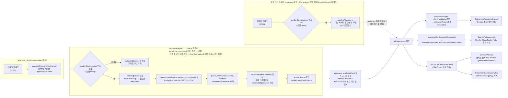

# DESIGN DOCUMENT
# AI Module — Gender Classification

| | |
|---|---|
| **Document ID** | DESIGN-LTS-AI-GEN-01 |
| **Version** | 1.1 |
| **Status** | Proposed (opt-in) |
| **Date** | 2026-07-14 |
| **Parent SRS** | [SRS_AI_Gender_Classification](../srs/SRS_AI_Gender_Classification.md) |
| **Related** | [Design_AI_Age_Estimation](Design_AI_Age_Estimation.md), [Design_AI_Model_Catalog](Design_AI_Model_Catalog.md), [Design_AI_Cloth_Analysis](Design_AI_Cloth_Analysis.md) |

---

## 목차

1. [개요](#1-개요)
2. [아키텍처 개요](#2-아키텍처-개요)
3. [파일 구조](#3-파일-구조)
4. [모델 카탈로그 통합](#4-모델-카탈로그-통합)
5. [PT→ONNX 변환 — 기존 `hfOptimumExport` 재사용](#5-ptonnx-변환--기존-hfoptimumexport-재사용)
6. [GenderClassificationService 설계](#6-genderclassificationservice-설계)
7. [입력 소스 폴백 로직 — 두 진입점](#7-입력-소스-폴백-로직--두-진입점)
8. [Admin Dashboard 통합](#8-admin-dashboard-통합)
9. [데이터 모델](#9-데이터-모델)
10. [오류 처리 및 한계](#10-오류-처리-및-한계)
11. [검증 (Verification)](#11-검증-verification)
12. [라인 플로우 — 프레임에서 화면까지](#12-라인-플로우--프레임에서-화면까지)

---

## 1. 개요

Gender Classification은 추적된 person에 대해 정밀 성별 예측을 수행하는 opt-in AI 모듈이다. 기존 cloth-PAR(`colorClothService.js`)이 부산물로 내놓는 `gender` 속성과 독립적으로 동작하며, Admin Dashboard에서 두 모델(InsightFace GenderAge / ViT Gender Classifier) 중 하나를 선택해 활성화한다 — Age Estimation의 설계·구현 패턴을 그대로 재사용한다.

**Age Estimation과의 결정적 차이 — 두 진입점 동시 구현**: Age Estimation은 2026-07-12에 `pipelineManager.js`의 로컬 카메라 루프에만 구현되었고, `SERVER_MODE=streaming`이 위임하는 `analysisApi.js`의 `POST /frame` 핸들러에는 2026-07-14까지 전혀 연동되지 않아 streaming 배포에서 `estimatedAge`가 절대 나타날 수 없는 구조적 결함이 있었다(§12.1 참고, `Design_AI_Age_Estimation.md` §12.1에 상세 기록). Gender Classification은 이 교훈을 반영해 **최초 구현부터 두 진입점을 동시에 작성**했다.

## 2. 아키텍처 개요

```
┌──────────────────────────────────────────────────────────────────────────┐
│                       SERVER (analysis / combined mode)                   │
│                                                                            │
│  routes/analysisApi.js                                                    │
│   ├─ EXTENDED_CATALOG += gender-classification (2 entries)                │
│   ├─ _activeFileForEntry()  — case 'gender-classification'               │
│   ├─ /models/switch          — case 'gender-classification'               │
│   ├─ /models/deactivate      — case 'gender-classification'               │
│   ├─ /models/download        — entry.hfOptimumExport 분기 재사용(신규 아님)│
│   └─ POST /frame 핸들러      — Gender Classification 추론 블록 (신규,     │
│      Age Estimation과 달리 최초 구현부터 포함)                            │
│                                                                            │
│  services/genderClassificationService.js (신규)                          │
│   ├─ load()/reload()/unload()/ready/status                               │
│   └─ classifyGender(jpegBuffer, bbox, {isFaceCrop})                      │
│        → {value:'male'|'female', confidence, source, modelId}            │
│                                                                            │
│  services/pipelineManager.js                                              │
│   ├─ this._genderClassification = new GenderClassificationService()      │
│   ├─ lazy-load in _doStartCamera()                                        │
│   └─ 로컬 카메라 루프: Age Estimation 블록 직후 동일 패턴으로 추론        │
│                                                                            │
│  services/tracking.js                                                     │
│   └─ Track에 estimatedGender 필드 + updateEstimatedGender() 추가          │
│                                                                            │
│  services/analyticsConfig.js                                              │
│   └─ DEFAULT_CONFIG.genderClassification = false (opt-in)                 │
└──────────────────────────────┬─────────────────────────────────────────────┘
                                │ REST (/api/analysis/models*)
┌──────────────────────────────▼─────────────────────────────────────────────┐
│                   CLIENT — AdminUsersPage.tsx AiModelsSection()            │
│   제네릭 카탈로그 테이블이 gender-classification family를 자동 렌더링      │
│   (신규 컴포넌트 불필요 — 상수 4곳만 갱신)                                │
└─────────────────────────────────────────────────────────────────────────────┘
```

## 3. 파일 구조

```
loitering_tracking/
├── server/
│   ├── models/
│   │   ├── genderage.onnx                # InsightFace GenderAge — Age Estimation과 동일 파일 공유
│   │   └── vit_gender_classifier.onnx    # ViT Gender Classifier (hfOptimumExport 변환 시 생성)
│   └── src/
│       ├── routes/
│       │   └── analysisApi.js          # 카탈로그·switch·download·deactivate·/frame 핸들러
│       └── services/
│           ├── genderClassificationService.js # 신규
│           ├── pipelineManager.js      # 로컬 카메라 루프 연동
│           ├── tracking.js             # Track 필드
│           └── analyticsConfig.js      # genderClassification 토글
└── docs/
    ├── rfp/RFP_AI_Gender_Classification.md
    ├── prd/PRD_AI_Gender_Classification.md
    ├── srs/SRS_AI_Gender_Classification.md
    ├── design/Design_AI_Gender_Classification.md   # 이 문서
    ├── tc/TC_AI_Gender_Classification.md
    ├── mrd/MRD_AI_Gender_Classification.md
    └── ops/Gender_Classification_Guide.md
```

## 4. 모델 카탈로그 통합

**파일:** `server/src/routes/analysisApi.js` — `EXTENDED_CATALOG` 배열

```javascript
// Gender Classification (Proposed) — dedicated gender prediction, independent of the
// PA100k cloth-PAR gender byproduct (see RFP_AI_Gender_Classification.md §9).
{
  id: 'insightface-genderage-gender', label: 'InsightFace GenderAge (buffalo_l)',
  family: 'gender-classification', series: 'Gender Classification',
  file: 'genderage.onnx', size: 96,
  url: 'https://huggingface.co/JackCui/facefusion/resolve/main/gender_age.onnx', // Age Estimation과 동일 파일
  license: 'InsightFace non-commercial research license (acceptable — non-commercial project)',
},
{
  id: 'vit-gender-classifier', label: 'ViT Gender Classifier (rizvandwiki)',
  family: 'gender-classification', series: 'Gender Classification',
  file: 'vit_gender_classifier.onnx', size: 224,
  hfOptimumExport: { repo: 'rizvandwiki/gender-classification-2' },
  license: 'See Hugging Face model card',
  classMap: VIT_GENDER_CLASSES,
},
```

`_activeFileForEntry()`에 추가되는 분기 (기존 `age-estimation` 케이스와 동일 구조):

```javascript
case 'gender-classification':
  return _genderClassification?.ready ? path.basename(_genderClassification.modelPath) : null;
```

## 5. PT→ONNX 변환 — 기존 `hfOptimumExport` 재사용

Age Estimation의 ViT Age Classifier가 이미 `hfOptimumExport`(HuggingFace `optimum.exporters.onnx.main_export`, `task="image-classification"`) 경로를 검증했다. `rizvandwiki/gender-classification-2`도 동일하게 HuggingPics로 생성된 ViT 이미지 분류기이므로, **새 변환 로직 없이** `/models/download` 핸들러의 기존 `entry.hfOptimumExport` 분기가 그대로 처리한다 — family를 구분하지 않는 제네릭 분기이기 때문이다(구현 중 코드 확인 완료).

## 6. GenderClassificationService 설계

**파일:** `server/src/services/genderClassificationService.js` (신규, `ageEstimationService.js` 템플릿)

```javascript
class GenderClassificationService {
  constructor({ modelPath } = {}) { /* status: not_started|missing|loaded|failed */ }
  async load() { /* fs.existsSync 체크 → createOnnxSession */ }
  async reload(filePath) { /* 모델 카탈로그 hot-swap */ }
  unload() { /* session.release?.() */ }
  get ready() {}
  get status() {}
  async classifyGender(jpegBuffer, bbox, { isFaceCrop }) {
    // 활성 모델(this.modelPath 기준)에 따라 전처리/후처리 분기
    // InsightFace: 96×96 BGR → output[0:2] argmax (2-class softmax)
    // ViT:        224×224 RGB, ImageNet 정규화 → 2-class softmax argmax
    // 반환: { value: 'male'|'female', confidence, source: isFaceCrop ? 'face' : 'body', modelId }
  }
}
```

### 6.1 모델별 전처리 계약 (구현 시 실제 ONNX 메타데이터로 재검증 — §11)

| | InsightFace GenderAge | ViT Gender Classifier |
|---|---|---|
| 입력 크기 | 96×96 | 224×224 |
| 채널 순서 | BGR (Age Estimation과 동일 관례) | RGB |
| 정규화 | `(pixel - 127.5) / 127.5` | ImageNet mean/std |
| 출력 | `[1,3]` — gender 2채널(`output[0:2]`) + age 1채널(`output[2]`, 이 서비스는 무시) | `[1,2]` softmax logits (`female`, `male`) |
| 후처리 | `argmax(output[0:2])` — 관례: 0=female, 1=male (업스트림 `insightface`의 `genderage.py` 참고) | `argmax(softmax(logits))` |
| `confidence` | 승자 클래스의 softmax 확률 | 승자 클래스의 softmax 확률 |

**Age Estimation과의 중요한 차이**: `insightface-genderage-gender`는 Age Estimation의 `insightface-genderage` 엔트리와 **동일한 `genderage.onnx` 파일**을 가리킨다. 두 서비스(`AgeEstimationService`, `GenderClassificationService`)는 서로 독립적으로 각자의 ONNX 세션을 열며, 세션을 공유하지 않는다 — 코드 결합도를 낮추기 위한 의도적 선택이다(두 토글이 동시에 켜지면 동일 파일에 대해 세션이 두 번 열리는 약간의 메모리 중복이 발생하지만, 이는 다른 모든 독립 attribute 서비스와 일관된 패턴이다).

`VIT_GENDER_CLASSES`는 `ageEstimationService.js`의 `VIT_AGE_BUCKET_CLASSES` export 패턴과 동일하게 export되어 `analysisApi.js`가 카탈로그 `classMap`으로 연결한다:

```javascript
const VIT_GENDER_CLASSES = ['female', 'male'];
```

## 7. 입력 소스 폴백 로직 — 두 진입점

> **핵심 설계 결정**: 프레임 처리 진입점은 두 곳이며, 최초 구현부터 **둘 다** 작성했다 — Age Estimation이 겪은 "한쪽만 구현 후 후속 수정" 사고(`Design_AI_Age_Estimation.md` §12.1)를 반복하지 않기 위함이다.

**진입점 1 — `server/src/services/pipelineManager.js` 로컬 카메라 루프**

```
For each person object in attrObjects (매 프레임, Age Estimation 블록 직후):
  if analyticsConfig.genderClassification !== true → skip
  if obj.face?.bbox 존재 → _getGenderClassification(jpegBuffer, obj.objectId, obj.face.bbox, isFaceCrop: true)
  else if obj.bbox 존재 → _getGenderClassification(jpegBuffer, obj.objectId, obj.bbox, isFaceCrop: false)
  else → skip (에러 없이 건너뜀)

  _getGenderClassification()는 objectId별 4초 캐시(this._genderClassifyCache) 적용
  결과 → obj.estimatedGender = { value, confidence, source, modelId }
       → behaviorEngine.update()의 {...obj} 스프레드로 enrichedObjects까지 그대로 전파
       → 동시에 tracker.updateEstimatedGender(obj.objectId, obj.estimatedGender)로 track에도 기록
```

**진입점 2 — `server/src/routes/analysisApi.js`의 `POST /frame` 핸들러**

```
_attrPipeline.enrich() 호출 직후, Age Estimation 블록 바로 다음:
  if analyticsConfig.genderClassification !== true → skip
  if enrichedObjects[i].face?.bbox 존재 → classifyGender(..., isFaceCrop: true)
  else if enrichedObjects[i].bbox 존재 → classifyGender(..., isFaceCrop: false)
  else → skip

  모듈-레벨 _genderClassifyCache(Map)/GENDER_CLASSIFICATION_INTERVAL_MS(4000)로 동일 4초 캐시
  (analysisApi.js는 클래스 인스턴스가 아니므로 this.* 대신 모듈 스코프 변수 사용)
  결과 → o.estimatedGender = result
       → tracked: enrichedObjects 응답에 자연히 포함되어 streaming 서버로 전달
```

`tracking.js`의 `Track` 클래스에 `estimatedGender` 필드와 `ByteTracker.updateEstimatedGender(objectId, estimatedGender)` 메서드를 추가 — `estimatedAge`/`updateEstimatedAge()`와 동일한 패턴.

## 8. Admin Dashboard 통합

`client/src/pages/admin/AdminUsersPage.tsx`에 다음 4곳만 갱신 (신규 컴포넌트 없음):

1. `ModelCatalogEntry.family` 유니온에 `'gender-classification'` 추가
2. `EXTENDED_SERIES_ORDER` / `PROPOSED_SERIES`에 `'Gender Classification'` 추가
3. `ADMIN_MODULE_GROUPS`의 `attributes` 그룹에 `genderClassification` 항목 추가
4. 나머지는 `AiModelsSection()`의 제네릭 테이블이 자동 처리

## 9. 데이터 모델

```typescript
// client/src/types/index.ts
export interface EstimatedGender {
  value:      'male' | 'female';
  confidence: number;         // softmax probability of the winning class (0-1)
  source:     'face' | 'body';
  modelId:    string;         // 'insightface-genderage-gender' | 'vit-gender-classifier'
}
```

## 10. 오류 처리 및 한계

| 상황 | 처리 방법 |
|---|---|
| 모델 파일 없음 | `status: 'missing'`, `classifyGender()` 호출 시 `null` 반환 — 파이프라인 정상 계속 |
| face bbox·person bbox 모두 없음 | 해당 프레임에서 조용히 skip |
| `analyticsConfig.genderClassification === false` (기본값) | 크롭 추출·추론 자체가 발생하지 않음 — 성능 영향 0 |
| InsightFace 정확한 gender 채널 순서(0=female/1=male) 미검증 | §11 참조 — 프로덕션 반영 전 실제 모델로 검증 필요 |
| `insightface-genderage-gender`와 Age Estimation의 `insightface-genderage`가 동일 파일을 가리킴 | 의도된 설계(§6.1) — 두 토글이 동시에 켜지면 파일이 두 번 세션을 열지만 정상 동작. 파일 다운로드는 어느 한쪽에서 한 번만 하면 됨(`server/models/genderage.onnx`가 이미 있으면 두 번째 다운로드는 idempotent) |

## 11. 검증 (Verification)

- InsightFace `output[0:2]`의 정확한 gender 채널 순서(0=female, 1=male 관례)가 실제 모델 출력과 일치하는지 — **미검증**: 모델 로드 자체는 예상되나, 실제 얼굴 이미지로 추론해 나온 예측이 실제 성별과 부합하는지는 알려진 샘플로 검증 필요.
- `rizvandwiki/gender-classification-2`가 `optimum.exporters.onnx.main_export(..., task="image-classification")`으로 실제 변환되는지 확인 — Age Estimation의 ViT Age Classifier로 이미 검증된 동일 메커니즘이므로 **낮은 리스크**로 평가되나, 이 특정 체크포인트로는 아직 미검증.
- 두 진입점(로컬 루프·`/frame` 핸들러) 모두에서 `estimatedGender`가 실제로 부착되는지 라이브 트래픽으로 확인 — Age Estimation의 §12.1 사고 재발 방지를 위해 **배포 후 필수 확인 항목**.

## 12. 라인 플로우 — 프레임에서 화면까지

프레임 1장이 들어와 `o.estimatedGender`가 결정되고, 그 값이 DB·화면까지 도달하는 전체 경로를 라인 플로우로 표현한다. Age Estimation(`Design_AI_Age_Estimation.md` §12)과 거의 동일한 구조이나, **두 진입점(LOCAL/AM)이 최초 구현부터 모두 존재**한다는 점이 결정적으로 다르다.



### 12.1 진단 포인트

Age Estimation의 §12.1 진단 표와 동일한 절차가 적용된다 — 단, "G1~G4 전체 미구현" 행(Age Estimation의 실제 2026-07-14 근본 원인)은 Gender Classification에는 **해당하지 않아야 한다**(두 진입점이 최초 구현부터 존재하므로). 그럼에도 배포 후 다음을 확인해 회귀를 방지한다:

| 단계 | 실패 시 증상 | 확인 방법 |
|---|---|---|
| G1 (게이트) | `estimatedGender`가 어디에도 없음 — `color`/`cloth`는 정상 | `GET /api/analytics/config` → `genderClassification` 값 확인 |
| G1 (모델 미로드) | 게이트는 통과하나 `classifyGender()`가 항상 null | `GET /api/analysis/metrics` → `services.genderClassification`(`not_started`/`missing`/`loaded`/`failed`) |
| **회귀 가드**: G1~G4가 `analysisApi.js`에 실제로 존재하는지 | `grep -n "_genderClassification.classifyGender" server/src/routes/analysisApi.js`가 매치되어야 함 — 매치 없으면 Age Estimation과 동일한 사고가 재발한 것 | 코드 검토 시 필수 확인 (TC-GEN-015) |
| P1 (영속화, combined/analysis 모드) | 실시간 화면(P3)엔 보이는데 이력(Detections 탭/검색)엔 없음 | `pipelineManager.js`의 `ctx._trackMeta` flush 분기 중 하나가 최신 커밋 이전 버전일 가능성 |
| **P1B (영속화, streaming 모드 — 2026-07-14 발견, Age Estimation 근본 원인 2와 동일 패턴)** | G1~G4는 정상(classifyGender 자체는 됨)인데 `GET /api/analysis/detection-tracks`(원격 analysis 서버 응답)에 `estimatedGender`가 0건 | 원격 analysis 서버에서 `grep -n "estimatedGender" server/src/routes/analysisApi.js`로 `ctx._trackMeta`/active-flush `fields`/`_completedFields` 3곳 모두에 있는지 확인 — `analysisApi.js`는 `pipelineManager.js`와 완전히 별개 코드 |

> **참고 (2026-07-14)**: Age Estimation의 Fullscreen Detections 타임라인 나이 미표시 재조사(`Design_AI_Age_Estimation.md` §12.2) 과정에서, `analysisApi.js`의 자체 `detectionTracks` 영속화 코드(3곳)가 `estimatedGender`도 함께 누락하고 있었음이 부수적으로 발견됨 — G1~G4(추론 호출)는 §7 설계대로 최초 구현부터 정상 존재했지만, **영속화 코드는 estimation 호출과 별개의 코드 사본**이라 `color`/`cloth`만 있고 `estimatedAge`/`estimatedGender` 둘 다 빠져 있었다. 두 필드를 함께 추가해 수정(FR-GEN-034/TC-GEN-016) — Age Estimation 쪽과 동일 커밋.

---

## Revision History

| 버전 | 날짜 | 변경 내용 |
|---|---|---|
| 1.0 | 2026-07-14 | 초기 작성 — Gender Classification 설계, Age Estimation의 `hfOptimumExport`/진단 필드/영속화 패턴 재사용. §7/§12에 "두 진입점 최초 구현부터 동시 작성" 설계 결정과 Age Estimation 2026-07-14 사고(§12.1 참고) 명시적 반영 |
| 1.1 | 2026-07-14 | §12.1에 P1B 행 신규 — Age Estimation 근본 원인 2(`Design_AI_Age_Estimation.md` §12.2) 조사 중 `analysisApi.js`의 자체 `detectionTracks` 영속화 코드(3곳)가 `estimatedGender`도 누락하고 있었음을 발견(estimation 호출 G1~G4는 정상이었음). FR-GEN-034/TC-GEN-016으로 수정 |
