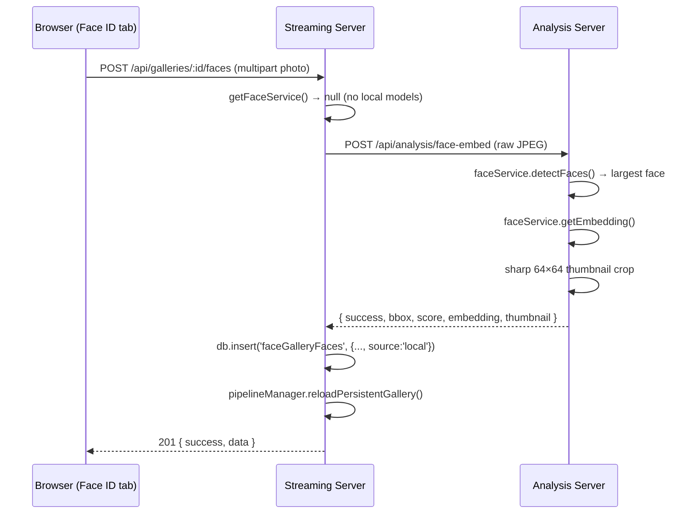
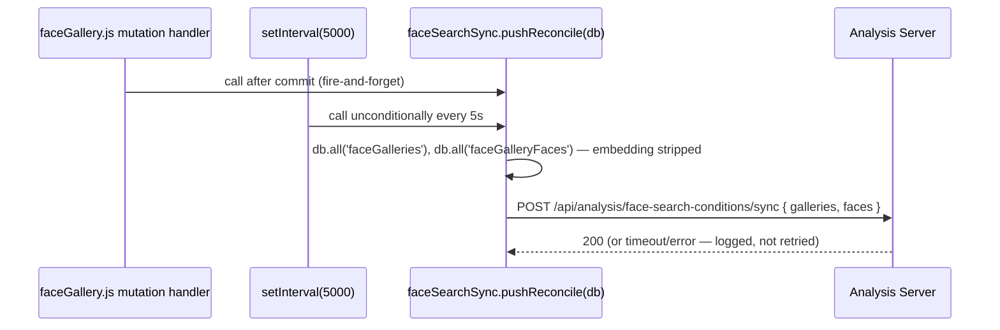

# DESIGN DOCUMENT
# Face Search Condition Sync — Streaming ↔ Analysis

| | |
|---|---|
| **Document ID** | DESIGN-LTS-FSC-01 |
| **Version** | 1.0 |
| **Status** | Active |
| **Date** | 2026-07-08 |
| **Author** | LTS-2026 Engineering |

---

## Table of Contents

1. [Overview](#1-overview)
2. [Enrollment Delegation](#2-enrollment-delegation)
3. [Face Search Condition Mirror](#3-face-search-condition-mirror)
4. [Reconcile Algorithm](#4-reconcile-algorithm)
5. [Dashboard UI](#5-dashboard-ui)
6. [File Change Summary](#6-file-change-summary)

---

## 1. Overview

This document is the implementation-level design for [PRD_Face_Search_Condition_Sync.md](../prd/PRD_Face_Search_Condition_Sync.md) and [SRS_Face_Search_Condition_Sync.md](../srs/SRS_Face_Search_Condition_Sync.md). It extends [Design_Server_Architecture.md](Design_Server_Architecture.md) §3.2/§3.3 (new §3.4) and is cross-referenced from [Design_AI_Face_Recognition.md](Design_AI_Face_Recognition.md).

Two independent mechanisms, sharing no state:

1. **Enrollment delegation** — a synchronous, request-scoped HTTP call from streaming to analysis, used only when the streaming server's local face service isn't loaded.
2. **Face search condition mirror** — an asynchronous, best-effort full-state sync from streaming to analysis, used only for dashboard display.

Neither mechanism changes live per-frame named-gallery matching, which remains entirely on the streaming server via the existing `pipelineManager._assignFaceIds()` / `_persistentGallery` path (unchanged, already correct in distributed mode).

---

## 2. Enrollment Delegation

### 2.1 Sequence



### 2.2 Component Design

| File | Change |
|---|---|
| `server/src/services/faceEnrollHelper.js` (new) | `async function extractFaceForEnrollment(faceService, rawImageBuffer)` — sharp-normalize to JPEG q95 → `faceService.detectFaces()` → pick largest bbox → `faceService.getEmbedding()` → 64×64 `sharp` crop/resize thumbnail. Throws `Error('No face detected...')` / `Error('Could not extract face embedding...')` for the two failure cases; callers map these to `422`. |
| `server/src/routes/analysisApi.js` | New `router.post('/face-embed', express.raw({ type: 'image/jpeg', limit: '10mb' }), async (req, res) => {...})` using the module's own already-loaded `AttributePipeline._face`. Calls `faceEnrollHelper.extractFaceForEnrollment()`, returns the 4-field JSON. |
| `server/src/services/analysisClient.js` | New method `extractFaceEmbedding(jpegBuffer)` — reuses the low-level `_postJpeg()` primitive `analyzeFrame()` already uses, but as an independent method with its own try/catch (no circuit-breaker/backpressure gating, since enrollment is rare and synchronous, not a per-frame call). |
| `server/src/index.js` | Instantiates one dedicated `AnalysisClient` for enrollment delegation when `SERVER_MODE==='streaming' && ANALYSIS_SERVER_URL` is set — **separate instance** from `pipelineManager`'s own lazily-created client (which may not exist until a camera starts). Passes it into `faceGalleryRouter(db, pipelineManager, getFaceService, analysisClient)`. |
| `server/src/api/faceGallery.js` | `POST /:id/faces`: local path is tried first (unchanged); if unavailable and `analysisClient` was injected, delegates via `analysisClient.extractFaceEmbedding(jpegBuf)` and proceeds with the existing DB-insert/response flow using the delegated result. |

### 2.3 Why Not Reuse `pipelineManager._analysisClient`

`pipelineManager`'s own `AnalysisClient` instance is created lazily inside the streaming-mode camera-start path and may be `null` until at least one camera has started. Enrollment must work even with zero cameras configured (matching the existing "FaceService eager startup" guarantee already documented in `PRD_AI_Face_Recognition.md` §2.1). A dedicated instance, constructed once at server boot alongside the router, avoids that race entirely.

---

## 3. Face Search Condition Mirror

### 3.1 Design Decision: No New Table

`faceGalleries`/`faceGalleryFaces` are already unconditionally hydrated on every `SERVER_MODE` (`ALL_TABLES` in `server/src/db/constants.js` is not mode-gated, and `/api/galleries*` is mounted unconditionally in `index.js`). The mirror reuses these same tables with one added field rather than introducing a parallel schema — avoiding a second source of truth and the associated `ALL_TABLES` / `mongoDbService.js` TABLES / `installDb.js` registration overhead a new table would require.

### 3.2 `source` Field

```
faceGalleries.source:     'local' | 'synced'   (default 'local' when absent — pre-existing rows)
faceGalleryFaces.source:  'local' | 'synced'
```

- `'local'`: created via that server's own `POST /api/galleries` / `POST /api/galleries/:id/faces`.
- `'synced'`: written by an incoming `applyReconcile()` call — i.e. mirrored from a streaming server.

### 3.3 Push + Poll — One Function, Two Callers



`server/src/services/faceSearchSync.js`:
```js
async function pushReconcile(db) { /* build snapshot, fire-and-forget POST, 4s timeout, warn-only */ }
function startAutoSync(db) { pushReconcile(db); setInterval(() => pushReconcile(db), 5000).unref(); }
```

Modeled directly on the existing `_forwardToAnalysis()` pattern in `server/src/api/analytics.js:22-49` (own keep-alive `http`/`https` Agent, short timeout, `console.warn` on failure, never blocks the caller).

### 3.4 `faceSearchConditions.js` — Stateless Query/Reconcile Helper

```js
function summarize(db) { /* { total, byType } from db.all('faceGalleries')+('faceGalleryFaces') */ }
function listGrouped(db) { /* full face list with galleryType resolved, embedding excluded */ }
function applyReconcile(db, { galleries, faces }) { /* see §4 */ }
```

No interval, no module-level state — every call reads/writes the DB fresh. This keeps the analysis server's mirror trivially restart-safe: on process restart, the next incoming push/poll simply repopulates it.

---

## 4. Reconcile Algorithm

`applyReconcile(db, snapshot)` runs on the **analysis** server when it receives `POST /api/analysis/face-search-conditions/sync`:

```
incomingGalleryIds = new Set(snapshot.galleries.map(g => g.id))
incomingFaceIds    = new Set(snapshot.faces.map(f => f.id))

for each g in snapshot.galleries:
    upsert faceGalleries row { ...g, source: 'synced' }

for each f in snapshot.faces:
    upsert faceGalleryFaces row { ...f, source: 'synced' }   // embedding absent — set to [] or omitted, never used for matching here

for each existing row in db.all('faceGalleries') where row.source === 'synced':
    if row.id not in incomingGalleryIds: db.delete('faceGalleries', row.id)

for each existing row in db.all('faceGalleryFaces') where row.source === 'synced':
    if row.id not in incomingFaceIds: db.delete('faceGalleryFaces', row.id)

// rows with source === 'local' (or missing source) are never touched by this loop
```

This is a **full-state reconcile**, not an incremental diff — every push/poll cycle re-sends the complete current gallery/face set. Given realistic list sizes (dozens–low hundreds of named-gallery entries), this is simpler and strictly less bug-prone than maintaining ordering/dedup logic for incremental events, at negligible bandwidth cost on the LAN link streaming↔analysis servers already require.

---

## 5. Dashboard UI

### 5.1 Component Tree

```
AnalysisServerDashboard.tsx
  ├─ StatCard "Active Face Search"  (faceSearch.total from /api/analysis/metrics, existing 2s poll)
  │    onClick → setShowFaceSearchPanel(true)
  └─ {showFaceSearchPanel && <FaceSearchConditionPanel onClose={...} />}   (full-screen overlay, same pattern as AnalysisDetectionPanel)

FaceSearchConditionPanel.tsx (new)
  ├─ fetch GET /api/analysis/face-search-conditions on mount
  ├─ group by gallery type using client/src/utils/galleryTypeMeta.ts (GALLERY_TYPE_META/GALLERY_TYPE_ORDER, extracted from FaceGalleryTab.tsx)
  └─ "Add condition" form: name + type select + photo file input
       submit → (create gallery of that type if none exists) → POST /api/galleries
              → POST /api/galleries/:id/faces
              (both same-origin — analysis server already has a ready local face service)
```

### 5.2 Shared Metadata Extraction

`GALLERY_TYPE_META`/`GALLERY_TYPE_ORDER` move from being private to `FaceGalleryTab.tsx` into `client/src/utils/galleryTypeMeta.ts` (pure data, `.ts` not `.tsx`), imported by both `FaceGalleryTab.tsx` and the new panel — a mechanical extraction, not a redesign.

---

## 6. File Change Summary

| File | Type | Purpose |
|---|---|---|
| `server/src/services/faceEnrollHelper.js` | New | Shared detect+embed+thumbnail logic |
| `server/src/services/faceSearchConditions.js` | New | Stateless summarize/listGrouped/applyReconcile |
| `server/src/services/faceSearchSync.js` | New | Streaming-side pushReconcile + startAutoSync |
| `client/src/utils/galleryTypeMeta.ts` | New | Extracted shared gallery-type metadata |
| `client/src/components/FaceSearchConditionPanel.tsx` | New | Dashboard detail/add-condition overlay |
| `server/src/routes/analysisApi.js` | Modified | `/face-embed`, `/face-search-conditions/sync`, `/face-search-conditions`, `faceSearch` in `/metrics` |
| `server/src/services/analysisClient.js` | Modified | `extractFaceEmbedding()` |
| `server/src/api/faceGallery.js` | Modified | Delegation branch, `source` tagging, push-on-mutation |
| `server/src/services/pipelineManager.js` | Modified | `faceSearch` metrics field, 10s `reloadPersistentGallery()` interval |
| `server/src/index.js` | Modified | Dedicated `AnalysisClient` wiring, `startAutoSync()` call |
| `client/src/components/FaceGalleryTab.tsx` | Modified | Import shared metadata instead of local copy |
| `client/src/components/AnalysisServerDashboard.tsx` | Modified | StatCard + overlay wiring, `faceSearch` in `MetricsResponse` |

---

## Revision History

| 버전 | 날짜 | 변경 내용 |
|---|---|---|
| 1.0 | 2026-07-08 | 초기 작성 — 얼굴 등록 위임 + 얼굴 검색 조건 미러링(push+poll) 설계 |
