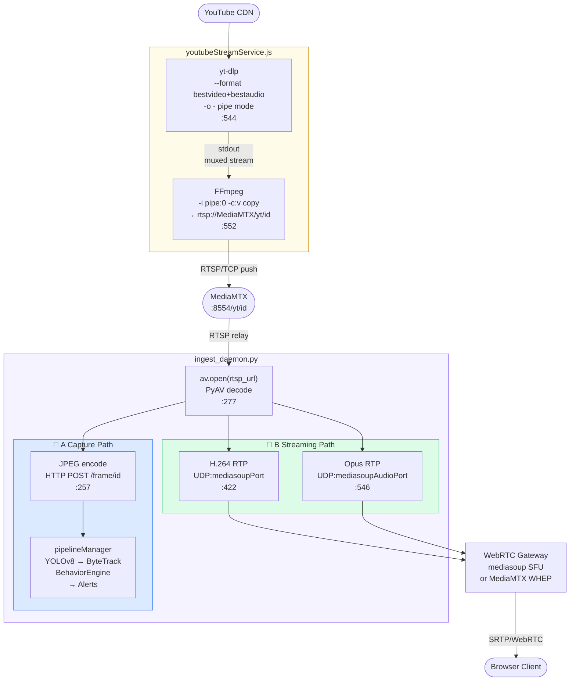

# DESIGN DOCUMENT
# YouTube URL → RTSP Ingest & Virtual Camera Channel

| | |
|---|---|
| **Document ID** | DESIGN-LTS-YT-01 |
| **Version** | 1.2 |
| **Status** | Active |
| **Date** | 2026-06-18 |
| **Parent SRS** | srs/SRS_YouTube_RTSP_Ingest.md |

---

## Table of Contents
1. [Architecture Overview](#1-architecture-overview)
2. [File Structure](#2-file-structure)
3. [Server-Side Design — YouTubeStreamService](#3-server-side-design--youtubestreamservice)
4. [State Machine Design](#4-state-machine-design)
5. [Process Pipeline Design](#5-process-pipeline-design)
6. [Data Model](#6-data-model)
7. [API Design](#7-api-design)
8. [MediaMTX Integration](#8-mediamtx-integration)
9. [Client-Side Design](#9-client-side-design)
10. [Sequence Diagrams](#10-sequence-diagrams)
11. [Configuration & Environment](#11-configuration--environment)
12. [Error Handling](#12-error-handling)

---

## 1. Architecture Overview

```
┌─────────────────────────────────────────────────────────────────┐
│                  Dashboard UI (Browser)                          │
│                                                                   │
│  Add Camera Modal                                                │
│   └─ YouTube Tab (name, URL, resolution, bitrate)               │
│       └─ POST /api/youtube-streams                              │
│                                                                   │
│  CameraGrid Tile                                                  │
│   ├─ 🔴 YT badge                                                 │
│   ├─ Error overlay + Restart button (status=error)              │
│   └─ Standard WebRTC / JPEG stream feed                         │
└────────────────────────┬────────────────────────────────────────┘
                         │ REST API + Socket.IO
┌────────────────────────▼────────────────────────────────────────┐
│                  SERVER (Node.js, port 3080)                     │
│                                                                   │
│  YouTubeStreamService                                            │
│   ├─ createStream(name, youtubeUrl, resolution, bitrate)         │
│   ├─ _startStream(entry)                                         │
│   │    ├─ spawn yt-dlp (pipe mode, stdout→FFmpeg stdin)          │
│   │    ├─ spawn FFmpeg (stdin←yt-dlp, output→MediaMTX)           │
│   │    ├─ START_TIMEOUT timer (30s)                              │
│   │    └─ stderr monitor → _setLive() on RTSP_LIVE_RE match      │
│   ├─ _setLive(entry)  → status:'live', start PipelineManager     │
│   ├─ _stopEntry(entry) → kill yt-dlp → kill FFmpeg (grace)       │
│   ├─ _scheduleRestart() → restartCount++, delay, restart        │
│   ├─ stopAll()          → parallel _stopEntry for all           │
│   └─ init()             → restore YouTube cameras from DB        │
│                                                                   │
│  PipelineManager                                                  │
│   └─ startCamera(camRecord) / stopCamera(id)                    │
│       (standard RTSP pipeline: AI inference, tracking, alerts)  │
└────────────────┬───────────────────────────────────────────────┘
                 │ rtsp://127.0.0.1:8554/yt/<id>
┌────────────────▼───────────────────────────────────────────────┐
│                  MediaMTX (port 8554, 127.0.0.1 only)           │
│   ├─ Receives FFmpeg RTSP publish on /yt/<id>                   │
│   └─ Webhook: POST /internal/mediamtx → _setLive() / restart   │
└────────────────────────────────────────────────────────────────┘
```

---

## 2. File Structure

```
server/src/
├── services/
│   └── youtubeStreamService.js   # YouTubeStreamService class (singleton)
├── api/
│   └── youtubeStreams.js          # Express router for /api/youtube-streams
├── middleware/
│   └── mediamtxWebhook.js         # POST /internal/mediamtx handler
└── utils/
    └── binaryDetect.js            # yt-dlp / ffmpeg binary auto-detection

client/src/
├── components/
│   ├── AddCameraModal.tsx          # Contains YouTube tab
│   ├── EditCameraModal.tsx         # YouTube camera edit form
│   └── CameraView.tsx              # YT badge, error overlay, restart button
└── stores/
    └── cameraStore.ts              # YouTube virtual camera state
```

---

## 3. Server-Side Design — YouTubeStreamService

### 3.1 Class Structure

```javascript
class YouTubeStreamService {
  // In-memory stream registry
  streams = new Map()   // streamId → StreamEntry

  // Lifecycle
  async init()                          // restore from DB on server start
  async createStream(opts)              // validate + spawn + await live
  async stopStream(id)                  // graceful stop
  async restartStream(id)               // reset restartCount + start
  async stopAll()                       // server shutdown cleanup
  async updateStream(id, patch)         // PATCH handler

  // Internal
  _startStream(entry)                   // spawn yt-dlp + FFmpeg
  _setLive(entry)                       // transition to live
  _stopEntry(entry)                     // kill processes
  _scheduleRestart(entry)               // exponential delay + restart
  _detectBinaries()                     // find yt-dlp / ffmpeg paths

  // MediaMTX webhook callbacks
  onMediaMTXPublish(path)               // /yt/<id> → _setLive
  onMediaMTXUnpublish(path)             // /yt/<id> → _scheduleRestart
}

// Singleton export
module.exports = new YouTubeStreamService()
```

### 3.2 Binary Detection

```javascript
// yt-dlp search order
const YTDLP_CANDIDATES = [
  process.env.YTDLP_BIN,
  path.join(os.homedir(), '.local/bin/yt-dlp'),
  '/usr/local/bin/yt-dlp',
  '/usr/bin/yt-dlp',
  'yt-dlp',
]

// FFmpeg: env override or 'ffmpeg' on PATH
const FFMPEG_BIN = process.env.FFMPEG_BIN || 'ffmpeg'
```

### 3.3 Stream Startup

```javascript
async _startStream(entry) {
  const ytdlp = spawn(YTDLP_BIN, [
    '--no-playlist',
    '--format', FORMAT_STRING,          // H.264 priority chain
    '--merge-output-format', 'mkv',     // mkv is natively streamable; mp4 needs seeking
    '-o', '-',
    '--no-progress', '--newline',
    ...(YTDLP_NO_CHECK_CERT ? ['--no-check-certificate'] : []),
    entry.youtubeUrl,
  ], { stdio: ['ignore', 'pipe', 'pipe'] })

  const ffmpeg = spawn(FFMPEG_BIN, [
    '-i', 'pipe:0',                 // No -re: rate controlled by yt-dlp
    '-c:v', 'copy',                 // Copy H.264 — no re-encoding (CPU savings)
    '-c:a', 'aac', '-b:a', '128k', // Re-encode AAC: converts ADTS→MPEG-4 headers
    '-f', 'rtsp', '-rtsp_transport', 'tcp',
    entry.rtspUrl,
  ], { stdio: [ytdlp.stdout, 'pipe', 'pipe'] })

  // Monitor FFmpeg stderr for live detection
  const rl = readline.createInterface({ input: ffmpeg.stderr })
  rl.on('line', line => {
    if (RTSP_LIVE_RE.test(line)) this._setLive(entry)
  })

  entry.ytdlpProcess = ytdlp
  entry.ffmpegProcess = ffmpeg
  entry.startTimer = setTimeout(() => this._handleTimeout(entry), START_TIMEOUT)
}
```

---

## 4. State Machine Design

```
                    createStream()
                         │
                         ▼
                    ┌──────────┐
                    │ starting │
                    └────┬─────┘
                         │ _setLive() (RTSP_LIVE_RE || MediaMTX publish)
                         ▼
              ┌─────── live ────────────────────────────┐
              │          │                               │
              │          │ process exit / MediaMTX      │
              │          │ unpublish                    │ stopStream()
              │          ▼                               │
              │   ┌─────────────┐                       │
              │   │ restarting  │                       │
              │   └──────┬──────┘                       │
              │          │ restartCount < MAX_RESTARTS  │
              │          │──────────────────────────────┤
              │          │ restartCount >= MAX_RESTARTS  │
              │          ▼                               │
              │       ┌───────┐                          │
              │       │ error │                          │
              │       └───────┘                          │
              │                                          │
              └──────────────────────► stopping ────────┘
                                            │
                                            ▼
                                        removed
```

### State Transitions

| From | Event | To | Action |
|---|---|---|---|
| starting | RTSP_LIVE_RE detected | live | `_setLive()`, start pipeline |
| starting | START_TIMEOUT (30s) | removed | reject Promise, delete DB record |
| live | FFmpeg exits / unpublish | restarting | `_scheduleRestart()` |
| live | `stopStream()` | stopping | kill processes |
| restarting | delay elapsed, count < MAX | starting | `_startStream()` |
| restarting | count >= MAX_RESTARTS | error | emit `status:error` |
| error | `restartStream()` | starting | reset count, `_startStream()` |
| stopping | processes killed | removed | delete DB record |

---

## 5. Process Pipeline Design

```
YouTube CDN
    │
    │  HTTP(S) video stream
    ▼
yt-dlp (pipe mode)
    stdout ──────────────────────────────────────┐
    stderr → log                                  │ pipe
                                                  ▼
                                             FFmpeg
                                               ├─ stdin = yt-dlp.stdout
                                               ├─ copy: H.264 (no re-encode)
                                               ├─ audio: AAC 128k (ADTS→MPEG-4)
                                               └─ output: rtsp://127.0.0.1:8554/yt/<id>
                                                          (RTSP over TCP)
                                                               │
                                                               ▼
                                                          MediaMTX
                                                      (port 8554, LAN-hidden)
                                                               │
                                                    ┌──────────┴──────────┐
                                                    │ Webhook             │ RTSP relay
                                                    ▼                     ▼
                                             /internal/mediamtx    PipelineManager
                                              → _setLive()        (AI + tracking + alerts)
```

### 5.1 YouTube 이중 경로 파이프라인 다이어그램

MediaMTX RTSP 변환 이후 `ingest-daemon`에서 **[A] 캡처 경로**와 **[B] 스트리밍 경로**로 분기하는 전체 흐름입니다.

```
YouTube CDN
      │
      │ HTTP(S)
      ▼
  yt-dlp  ──────────────────────────────── youtubeStreamService.js:544
  (pipe mode, -o -)
      │ stdout (muxed video+audio)
      ▼
  FFmpeg  ──────────────────────────────── youtubeStreamService.js:552
  (-i pipe:0, -c:v copy)
      │ RTSP/TCP push
      ▼
  MediaMTX  (:8554, /yt/<channelId>)
      │ RTSP relay
      ▼
  ingest_daemon.py
  av.open(rtsp://127.0.0.1:8554/yt/<id>)  ── ingest_daemon.py:277
  PyAV decode → raw frames
      │
      ├─────────────────────────────┐
      │                             │
      │                             │
🎯 [A] Capture Path          🎥 [B] Streaming Path
  (영상 처리 / 분석)           (실시간 송출)
      │                             │
  JPEG encode                  H.264 RTP passthrough ── ingest_daemon.py:422
  HTTP POST                    → UDP:mediasoupPort
  /api/internal/frame/id       Opus RTP encode       ── ingest_daemon.py:546
      │                        → UDP:mediasoupAudioPort
      │                             │
      ▼                             ▼
  pipelineManager.js          WebRTC Gateway
  YOLOv8 ONNX Detection       (mediasoup SFU / MediaMTX WHEP)
  ByteTrack Tracking               │
  BehaviorEngine               SRTP/WebRTC
  → Socket.IO frameData            │
  → Socket.IO newAlert             ▼
  → AI Analysis Server       Browser Client (React)
    (SERVER_MODE=streaming 시)
```



> **코드 라인 참조** (`:NNN` = `youtubeStreamService.js` 또는 `ingest_daemon.py` 라인)  
> - yt-dlp spawn: `youtubeStreamService.js:544`  
> - FFmpeg spawn: `youtubeStreamService.js:552`  
> - `av.open()` RTSP 수집 진입점: `ingest_daemon.py:277`  
> - AI JPEG POST: `ingest_daemon.py:257` (AI loop)  
> - H.264 RTP 팬아웃: `ingest_daemon.py:422` (vRTP)  
> - Opus RTP 팬아웃: `ingest_daemon.py:546` (aRTP)

### yt-dlp Format String

```
// DASH (separate video+audio) — highest quality, most VODs
bestvideo[ext=mp4][vcodec^=avc][height<=HEIGHT]+bestaudio[ext=m4a]/
bestvideo[vcodec^=avc][height<=HEIGHT]+bestaudio[ext=m4a]/
bestvideo[vcodec^=avc][height<=HEIGHT]+bestaudio/
bestvideo[vcodec^=avc]+bestaudio/
// HLS combined — live streams, age-restricted videos, some VODs
best[vcodec^=avc][height<=HEIGHT]/
best[vcodec^=avc]/
best[height<=HEIGHT]/
best
```

---

## 6. Data Model

### 6.1 StreamEntry (In-Memory)

```typescript
interface StreamEntry {
  id: string             // "yt-a1b2c3d4"
  name: string
  youtubeUrl: string
  rtspUrl: string        // "rtsp://<MEDIAMTX_HOST>:8554/yt/<id>"
  resolution: '1080p' | '720p' | '480p'
  bitrate: number        // kbps (in-memory)
  webrtcEnabled: boolean // true → WebRTC(WHEP), false → JPEG/Socket.IO
  status: StreamStatus
  restartCount: number
  repeatPlayback: boolean
  startedAt?: Date
  ytdlpProcess?: ChildProcess
  ffmpegProcess?: ChildProcess
  startTimer?: NodeJS.Timeout
  restartTimer?: NodeJS.Timeout
  liveResolve?: (cam: CameraRecord) => void
  liveReject?: (err: Error) => void
}
```

### 6.2 Database Record (cameras table)

```json
{
  "id": "yt-a1b2c3d4",
  "name": "My YouTube Stream",
  "type": "youtube",
  "youtubeUrl": "https://www.youtube.com/watch?v=...",
  "rtspUrl": "rtsp://127.0.0.1:8554/yt/yt-a1b2c3d4",
  "resolution": "720p",
  "bitrate": 1500000,
  "repeatPlayback": false,
  "webrtcEnabled": true,
  "status": "offline"
}
```

> **Note:** `bitrate` stored as bps in DB; API and in-memory use kbps. `webrtcEnabled` defaults to `true` for newly created YouTube cameras.

### 6.3 Resolution / Bitrate Map

| Resolution | yt-dlp height filter | Default Bitrate | kbps Range |
|---|---|---|---|
| `1080p` | `height<=1080` | 2500 kbps | 2000–4000 |
| `720p` | `height<=720` | 1500 kbps | 1000–2000 |
| `480p` | `height<=480` | 750 kbps | 500–1000 |

> **Note:** With `-c:v copy`, FFmpeg no longer applies a `-vf scale` filter. Resolution is enforced by the yt-dlp format selector (`height<=HEIGHT`). The `bitrate` field is retained for backward compatibility but does not control FFmpeg encoding when copying.

---

## 7. API Design

### 7.1 Endpoints

| Method | Path | Description |
|---|---|---|
| `POST` | `/api/youtube-streams` | Create virtual camera channel |
| `GET` | `/api/youtube-streams` | List active streams |
| `GET` | `/api/youtube-streams/:id/status` | Get stream status |
| `PATCH` | `/api/youtube-streams/:id` | Update stream properties |
| `DELETE` | `/api/youtube-streams/:id` | Stop and remove stream |
| `POST` | `/api/youtube-streams/:id/restart` | Restart errored stream |

### 7.2 POST /api/youtube-streams

**Request:**
```json
{
  "name": "My Stream",
  "youtubeUrl": "https://www.youtube.com/watch?v=dQw4w9WgXcQ",
  "resolution": "720p",
  "bitrate": 1500,
  "repeatPlayback": false,
  "webrtcEnabled": false
}
```

> `webrtcEnabled` — 선택 필드. `true`이면 브라우저가 WebRTC(WHEP)로 영상을 수신, `false`이면 JPEG/Socket.IO. 기본값: `false`.

**Response (201):**
```json
{
  "success": true,
  "camera": { "id": "yt-a1b2c3d4", "name": "My Stream", "status": "live", ... }
}
```

**Error responses:**

| HTTP | Code | Condition |
|---|---|---|
| 422 | `INVALID_YOUTUBE_URL` | URL fails regex |
| 429 | `MAX_STREAMS_REACHED` | Active streams ≥ MAX_STREAMS (4) |
| 503 | `FFMPEG_NOT_FOUND` | ffmpeg binary not found |
| 504 | `STREAM_TIMEOUT` | Not live within 30s |

### 7.3 PATCH /api/youtube-streams/:id

- Changes to `youtubeUrl`, `resolution`, `bitrate`, or `webrtcEnabled` → restart stream
- Changes to `name` or `repeatPlayback` only → no restart

---

## 8. MediaMTX Integration

### 8.1 Configuration

```yaml
# mediamtx.yml
rtspAddress: 127.0.0.1:8554   # LAN-hidden; loopback only
api: yes
apiAddress: 127.0.0.1:9997
```

### 8.2 Webhook Handler

```javascript
// POST /internal/mediamtx
// Only accepts requests from 127.0.0.1
app.post('/internal/mediamtx', (req, res) => {
  if (req.ip !== '127.0.0.1' && req.ip !== '::1') {
    return res.status(403).json({ error: 'Forbidden' })
  }
  const { action, path } = req.body
  if (action === 'publish') youtubeStreamService.onMediaMTXPublish(path)
  if (action === 'unpublish') youtubeStreamService.onMediaMTXUnpublish(path)
  res.json({ ok: true })
})
```

### 8.3 Path Convention

- RTSP publish path: `/yt/<streamId>` (e.g., `/yt/yt-a1b2c3d4`)
- Internal URL: `rtsp://127.0.0.1:8554/yt/<streamId>`
- PipelineManager treats this as a standard RTSP camera URL

---

## 9. Client-Side Design

### 9.1 Add Camera Modal — YouTube Tab

```
┌─────────────────────────────────┐
│  Add Camera          [×]        │
│  [RTSP]  [YouTube]              │
│  ─────────────────────────      │
│  Channel Name: [____________]   │
│  YouTube URL:  [____________]   │
│  Resolution:   [720p  ▼]        │
│  Bitrate(kbps):[1500       ]    │
│  Repeat Playback: [ ]           │
│  ─────────────────────────      │
│  WebRTC Streaming       [ ●]    │
│  Video via WebRTC (H.264+Audio) │
│                                 │
│  [Cancel]          [Add Stream] │
│    ← Loading spinner (30s) →    │
└─────────────────────────────────┘
```

- "Add Stream" calls `POST /api/youtube-streams` and awaits the response (up to 30s).
- While loading: spinner + "Starting YouTube stream…" message.
- On success: modal closes, camera appears in grid.
- On error: error code mapped to user-friendly message.
- **WebRTC toggle**: `webrtcEnabled` 필드를 POST body에 포함. `true`이면 `SERVER_IP` 환경변수 필요.

### 9.1-B Edit Camera Modal — YouTube 설정 편집

```
┌─────────────────────────────────┐
│  Edit Camera       [YT]  [×]    │
│  ─────────────────────────      │
│  Name: [____________________]   │
│  YouTube URL: [______________]  │
│  Resolution: [720p ▼]  Bitrate  │
│  Repeat Playback: [ ]           │
│  ─────────────────────────      │
│  WebRTC Streaming       [●  ]   │
│  Video via JPEG / Socket.IO     │
│  ─────────────────────────      │
│  Internal RTSP URL (read-only)  │
│                                 │
│  [Cancel]               [Save]  │
└─────────────────────────────────┘
```

- `PATCH /api/youtube-streams/:id` body에 `webrtcEnabled` 포함.
- `webrtcEnabled` 변경 시 스트림 자동 재시작.

### 9.2 YouTube Error Code UI Messages

| Code | Display Message |
|---|---|
| `INVALID_YOUTUBE_URL` | "Invalid YouTube URL. Please check and try again." |
| `MAX_STREAMS_REACHED` | "Maximum 4 YouTube streams allowed." |
| `FFMPEG_NOT_FOUND` | "FFmpeg is not installed on the server." |
| `STREAM_TIMEOUT` | "Stream timed out. YouTube may be unavailable." |

### 9.3 CameraView — YouTube Indicators

```tsx
// YT Badge (always shown for youtube-type cameras)
{camera.type === 'youtube' && (
  <span className="badge bg-red-600 text-white text-xs px-1">YT</span>
)}

// Error overlay
{camera.status === 'error' && (
  <div className="error-overlay">
    Stream error
    <button onClick={() => restartYouTubeStream(camera.id)}>Restart</button>
  </div>
)}
```

---

## 10. Sequence Diagrams

### 10.1 Stream Creation

```
UI                  Server              yt-dlp         FFmpeg        MediaMTX
│                     │                   │               │               │
│─POST /api/youtube──>│                   │               │               │
│ streams             │──spawn yt-dlp────>│               │               │
│                     │──spawn FFmpeg──────────────────>│               │
│                     │  (stdin=yt-dlp.stdout)           │               │
│                     │                   │── download ──>│               │
│                     │                   │               │─publish RTSP─>│
│                     │◄───────────────────── webhook ─────────────────── │
│                     │  _setLive()        │               │               │
│◄── 201 camera ─────│                   │               │               │
```

### 10.2 Server Shutdown (SIGTERM)

```
OS              Node.js             YouTubeStreamService    yt-dlp/FFmpeg
│               │                        │                      │
│─SIGTERM──────>│                        │                      │
│               │──stopAll()────────────>│                      │
│               │                        │──SIGTERM ────────────>│
│               │                        │  (3s grace yt-dlp)   │
│               │                        │  (5s grace ffmpeg)   │
│               │                        │──SIGKILL (if needed)─>│
│               │◄───── all stopped ──── │                      │
│               │──process.exit(0)──────>│                      │
```

---

## 11. Configuration & Environment

| Variable | Default | Description |
|---|---|---|
| `YTDLP_BIN` | auto-detect | Path to yt-dlp binary |
| `FFMPEG_BIN` | `ffmpeg` | Path to ffmpeg binary |
| `YTDLP_NO_CHECK_CERT` | `true` | Disable SSL cert check |
| `NODE_BIN_FOR_YTDLP` | (detected) | Node.js path for yt-dlp JS runtime |
| `YOUTUBE_MAX_STREAMS` | `4` | Maximum concurrent YouTube streams |
| `YOUTUBE_MAX_RESTARTS` | `5` | Max auto-restarts before error state |
| `YOUTUBE_RESTART_DELAY` | `5000` | Restart delay in ms |
| `YOUTUBE_START_TIMEOUT` | `30000` | Stream start timeout in ms |
| `MEDIAMTX_HOST` | `127.0.0.1` | MediaMTX RTSP host |
| `MEDIAMTX_PORT` | `8554` | MediaMTX RTSP port |

---

## 12. Error Handling

### 12.1 Process Exit Handling

```javascript
ffmpeg.on('close', (code, signal) => {
  const isNaturalEnd = code === 0 && signal === null
  if (entry.status === 'stopping' || entry.status === 'removed') return
  if (isNaturalEnd && entry.repeatPlayback) {
    entry.restartCount = 0
    this._scheduleRestart(entry)
  } else {
    this._scheduleRestart(entry)
  }
})
```

### 12.2 Error Code Response Format

```json
{
  "success": false,
  "code": "STREAM_TIMEOUT",
  "error": "Stream did not start within 30 seconds"
}
```

### 12.3 Security

- `youtubeUrl` is passed as an argument array to `spawn()` — never via shell interpolation.
- MediaMTX webhook endpoint (`/internal/mediamtx`) only accepts requests from `127.0.0.1`.
- RTSP URL is `rtsp://127.0.0.1:8554/yt/<id>` — not exposed to LAN.

---

## Document History

| Version | Date | Author | Description |
|---|---|---|---|
| 1.0 | 2026-05-28 | LTS Engineering Team | Initial release — Technical design for YouTube RTSP Ingest |
| 1.1 | 2026-06-17 | LTS Engineering Team | FFmpeg 파이프라인 최적화: libx264 → -c:v copy, HLS 폴백 포맷 셀렉터 추가, webrtcEnabled 기본값 추가 |
| 1.2 | 2026-06-18 | LTS Engineering Team | YouTube 채널 UI에 WebRTC 토글 추가: Add/Edit 폼 모두 webrtcEnabled 필드 지원, API 명세 업데이트 |
| 1.3 | 2026-06-26 | LTS Engineering Team | §5.1 YouTube 이중 경로 파이프라인 다이어그램 추가 (ASCII + Mermaid, 코드 라인 참조 포함) |
