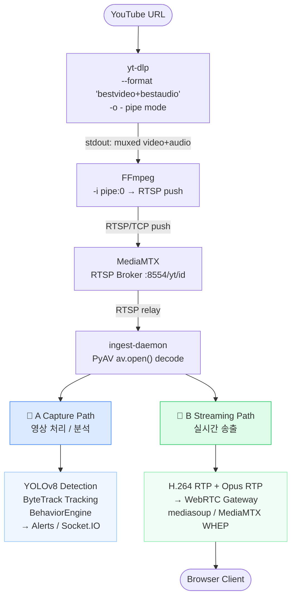

# RFP — YouTube URL → RTSP Ingest & Virtual Camera Channel
**Document ID**: LTS-2026-004  
**Version**: 1.1  
**Date**: 2026-05-20  
**Project**: Loitering Detection & Tracking System (LTS-2026)  
**Status**: Draft

---

## Table of Contents

1. [Overview](#1-overview)
2. [Use Case & Motivation](#2-use-case--motivation)
3. [Proposed Architecture](#3-proposed-architecture)
4. [Technology Selection](#4-technology-selection)
5. [Functional Requirements](#5-functional-requirements)
6. [Non-Functional Requirements](#6-non-functional-requirements)
7. [API Specification](#7-api-specification)
8. [UI / UX Requirements](#8-ui--ux-requirements)
9. [Stream Lifecycle & State Machine](#9-stream-lifecycle--state-machine)
10. [ffmpeg Command Specification](#10-ffmpeg-command-specification)
11. [MediaMTX RTSP Server Configuration](#11-mediamtx-rtsp-server-configuration)
12. [Implementation Plan & Milestones](#12-implementation-plan--milestones)
13. [File & Module Layout](#13-file--module-layout)
14. [Security Considerations](#14-security-considerations)
15. [Limitations & Known Constraints](#15-limitations--known-constraints)
16. [Glossary](#16-glossary)

---

## 1. Overview

The LTS-2026 system currently supports only physical IP cameras whose streams are available via an RTSP URL. Operators frequently need to test the AI analytics pipeline against publicly available reference video (crowd footage, traffic scenes, fire/smoke test clips) **without deploying physical cameras**.

This document specifies requirements for a **YouTube RTSP Ingest** subsystem that:

- Accepts a YouTube URL from the operator via the dashboard UI.
- Resolves the best-quality direct stream URL using **yt-dlp**.
- Re-encodes and publishes the stream as an RTSP endpoint via a local **MediaMTX** server using **FFmpeg**.
- Automatically registers the resulting RTSP URL as a **virtual camera channel** in the LTS camera pipeline, making it indistinguishable from a physical IP camera.
- Supports continuous loop playback (`-stream_loop -1`) so the virtual channel remains live for the duration of the operator session.

---

## 2. Use Case & Motivation

### 2.1 Primary Use Cases

| ID | Actor | Goal |
|----|-------|------|
| UC-1 | System Integrator | Test AI models (crowd loitering, fire/smoke) against real-world YouTube reference videos without physical cameras. |
| UC-2 | QA Engineer | Reproduce specific edge-case scenarios (stadium crowd, rain occlusion, night footage) on demand by pasting a YouTube link. |
| UC-3 | Sales / Demo Engineer | Run a live product demo using publicly available surveillance-style footage, eliminating the need to ship physical cameras to a demo site. |
| UC-4 | Developer | Validate detection accuracy changes against a known, reproducible video fixture. |

### 2.2 Baseline Command

> **Implementation Note (v1.1):** The original baseline used `yt-dlp --get-url` to resolve a direct HTTPS URL and passed it to FFmpeg as `-i <URL>`. Due to corporate network self-signed SSL certificates causing FFmpeg to hang when opening HTTPS URLs, the implementation was changed to use a **pipe mode** where yt-dlp writes to stdout and FFmpeg reads from stdin. This eliminates the SSL issue entirely while preserving functionally identical behaviour.

The core pipeline as implemented:

```bash
# yt-dlp writes to stdout; ffmpeg reads from stdin (pipe:0)
yt-dlp --no-playlist \
  --format "bestvideo[ext=mp4][height<=1080]+bestaudio[ext=m4a]/best[ext=mp4][height<=1080]/best[height<=1080]" \
  -o - --quiet --no-check-certificate "https://youtu.be/XXXXXXXXX" \
| ffmpeg \
  -re -i pipe:0 \
  -c:v libx264 -profile:v main -level 4.1 \
  -preset ultrafast -tune zerolatency \
  -b:v 2000k -maxrate 2000k -bufsize 4000k \
  -vf scale=-2:1080 -g 60 -keyint_min 30 -sc_threshold 0 \
  -c:a aac -b:a 128k -ar 44100 \
  -f rtsp -rtsp_transport tcp \
  rtsp://127.0.0.1:8554/yt/<channelId>
```

**Parameter rationale:**

| Flag | Purpose |
|------|---------|
| `-re` | Read input at native frame rate (real-time); prevents burst ingestion that would overflow downstream buffers. |
| `-i pipe:0` | Read from stdin (yt-dlp pipe); avoids FFmpeg opening HTTPS URLs directly, bypassing SSL certificate issues. |
| `yt-dlp -o -` | Write video bytes to stdout instead of a file; enables the pipe to FFmpeg. |
| `--no-check-certificate` | Required on networks with self-signed SSL certificates (e.g., corporate proxies). |
| `-c:v libx264` | Re-encode to H.264 Baseline/Main profile; ensures compatibility with the LTS FFmpeg inference pipeline. |
| `-preset ultrafast` | Minimise encoding latency at the cost of compression efficiency; acceptable for real-time preview use. |
| `-tune zerolatency` | Remove B-frames and lookahead buffers; reduces end-to-end latency by ~200 ms. |
| `-b:v 2000k` | Target 2 Mbps video bitrate; sufficient for 1080p AI inference. |
| `-c:a aac` | Encode audio as AAC; compatible with the WebRTC media gateway (LTS-2026-003). |
| `-f rtsp -rtsp_transport tcp` | Publish to MediaMTX over TCP RTSP; avoids UDP packet loss on loopback. |

**Loop behaviour:** When the source video ends, yt-dlp's pipe closes and FFmpeg exits. The `youtubeStreamService.js` auto-restart policy (up to 5 retries) re-spawns the pipe, achieving equivalent looping behaviour to `-stream_loop -1`.

---

## 3. Proposed Architecture

### 3.1 High-Level Data Flow

```
[Operator Browser]
      │  POST /api/youtube-streams  { youtubeUrl, name }
      ▼
[LTS Server — youtubeStreamService.js]
      │  1. Validate URL (youtube.com / youtu.be)
      │  2. Spawn: yt-dlp -g <url>  → directUrl
      │  3. Spawn: yt-dlp -o - <url> | ffmpeg -re -i pipe:0 ... rtsp://127.0.0.1:8554/yt/<id>
      │  4. Wait for FFmpeg stdout confirmation ("Output #0 ... rtsp")
      ▼
[MediaMTX RTSP Server]  (localhost:8554)
      │  Path: /yt/<channelId>
      │  RTSP/TCP
      ▼
[LTS Camera Pipeline]  (existing pipelineManager.js)
      │  Camera record: { rtspUrl: "rtsp://127.0.0.1:8554/yt/<id>", type: "youtube" }
      │  Same FFmpeg → inference → Socket.IO / WebRTC path as physical cameras
      ▼
[React WebUI]
      │  Camera tile renders with "YT" badge
      │  Detections, zones, alerts behave identically to physical cameras
```

### 3.1-B YouTube 캡처 파이프라인 — 이중 경로 구조

YouTube 스트림은 수집 단계 이후 **[A] 영상 분석 경로**와 **[B] 실시간 송출 경로**로 분기합니다.



> **핵심**: yt-dlp와 FFmpeg은 YouTube 스트림을 MediaMTX RTSP로 변환하는 전처리 단계입니다.  
> 이후는 IP 카메라와 동일하게 ingest-daemon이 단일 RTSP 세션에서 AI 캡처(A)와 WebRTC 송출(B)을 동시에 처리합니다.

### 3.2 Component Responsibilities

| Component | Responsibility |
|-----------|---------------|
| **`youtubeStreamService.js`** | Lifecycle management of yt-dlp and FFmpeg child processes; RTSP path allocation; health monitoring; restart on failure. |
| **`MediaMTX`** | Lightweight RTSP server running on `localhost:8554`; receives FFmpeg RTSP publish; re-serves to the LTS pipeline and optionally to WebRTC clients. |
| **`cameras.js` API** | Extended to accept `type: "youtube"` and `youtubeUrl` fields; delegates stream creation to `youtubeStreamService.js`. |
| **`CameraEditModal.tsx`** | Extended with a "YouTube Source" toggle that reveals a URL input field and triggers the new API endpoint. |
| **`pipelineManager.js`** | No changes required; consumes the RTSP URL from MediaMTX identically to a physical camera. |

---

## 4. Technology Selection

### 4.1 yt-dlp

| Criterion | Decision |
|-----------|----------|
| **Role** | Extract direct HTTPS stream URL from a YouTube page URL. |
| **Why yt-dlp over youtube-dl** | Actively maintained fork; faster extraction; supports `--format` selector for adaptive streams; returns separate video+audio URLs for muxed formats. |
| **Invocation mode** | Spawned as a child process with `stdout` as a pipe to FFmpeg's `stdin`. Avoids Node.js binding complexity and SSL certificate issues. |
| **Installation** | System package (`pip install yt-dlp`) or Docker image layer. Must be present in `PATH` at server startup. Auto-detected from `~/.local/bin/yt-dlp`, `/usr/local/bin/yt-dlp`, or `PATH`. |
| **Format selection** | `bestvideo[ext=mp4][height<=H]+bestaudio[ext=m4a]/best[ext=mp4][height<=H]/best[height<=H]` — prefers MP4+M4A, caps at configured height, automatically muxed by yt-dlp in pipe mode. |
| **SSL bypass** | `--no-check-certificate` flag required on networks with self-signed or corporate proxy certificates. Controlled by `YTDLP_NO_CHECK_CERT` env var (default: `true`). |

### 4.2 FFmpeg

| Criterion | Decision |
|-----------|----------|
| **Role** | Decode the yt-dlp-resolved stream and re-publish as RTSP H.264. |
| **Version** | ≥ 5.0 with `libx264` encoder enabled. |
| **Process management** | One FFmpeg child process per active YouTube channel. Managed by `youtubeStreamService.js`. |
| **Restart policy** | Auto-restart on exit code ≠ 0 with 5-second back-off; maximum 5 retries before marking channel as `error`. |

### 4.3 MediaMTX (formerly rtsp-simple-server)

| Criterion | Decision |
|-----------|----------|
| **Role** | Local RTSP broker; receives FFmpeg publish; distributes to LTS pipeline. |
| **Why MediaMTX** | Zero-config path creation; supports RTSP, RTMP, HLS, WebRTC output simultaneously; webhook events for publish/read lifecycle; single static binary. |
| **Port** | `8554` (RTSP/TCP, loopback only — not exposed to LAN). |
| **Path prefix** | `/yt/<channelId>` — isolates YouTube virtual channels from physical camera paths. |
| **Webhook** | `POST http://localhost:3080/internal/mediamtx` — notifies LTS server of `publish`, `read`, `unpublish` events. |
| **Docker** | `bluenviron/mediamtx:latest` added to `docker-compose.yml`. |

### 4.4 Dependency Summary

```
Runtime dependencies (server):
  yt-dlp       >= 2024.x   (system binary or Docker layer)
  ffmpeg       >= 5.0      (system binary or Docker layer)
  mediamtx     latest      (separate Docker service or system binary)

Node.js packages (no new npm dependencies required):
  child_process  (built-in)  spawn / execFile
  uuid           (existing)  channel ID generation
```

---

## 5. Functional Requirements

### 5.1 Stream Creation

| ID | Requirement | Priority |
|----|-------------|----------|
| FR-1 | The system SHALL accept a YouTube URL in the formats `https://www.youtube.com/watch?v=ID`, `https://youtu.be/ID`, and `https://youtube.com/shorts/ID`. | Must |
| FR-2 | The system SHALL reject non-YouTube URLs with HTTP 422 and an error message. | Must |
| FR-3 | The system SHALL invoke `yt-dlp --format "bestvideo[ext=mp4][height<=H]+bestaudio[ext=m4a]/best" -o - <url>` and pipe its stdout to FFmpeg's stdin, bypassing SSL certificate restrictions. | Must |
| FR-4 | The system SHALL spawn an FFmpeg process that reads the resolved URL and publishes it to `rtsp://127.0.0.1:8554/yt/<channelId>`. | Must |
| FR-5 | The system SHALL create a camera record in the LTS database with `type: "youtube"`, the resolved `rtspUrl`, and the original `youtubeUrl` metadata. | Must |
| FR-6 | The system SHALL return the camera record (including `id` and `rtspUrl`) to the caller upon successful stream creation. | Must |
| FR-7 | Stream creation SHALL complete (RTSP path live) within **30 seconds** of the API call; a timeout SHALL result in HTTP 504. | Must |

### 5.2 Stream Playback & Looping

| ID | Requirement | Priority |
|----|-------------|----------|
| FR-8 | The stream SHALL loop indefinitely until explicitly stopped by the operator or the server restarts. When the yt-dlp pipe ends (video finishes), the service SHALL automatically restart the stream. | Must |
| FR-9 | The system SHALL automatically restart the FFmpeg process if it exits unexpectedly, up to 5 times with 5-second back-off between attempts. | Must |
| FR-10 | Each loop restart SHALL be seamless from the perspective of the LTS inference pipeline (RTSP path remains registered in MediaMTX). | Should |

### 5.3 Stream Management

| ID | Requirement | Priority |
|----|-------------|----------|
| FR-11 | The system SHALL provide an API to **list** all active YouTube stream channels. | Must |
| FR-12 | The system SHALL provide an API to **stop** a YouTube stream, which terminates the FFmpeg process, removes the RTSP path from MediaMTX, and deletes the camera record. | Must |
| FR-13 | All active YouTube streams SHALL be **automatically stopped** when the LTS server process exits (SIGTERM / SIGINT). | Must |
| FR-14 | The operator SHALL be able to **update** the YouTube URL, name, resolution, or bitrate of an existing virtual channel; URL/resolution/bitrate changes SHALL trigger an async FFmpeg restart. | Should |
| FR-19 | The system SHALL provide an API (`POST /api/youtube-streams/:id/restart`) to manually restart a stream that has entered the `error` state. | Should |

### 5.4 UI Integration

| ID | Requirement | Priority |
|----|-------------|----------|
| FR-15 | The **Add Camera** modal SHALL include a "YouTube Source" radio button that reveals a URL input field. | Must |
| FR-16 | The camera tile for YouTube virtual channels SHALL display a **"YT"** badge to visually distinguish it from physical cameras. | Must |
| FR-17 | The UI SHALL display a **loading indicator** during the stream creation phase and an **error notification** if creation fails. | Must |
| FR-18 | YouTube virtual channels SHALL support all existing features: zone editing, AI analytics, alert rules, fullscreen view, WebRTC delivery. | Must |

---

## 6. Non-Functional Requirements

| ID | Requirement | Target |
|----|-------------|--------|
| NFR-1 | **Startup latency** — time from API call to first RTSP frame available in MediaMTX. | ≤ 30 s |
| NFR-2 | **End-to-end latency** — YouTube source to browser `<video>` element via WebRTC. | ≤ 5 s |
| NFR-3 | **Concurrent streams** — number of simultaneous YouTube virtual channels. | ≥ 4 |
| NFR-4 | **CPU overhead** — incremental server CPU per active YouTube stream at 1080p / 2 Mbps. | ≤ 15% of a single core (ultrafast preset) |
| NFR-5 | **Memory overhead** — RSS per FFmpeg process at steady state. | ≤ 150 MB |
| NFR-6 | **Availability** — auto-restart on FFmpeg crash recovers within 10 seconds. | 99% uptime per session |
| NFR-7 | **Isolation** — failure of a YouTube stream SHALL NOT affect physical camera pipelines. | Zero cross-channel impact |
| NFR-8 | **Legal compliance** — system documentation SHALL warn operators that streaming copyrighted YouTube content may violate YouTube's Terms of Service. | Informational |

---

## 7. API Specification

### 7.1 Base Path

```
/api/youtube-streams
```

### 7.2 Endpoints

#### `POST /api/youtube-streams` — Create Virtual Camera from YouTube URL

**Request Body:**

```json
{
  "youtubeUrl": "https://www.youtube.com/watch?v=dQw4w9WgXcQ",
  "name": "Test Stream — Crowd Scene",
  "resolution": "1080p",
  "bitrate": 2000
}
```

| Field | Type | Required | Description |
|-------|------|----------|-------------|
| `youtubeUrl` | `string` | ✅ | YouTube page URL (watch, youtu.be, shorts formats). |
| `name` | `string` | ✅ | Display name for the virtual camera channel. |
| `resolution` | `"1080p" \| "720p" \| "480p"` | ❌ | Maximum output resolution. Default: `"1080p"`. |
| `bitrate` | `number` | ❌ | Target video bitrate in kbps. Default: `2000`. |

**Response `201 Created`:**

```json
{
  "success": true,
  "camera": {
    "id": "yt-a1b2c3d4",
    "name": "Test Stream — Crowd Scene",
    "type": "youtube",
    "youtubeUrl": "https://www.youtube.com/watch?v=dQw4w9WgXcQ",
    "rtspUrl": "rtsp://127.0.0.1:8554/yt/a1b2c3d4",
    "status": "starting",
    "createdAt": "2026-05-19T10:00:00.000Z"
  }
}
```

**Error Responses:**

| Status | Code | Condition |
|--------|------|-----------|
| `422` | `INVALID_YOUTUBE_URL` | URL is not a recognised YouTube URL. |
| `422` | `YT_DLP_FAILED` | `yt-dlp` could not extract a stream URL (private / age-restricted / deleted video). |
| `429` | `MAX_STREAMS_REACHED` | Server has reached the configured `YOUTUBE_MAX_STREAMS` limit. |
| `504` | `STREAM_TIMEOUT` | RTSP path did not become live within 30 seconds. |

---

#### `GET /api/youtube-streams` — List Active Streams

**Response `200 OK`:**

```json
{
  "success": true,
  "streams": [
    {
      "id": "yt-a1b2c3d4",
      "name": "Test Stream — Crowd Scene",
      "youtubeUrl": "https://www.youtube.com/watch?v=dQw4w9WgXcQ",
      "rtspUrl": "rtsp://127.0.0.1:8554/yt/a1b2c3d4",
      "status": "live",
      "restartCount": 0,
      "uptimeSeconds": 3600,
      "resolution": "1080p",
      "bitrate": 2000
    }
  ]
}
```

**Stream `status` values:**

| Value | Meaning |
|-------|---------|
| `starting` | yt-dlp resolve and FFmpeg spawn in progress. |
| `live` | FFmpeg is publishing; RTSP path is active in MediaMTX. |
| `restarting` | FFmpeg exited unexpectedly; automatic restart in progress. |
| `error` | Maximum restart attempts exceeded; manual intervention required. |
| `stopping` | Graceful shutdown in progress. |

---

#### `DELETE /api/youtube-streams/:id` — Stop and Remove a Stream

**Response `200 OK`:**

```json
{
  "success": true,
  "message": "Stream yt-a1b2c3d4 stopped and camera record removed."
}
```

---

#### `PATCH /api/youtube-streams/:id` — Update YouTube URL / Settings

**Request Body:**

```json
{
  "youtubeUrl": "https://www.youtube.com/watch?v=NEW_VIDEO_ID",
  "name": "Updated Stream Name",
  "resolution": "720p",
  "bitrate": 1500
}
```

| Field | Type | Required | Description |
|-------|------|----------|-------------|
| `youtubeUrl` | `string` | ❌ | New YouTube URL. Triggers stream restart. |
| `name` | `string` | ❌ | Display name. No restart required. |
| `resolution` | `"1080p" \| "720p" \| "480p"` | ❌ | Output resolution. Triggers stream restart. |
| `bitrate` | `number` | ❌ | Target bitrate in kbps. Triggers stream restart. |

**Response `200 OK`:** Returns updated camera record (same schema as POST response).

---

#### `POST /api/youtube-streams/:id/restart` — Restart Error Stream

Manually restart a stream that has entered the `error` state (max retries exceeded). Resets the retry counter to 0 and re-spawns the yt-dlp → FFmpeg pipeline.

**Response `200 OK`:** Returns camera record with `status: "starting"`.

**Error Responses:**

| Status | Code | Condition |
|--------|------|-----------|
| `404` | `NOT_FOUND` | Stream ID does not exist. |
| `409` | `STREAM_STOPPED` | Stream has been deleted (cannot restart). |

---

#### `GET /api/youtube-streams/:id/status` — Polling Endpoint for Stream Readiness

Used by the UI during the `starting` phase to detect when the stream becomes `live`.

**Response `200 OK`:**

```json
{
  "id": "yt-a1b2c3d4",
  "status": "live",
  "rtspUrl": "rtsp://127.0.0.1:8554/yt/a1b2c3d4",
  "elapsed": 8.4
}
```

---

### 7.3 Internal MediaMTX Webhook

MediaMTX is configured to call this endpoint on path publish/unpublish events.

#### `POST /internal/mediamtx` — MediaMTX Event Webhook

```json
{
  "event": "publish",
  "path": "/yt/a1b2c3d4",
  "query": "",
  "sourceType": "rtspSession",
  "sourceId": "..."
}
```

The server uses this to transition stream status from `starting` → `live` and to detect unexpected FFmpeg disconnection.

---

## 8. UI / UX Requirements

### 8.1 Add Camera Modal — YouTube Tab

The existing `CameraEditModal.tsx` SHALL be extended with a **"YouTube Source"** tab or radio option, separate from the manual RTSP URL entry.

**Wireframe (text):**

```
┌─────────────────────────────────────────────────┐
│  Add Camera                              [×]    │
├─────────────────────────────────────────────────┤
│  Source Type:  ○ IP Camera   ● YouTube           │
├─────────────────────────────────────────────────┤
│  Channel Name  [Test Stream — Crowd Scene      ] │
│  YouTube URL   [https://youtu.be/xxxxxxxxxx    ] │
│  Resolution    [1080p ▼]                         │
│  Bitrate       [2000 kbps                      ] │
├─────────────────────────────────────────────────┤
│                          [Cancel]  [Add Stream] │
└─────────────────────────────────────────────────┘
```

**After clicking "Add Stream":**

```
┌─────────────────────────────────────────────────┐
│  Add Camera                              [×]    │
├─────────────────────────────────────────────────┤
│  ⏳  Resolving YouTube URL...                    │
│      Elapsed: 5s / 30s                          │
│      [━━━━━━━━━━━━░░░░░░░░░░░░░░░] 17%           │
├─────────────────────────────────────────────────┤
│                                       [Cancel] │
└─────────────────────────────────────────────────┘
```

### 8.4 Edit Camera Modal — YouTube Camera

The **Edit Camera** modal SHALL detect `camera.type === 'youtube'` and display a YouTube-specific form:

```
┌─────────────────────────────────────────────────┐
│  Edit Camera                ● YouTube  [×]      │
├─────────────────────────────────────────────────┤
│  Channel Name  [Test Stream — Crowd Scene      ] │
│  YouTube URL   [https://youtu.be/xxxxxxxxxx    ] │
│  Resolution    [1080p ▼]                         │
│  Bitrate       [2000 kbps                      ] │
│  RTSP URL      [rtsp://127.0.0.1:8554/yt/...  ] │
│  (read-only — internal stream URL)               │
│  ⚠ Saving will restart the RTSP stream           │
├─────────────────────────────────────────────────┤
│                          [Cancel]  [Save]        │
└─────────────────────────────────────────────────┘
```

Save action calls `PATCH /api/youtube-streams/:id` with updated fields.

### 8.2 Camera Tile Badge

YouTube virtual cameras SHALL display a `YT` badge in the top-right corner of the camera tile in `CameraGrid.tsx`.

```tsx
{camera.type === 'youtube' && (
  <span className="absolute top-1 right-1 bg-red-600 text-white text-[10px]
                   font-bold px-1.5 py-0.5 rounded-sm z-10">
    YT
  </span>
)}
```

### 8.3 Error Notifications

| Scenario | UI Behaviour |
|----------|-------------|
| `YT_DLP_FAILED` | Toast error: "Unable to retrieve video. It may be private or deleted." |
| `INVALID_YOUTUBE_URL` | Inline field error below the URL input. |
| `STREAM_TIMEOUT` | Toast error: "Stream start timed out. Please try again." |
| Stream enters `error` state | Camera tile overlays a red error banner with a **Restart** button. Clicking calls `POST /api/youtube-streams/:id/restart` which resets the retry counter and re-spawns the stream. |

---

## 9. Stream Lifecycle & State Machine

```
              POST /api/youtube-streams
                         │
                         ▼
                    [ starting ]
                    │         │
          MediaMTX webhook   timeout > 30s
          "publish" received      │
                    │         ▼
                    │    [ error ] ──────────────┐
                    ▼                            │
                 [ live ]                        │
                    │                            │
          ffmpeg exits                           │
          (code ≠ 0)                             │
                    │                            │
            retries < 5                          │
                    │                            │
                    ▼                            │
              [ restarting ]                     │
                    │                            │
            retries >= 5 ──────────────────────► │
                    │                        [ error ]
          back-off 5s, re-spawn                  │
                    │                    operator DELETE or
                    ▼                    server shutdown
                 [ live ]                        │
                    │                            ▼
          DELETE /api/youtube-streams/:id   [ stopping ]
                    │                            │
                    ▼                            ▼
              [ stopping ]                  [ removed ]
                    │
           ffmpeg SIGTERM sent
                    │
                    ▼
               [ removed ]
```

---

## 10. ffmpeg Command Specification

### 10.1 Full Command Template

```bash
ffmpeg \
  -re \
  -stream_loop -1 \
  -i "<DIRECT_STREAM_URL>" \
  -c:v libx264 \
  -profile:v main \
  -level 4.1 \
  -preset ultrafast \
  -tune zerolatency \
  -b:v <BITRATE_KBPS>k \
  -maxrate <BITRATE_KBPS>k \
  -bufsize <BITRATE_KBPS * 2>k \
  -vf "scale=-2:<HEIGHT>" \
  -g 60 \
  -keyint_min 30 \
  -sc_threshold 0 \
  -c:a aac \
  -b:a 128k \
  -ar 44100 \
  -f rtsp \
  -rtsp_transport tcp \
  "rtsp://127.0.0.1:8554/yt/<CHANNEL_ID>"
```

### 10.2 Resolution Mapping

| `resolution` input | `-vf scale` value | Recommended bitrate |
|--------------------|--------------------|---------------------|
| `1080p` | `scale=-2:1080` | 2000–4000 kbps |
| `720p` | `scale=-2:720` | 1000–2000 kbps |
| `480p` | `scale=-2:480` | 500–1000 kbps |

### 10.3 yt-dlp Invocation (Pipe Mode)

> **v1.1 change:** Replaced `--get-url` (direct URL) mode with `-o -` (pipe) mode to eliminate SSL certificate hang issues in corporate network environments.

```bash
yt-dlp \
  --no-playlist \
  --format "bestvideo[ext=mp4][height<=<MAX_HEIGHT>]+bestaudio[ext=m4a]/best[ext=mp4][height<=<MAX_HEIGHT>]/best[height<=<MAX_HEIGHT>]" \
  -o - \
  --quiet \
  --no-check-certificate \
  "<YOUTUBE_URL>"
```

- `--no-playlist`: prevents accidental full playlist download when a playlist URL is pasted.
- `-o -`: write video bytes to stdout; FFmpeg reads from `pipe:0` (stdin).
- `--quiet`: suppress progress output to stderr so only the video stream goes to stdout.
- `--no-check-certificate`: required on networks with self-signed proxy certificates.
- The format selector prefers `mp4+m4a` adaptive streams; yt-dlp **muxes** them before piping, so FFmpeg always receives a single muxed stream on `pipe:0`.

### 10.4 Adaptive Stream Handling

In pipe mode (`-o -`), yt-dlp automatically muxes separate video and audio adaptive tracks before writing to stdout using its internal ffmpeg merge step. FFmpeg therefore always receives a single interleaved stream on `pipe:0`; no dual `-i` arguments are required.

This replaces the previous two-URL handling described in v1.0 of this document.

---

## 11. MediaMTX RTSP Server Configuration

### 11.1 `mediamtx.yml` (MediaMTX v1.18.2 compatible)

> **v1.1 change:** MediaMTX v1.18.2 does not support wildcard path names (`yt/*`) or `runOnPublish`/`runOnUnpublish` in path sections. The configuration was updated to use the `all_others` catch-all path and all listeners are bound to `127.0.0.1` for security. Stream readiness detection is performed via FFmpeg stderr (`Output #0 ... rtsp`) rather than webhooks.

```yaml
# MediaMTX configuration — LTS-2026 YouTube RTSP Ingest
# Compatible with MediaMTX v1.18.2
logLevel: info
logDestinations: [stdout]

# Bind to loopback only — YouTube streams must NOT be exposed to LAN (Security S-2)
rtspAddress: 127.0.0.1:8554
rtspEncryption: "no"
rtmpAddress: 127.0.0.1:1935
hlsAddress: 127.0.0.1:8888
webrtcAddress: 127.0.0.1:8889
srtAddress: 127.0.0.1:8890

api: yes
apiAddress: 127.0.0.1:9997

authInternalUsers:
  - user: any
    pass: ""
    ips: []
    permissions:
      - action: publish
        path: ""
      - action: read
        path: ""
      - action: playback
        path: ""

pathDefaults:
  overridePublisher: yes
  maxReaders: 10

paths:
  all_others:
    overridePublisher: yes
    maxReaders: 10
```

**Stream readiness detection:** `youtubeStreamService.js` monitors FFmpeg stderr for `Output #0.*rtsp` (case-insensitive) to transition stream status from `starting` → `live`. This is functionally equivalent to the webhook approach.

### 11.2 docker-compose.yml Extension

```yaml
  mediamtx:
    image: bluenviron/mediamtx:latest
    container_name: lts-mediamtx
    network_mode: host          # loopback access from lts-server container
    volumes:
      - ./mediamtx.yml:/mediamtx.yml:ro
    restart: unless-stopped
    depends_on:
      - server
```

> **Note:** `network_mode: host` is required so that MediaMTX's loopback RTSP port is accessible from both the `server` container (FFmpeg publisher) and the host (LTS pipeline consumer). Alternatively, a dedicated bridge network with a fixed subnet may be used and all `127.0.0.1` references replaced with the container service name.

---

## 12. Implementation Plan & Milestones

### Phase 1 — Backend Core (Week 1–2)

| Task | Owner | Deliverable |
|------|-------|-------------|
| Add `mediamtx` service to `docker-compose.yml` | Backend | `docker-compose.yml` updated |
| Create `youtubeStreamService.js` with full lifecycle management | Backend | `server/src/services/youtubeStreamService.js` |
| Implement yt-dlp URL resolution with two-URL adaptive stream handling | Backend | Part of `youtubeStreamService.js` |
| Add `/api/youtube-streams` REST routes | Backend | `server/src/api/youtubeStreams.js` |
| Add `/internal/mediamtx` webhook handler | Backend | `server/src/api/internal.js` |
| Register new routes in `server/src/index.js` | Backend | `index.js` updated |
| Integration test: create → live → delete cycle | QA | Test report |

### Phase 2 — UI Integration (Week 2–3)

| Task | Owner | Deliverable |
|------|-------|-------------|
| Extend `CameraEditModal.tsx` with YouTube tab | Frontend | Updated component |
| Add polling logic for stream `starting` → `live` transition | Frontend | Hook or inline polling in modal |
| Add `YT` badge to camera tile in `CameraGrid.tsx` | Frontend | Updated component |
| Add `youtubeUrl` and `type` fields to camera TypeScript types | Frontend | `client/src/types/index.ts` |
| Localisation strings for YouTube-specific UI messages | Frontend | `i18n/translations/*` |
| End-to-end UI test: paste URL → camera tile appears | QA | Test report |

### Phase 3 — Hardening & Documentation (Week 3–4)

| Task | Owner | Deliverable |
|------|-------|-------------|
| Add `YOUTUBE_MAX_STREAMS` environment variable and enforcement | Backend | Config update |
| Graceful shutdown: `SIGTERM` handler stops all FFmpeg processes | Backend | `index.js` updated |
| Operator warning banner for YouTube ToS compliance | Frontend | UI component |
| Update `README.md` with setup instructions for yt-dlp and MediaMTX | Docs | `README.md` |
| Load test: 4 concurrent 1080p YouTube streams for 1 hour | QA | Performance report |

---

## 13. File & Module Layout

```
server/
└── src/
    ├── api/
    │   ├── youtubeStreams.js        NEW  REST endpoints for YouTube stream CRUD
    │   └── internal.js             NEW  /internal/mediamtx webhook handler
    ├── services/
    │   └── youtubeStreamService.js NEW  yt-dlp + FFmpeg lifecycle management
    └── index.js                    MOD  Register new routers; SIGTERM cleanup hook

client/
└── src/
    ├── components/
    │   ├── CameraEditModal.tsx      MOD  Add YouTube source tab
    │   ├── CameraGrid.tsx           MOD  Add YT badge
    │   └── YouTubeStreamStatus.tsx  NEW  Loading / error UI during stream creation
    ├── stores/
    │   └── cameraStore.ts           MOD  Handle type: "youtube" in camera list
    └── types/
        └── index.ts                 MOD  Add youtubeUrl?: string; type?: string fields

root/
├── mediamtx.yml                     NEW  MediaMTX configuration
└── docker-compose.yml               MOD  Add mediamtx service
```

---

## 14. Security Considerations

| # | Risk | Mitigation |
|---|------|-----------|
| S-1 | **Command Injection via YouTube URL** — a malicious URL passed directly to a shell command could execute arbitrary code. | The YouTube URL SHALL be validated against a strict regex (`/^https?:\/\/(www\.)?(youtube\.com\/watch\?v=|youtu\.be\/|youtube\.com\/shorts\/)[A-Za-z0-9_\-]+/`) before use. yt-dlp and FFmpeg SHALL be invoked via `child_process.spawn()` with argument arrays (never `exec()` with shell interpolation). |
| S-2 | **MediaMTX exposed to LAN** — other devices on the network could read or publish streams. | All MediaMTX listeners (RTSP, RTMP, HLS, WebRTC, SRT, API) are bound to `127.0.0.1` only. The `docker-compose.yml` SHALL NOT publish any MediaMTX ports to the host interface. |
| S-3 | **Unlimited FFmpeg process spawn** — a malicious or buggy client could exhaust server resources by creating many streams. | Enforce `YOUTUBE_MAX_STREAMS` (default: 4) in the POST handler before spawning any processes. |
| S-4 | **yt-dlp network access to arbitrary URLs** | URL is validated to YouTube domains before passing to yt-dlp. `--no-playlist` prevents multi-URL attacks. |
| S-5 | **FFmpeg reading from arbitrary HTTPS URLs** | The direct stream URL returned by yt-dlp is used only after the YouTube URL is validated; it is never passed to FFmpeg from untrusted input directly. |
| S-6 | **MediaMTX webhook forgery** | The `/internal/mediamtx` endpoint SHALL only accept requests from `127.0.0.1`; middleware SHALL reject requests from other source IPs. |

### 14.1 URL Validation Regex

```javascript
const YOUTUBE_URL_REGEX =
  /^https?:\/\/(www\.)?(youtube\.com\/watch\?v=|youtu\.be\/|youtube\.com\/shorts\/)[A-Za-z0-9_\-]{11}([&?].*)?$/;

function validateYoutubeUrl(url) {
  if (!YOUTUBE_URL_REGEX.test(url)) {
    throw new Error('INVALID_YOUTUBE_URL');
  }
}
```

### 14.2 Child Process Spawn (Safe)

```javascript
// SAFE — argument array, no shell interpolation
const ytDlp = spawn('yt-dlp', [
  '--no-playlist',
  '--format', 'bestvideo[ext=mp4][height<=1080]+bestaudio/best',
  '--get-url',
  youtubeUrl          // validated above; passed as a single argument token
]);

// UNSAFE — never do this
// exec(`yt-dlp -g ${youtubeUrl}`)  ← shell injection risk
```

---

## 15. Limitations & Known Constraints

| # | Limitation | Notes |
|---|------------|-------|
| L-1 | **YouTube Terms of Service** — streaming YouTube content via yt-dlp may violate YouTube's ToS (Section 5.B). Operators are responsible for ensuring their use is compliant (e.g., testing against own-channel content or videos with appropriate licences). | System displays a warning on first use. |
| L-2 | **Age-restricted / private videos** — yt-dlp cannot extract URLs for private, age-gated, or DRM-protected videos without authenticated cookies. | API returns `YT_DLP_FAILED` with an informative message. |
| L-3 | **No DVR / seek** — the looped stream has no timeline; operators cannot seek to a specific timestamp. | Out of scope for LTS-2026. |
| L-4 | **YouTube URL expiry** — in `--get-url` mode, direct HTTPS URLs expire in ~6 hours. | **Resolved in v1.1:** Pipe mode (`-o -`) fetches fresh URLs on each stream restart; URL expiry is a non-issue. When the source video ends (or yt-dlp hits an expired segment), the pipe closes and the auto-restart policy spawns a fresh yt-dlp invocation. |
| L-5 | **Network dependency** — the server must have outbound HTTPS access to YouTube CDN. In air-gapped deployments, this feature is unavailable. | Feature can be disabled via `YOUTUBE_STREAM_ENABLED=false` env var. |
| L-6 | **No GPU acceleration** — `-preset ultrafast` uses CPU encoding. For deployments with NVIDIA GPUs, the command can be extended with `-c:v h264_nvenc -preset p1 -tune ll`. | Optional optimisation; out of scope for MVP. |

---

## 16. Glossary

| Term | Definition |
|------|-----------|
| **yt-dlp** | A command-line program to download or extract stream URLs from YouTube and 1000+ other video platforms. A feature-rich fork of youtube-dl. |
| **FFmpeg** | Cross-platform multimedia framework for decoding, encoding, transcoding, muxing, and streaming video/audio. |
| **MediaMTX** | A lightweight, zero-dependency RTSP/RTMP/HLS/WebRTC media server. Formerly known as rtsp-simple-server. |
| **RTSP** | Real Time Streaming Protocol — a network control protocol for streaming media servers. |
| **Adaptive Stream** | A YouTube delivery method where video and audio are served as separate HTTPS tracks that clients merge locally. |
| **Virtual Camera Channel** | An LTS camera record backed by a software-generated RTSP stream rather than a physical IP camera. |
| **stream_loop** | An FFmpeg input option (`-stream_loop -1`) that causes the input file or stream to be read and re-published indefinitely. |
| **SIGTERM** | POSIX signal sent to a process requesting graceful shutdown; used by Docker and process managers. |

---

---

## 17. Change Log

| Version | Date | Changes |
|---------|------|---------|
| 1.0 | 2026-05-19 | Initial draft |
| 1.1 | 2026-05-20 | Pipe mode adoption (SSL bypass); MediaMTX v1.18.2 config; PATCH extended with resolution/bitrate; Added `POST /:id/restart` API; Error tile overlay with restart button; All MediaMTX listeners bound to loopback (S-2); L-4 URL expiry resolved; YouTubeStreamStatus merged inline into CameraList |

*End of Document — LTS-2026-004 v1.1*

---

## Document History

| Version | Date | Author | Description |
|---|---|---|---|
| 1.0 | 2026-05-28 | LTS Engineering Team | Initial release — RFP for YouTube RTSP Ingest |
| 1.1 | 2026-06-26 | LTS Engineering Team | §3.1-B YouTube 이중 경로 Mermaid 다이어그램 추가 (Capture Path / Streaming Path) |
