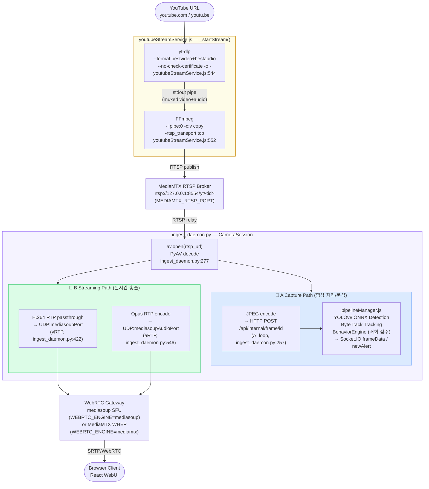

# SOFTWARE REQUIREMENTS SPECIFICATION (SRS)
# YouTube URL → RTSP Ingest & Virtual Camera Channel

| | |
|---|---|
| **Document ID** | SRS-LTS-YT-01 |
| **Version** | 1.0 |
| **Status** | Active |
| **Date** | 2026-05-26 |
| **Parent PRD** | prd/PRD_YouTube_RTSP_Ingest.md |
| **Parent RFP** | rfp/RFP_YouTube_RTSP_Ingest.md |

---

## Table of Contents
1. [Introduction](#1-introduction)
2. [System Overview](#2-system-overview)
3. [Functional Requirements — Stream Creation & Validation](#3-functional-requirements--stream-creation--validation)
4. [Functional Requirements — Process Pipeline](#4-functional-requirements--process-pipeline)
5. [Functional Requirements — State Machine & Lifecycle](#5-functional-requirements--state-machine--lifecycle)
6. [Functional Requirements — Stream Management API](#6-functional-requirements--stream-management-api)
7. [Functional Requirements — MediaMTX Integration](#7-functional-requirements--mediamtx-integration)
8. [Functional Requirements — UI Integration](#8-functional-requirements--ui-integration)
9. [Non-Functional Requirements](#9-non-functional-requirements)
10. [Interface Requirements](#10-interface-requirements)
11. [Constraints & Assumptions](#11-constraints--assumptions)

---

## 1. Introduction

### 1.1 Purpose

This SRS defines verifiable functional requirements for the YouTube RTSP Ingest subsystem of LTS-2026. Each requirement is identified by FR-YT-NNN and is traceable to TC_YouTube_RTSP_Ingest.md.

### 1.2 Scope

This document covers:
- YouTube URL validation and virtual camera channel creation
- `yt-dlp → FFmpeg → MediaMTX` pipeline management
- Stream lifecycle state machine (starting/live/restarting/error/stopping/removed)
- REST API for CRUD and restart operations
- MediaMTX webhook integration (`/internal/mediamtx`)
- UI integration (Add Camera modal YouTube tab, YT badge, error overlay)

Out of scope: age-restricted/private/DRM-protected videos, DVR seek, GPU-accelerated encoding, mDNS/LAN discovery of virtual cameras.

### 1.3 Definitions

| Term | Definition |
|---|---|
| YouTubeStreamService | Node.js class managing the full lifecycle of YouTube virtual camera channels |
| yt-dlp | Python-based YouTube downloader; used in pipe mode (`-o -`) to stream video to stdout |
| MediaMTX | Local RTSP broker bound to `127.0.0.1:8554`; receives FFmpeg publish and serves the LTS pipeline |
| pipe mode | yt-dlp writes muxed video/audio bytes to stdout; FFmpeg reads from `pipe:0` (stdin) |
| StreamEntry | In-memory record for an active YouTube virtual camera |
| virtual camera | A camera record in the LTS database backed by an internal RTSP URL rather than a physical device |
| repeatPlayback | Boolean flag: when true, a natural video end resets the restart counter and loops the stream |

---

## 2. System Overview

### 2.1 Component Dependencies

```
Operator (Dashboard UI)
  └─ POST /api/youtube-streams
       └─ YouTubeStreamService.createStream()
            ├─ Validate URL (YOUTUBE_URL_REGEX)
            ├─ Enforce MAX_STREAMS limit
            ├─ spawn yt-dlp (pipe mode) → stdout pipe
            ├─ spawn FFmpeg (stdin = yt-dlp stdout) → rtsp://127.0.0.1:8554/yt/<id>
            ├─ START_TIMEOUT timer (30s)
            ├─ FFmpeg stderr monitor (RTSP_LIVE_RE)
            └─ db.insert('cameras', { type: 'youtube', ... })

MediaMTX (127.0.0.1:8554)
  └─ POST /internal/mediamtx (webhook)
       └─ YouTubeStreamService.onMediaMTXPublish(path)   → status: 'live'
       └─ YouTubeStreamService.onMediaMTXUnpublish(path) → _scheduleRestart()

PipelineManager
  └─ startCamera(camRecord)     — called on _setLive()
  └─ stopCamera(entry.id)       — called on _stopEntry()
```

### 2.1-A YouTube 캡처 이중 경로 파이프라인

YouTube 스트림의 전체 데이터 흐름은 다음과 같이 두 경로로 분기합니다.  
`SERVER_MODE=analysis`에서는 이 파이프라인 전체가 비활성화됩니다 (`captureOnly`).



| 경로 | 데이터 | 목적지 | FR 참조 |
|---|---|---|---|
| A (Capture) | JPEG HTTP POST | pipelineManager → YOLOv8 → 알림 | FR-YT-010, FR-YT-020 |
| B (Streaming) | H.264 + Opus RTP | mediasoup SFU → 브라우저 | FR-YT-030 |

### 2.2 Startup Sequence

```
Server start
  1. YouTubeStreamService.init() — restore YouTube cameras from DB
  2. setTimeout 2s → auto-start restored offline streams
  3. _startStream(entry) — spawn yt-dlp | FFmpeg
  4. FFmpeg stderr emits RTSP_LIVE_RE pattern OR MediaMTX webhook fires
  5. _setLive(entry) — status: 'live', resolve promise, start pipeline
```

---

## 3. Functional Requirements — Stream Creation & Validation

### FR-YT-001 — URL Validation

- The service must validate submitted URLs against the regex:
  ```
  /^https?:\/\/(www\.)?(youtube\.com\/watch\?[^\s]*v=|youtu\.be\/|youtube\.com\/shorts\/)[A-Za-z0-9_\-]{11}/
  ```
- URLs that do not match must result in error code `INVALID_YOUTUBE_URL`.
- URL validation must be performed before spawning any child process.

### FR-YT-002 — Stream Limit Enforcement

- Before creating a new stream, the service must count active streams (status != 'removed').
- If the count equals or exceeds `YOUTUBE_MAX_STREAMS` (default: 4), the creation must fail with `MAX_STREAMS_REACHED`.

### FR-YT-003 — Stream ID Generation

- Each new stream must receive a unique ID in the format `yt-<8-char-uuid-segment>` (e.g., `yt-a1b2c3d4`).
- The RTSP URL must be `rtsp://<MEDIAMTX_HOST>:<MEDIAMTX_PORT>/yt/<id>`.

### FR-YT-004 — Camera Record Persistence

- On stream creation, a camera record must be inserted into the `cameras` database table with:
  - `type: 'youtube'`, `youtubeUrl`, `rtspUrl`, `resolution`, `bitrate` (in bps), `repeatPlayback`, `status: 'offline'`.
- The record must exist so `pipelineManager` can consume it as a standard RTSP camera.

### FR-YT-005 — Startup Promise

- `createStream()` must return a Promise that resolves with the camera record only when the stream reaches `live` state.
- If the stream does not reach `live` within 30 seconds (`START_TIMEOUT`), the Promise must reject with `STREAM_TIMEOUT`.
- On timeout or early failure, the camera record must be removed from the database.

---

## 4. Functional Requirements — Process Pipeline

### FR-YT-010 — yt-dlp Invocation (Pipe Mode)

- `yt-dlp` must be spawned via `child_process.spawn()` with an argument array (never shell interpolation).
- Required arguments:
  - `--no-playlist`
  - `--format` with H.264-priority format string
  - `--merge-output-format mp4`
  - `-o -` (stdout output)
  - `--no-progress --newline`
  - `--no-check-certificate` when `YTDLP_NO_CHECK_CERT !== 'false'`
  - `--js-runtimes node:<NODE_BIN>` when `NODE_BIN_FOR_YTDLP` is detected
- The YouTube URL must be the last argument.
- `stdio` must be `['ignore', 'pipe', 'pipe']`.

### FR-YT-011 — FFmpeg Invocation (Pipe Mode)

- FFmpeg must be spawned with `stdio[0]` set to `yt-dlp.stdout` (direct pipe connection).
- Required FFmpeg arguments:
  - `-re -i pipe:0`
  - `-c:v libx264 -profile:v main -level 4.1 -preset ultrafast -tune zerolatency`
  - `-b:v <bitrate>k -maxrate <bitrate>k -bufsize <bitrate*2>k`
  - `-vf scale=-2:<height> -g 60 -keyint_min 30 -sc_threshold 0`
  - `-c:a aac -b:a 128k -ar 44100`
  - `-f rtsp -rtsp_transport tcp`
  - Target RTSP URL: `rtsp://127.0.0.1:8554/yt/<id>`
- Shell interpolation is prohibited; spawn with argument array.

### FR-YT-012 — Resolution and Bitrate Mapping

| Resolution | `-vf scale` | Bitrate Range |
|---|---|---|
| `1080p` | `scale=-2:1080` | 2000–4000 kbps |
| `720p` | `scale=-2:720` | 1000–2000 kbps |
| `480p` | `scale=-2:480` | 500–1000 kbps |

- Bitrate must be stored in the database as bps (multiply kbps × 1000).
- API requests and in-memory entries must use kbps.

### FR-YT-013 — Live Detection

- The service must monitor FFmpeg stderr (line-buffered) for a pattern matching:
  `Output #0[^\n]*rtsp` or `frame=\s*[1-9]` or `size=\s*\d+kB`
- On first match, `_setLive(entry)` must be called and the startup timer cleared.
- A MediaMTX publish webhook (FR-YT-030) may also trigger `_setLive()` independently.

### FR-YT-014 — Process Cleanup on Stop

- When stopping a stream, `yt-dlp` must be killed first with `SIGTERM`.
- A 3-second grace period must be allowed; then `SIGKILL` is sent if still running.
- FFmpeg must then be killed with `SIGTERM` (5-second grace, then `SIGKILL`).
- The pipeline manager's `stopCamera(id)` must be called before killing processes.

### FR-YT-015 — Binary Detection

- `YTDLP_BIN` must be detected by trying known paths (`~/.local/bin/yt-dlp`, `/usr/local/bin/yt-dlp`, `/usr/bin/yt-dlp`) before falling back to `yt-dlp` on PATH.
- `FFMPEG_BIN` defaults to `ffmpeg` unless overridden by `FFMPEG_BIN` env var.
- If FFmpeg is not found (`ENOENT`), the stream must fail with `FFMPEG_NOT_FOUND`.

---

## 5. Functional Requirements — State Machine & Lifecycle

### FR-YT-020 — State Definitions

| State | Description |
|---|---|
| `starting` | yt-dlp and FFmpeg processes starting; waiting for RTSP confirmation |
| `live` | RTSP path active; stream flowing; pipeline running |
| `restarting` | Process exited; RESTART_DELAY in progress before re-spawn |
| `error` | MAX_RESTARTS exceeded; manual restart required |
| `stopping` | `stopStream()` called; process terminating |
| `removed` | Record deletion complete |

### FR-YT-021 — State Transitions

- `starting → live`: `_setLive()` called (FFmpeg RTSP_LIVE_RE or MediaMTX publish webhook).
- `starting → error`: `START_TIMEOUT` exceeded OR FFmpeg exits during startup.
- `live → restarting`: FFmpeg process exits (any cause) OR MediaMTX unpublish webhook.
- `restarting → starting`: After `RESTART_DELAY` ms, if restart limit not reached.
- `restarting → error`: `restartCount >= MAX_RESTARTS` AND `repeatPlayback` is false.

### FR-YT-022 — Restart Counter

- On each `_scheduleRestart()` call: `entry.restartCount` must be incremented before the delay.
- When `restartCount >= MAX_RESTARTS`, the state must transition to `error` (no restart scheduled).
- A `POST /:id/restart` request must reset `restartCount` to 0 before re-spawning.

### FR-YT-023 — Repeat Playback Logic

- When FFmpeg exits with `code === 0` and `signal === null` (natural video end), `isNaturalEnd = true`.
- When `repeatPlayback` is true and `isNaturalEnd` is true, `restartCount` must be reset to 0 before scheduling restart.
- Error exits (`code !== 0`) always consume the restart counter regardless of `repeatPlayback`.

### FR-YT-024 — Service Constants

| Constant | Default | Env Override |
|---|---|---|
| `MAX_RESTARTS` | 5 | `YOUTUBE_MAX_RESTARTS` |
| `RESTART_DELAY` | 5000 ms | `YOUTUBE_RESTART_DELAY_MS` |
| `START_TIMEOUT` | 30000 ms | `YOUTUBE_START_TIMEOUT_MS` |
| `MAX_STREAMS` | 4 | `YOUTUBE_MAX_STREAMS` |

### FR-YT-025 — Server Shutdown Cleanup

- `YouTubeStreamService.stopAll()` must be called on server `SIGTERM` / `SIGINT`.
- All active yt-dlp and FFmpeg processes must be terminated within 5 seconds.
- After `stopAll()`, `this.streams` must be cleared.

### FR-YT-026 — Startup Restoration

- On server startup, `YouTubeStreamService.init()` must restore YouTube camera records from the database.
- Restored entries must have `status: 'offline'` in memory and database.
- After a 2-second delay, restored streams with `status: 'offline'` must be auto-started.

---

## 6. Functional Requirements — Stream Management API

### FR-YT-030 — Create Stream (POST /)

- `POST /api/youtube-streams` must accept `{ youtubeUrl, name, resolution?, bitrate?, repeatPlayback? }`.
- `youtubeUrl` is required (422 if missing or invalid format).
- `name` is required (400 if missing or blank).
- `bitrate` must be 100–20000 kbps if provided.
- `resolution` must be one of `1080p`, `720p`, `480p` if provided.
- On success, must return HTTP 201 with `{ success: true, camera: StreamPublicRecord }`.

### FR-YT-031 — List Streams (GET /)

- `GET /api/youtube-streams` must return `{ success: true, streams: StreamPublicRecord[] }`.
- Entries with `status: 'removed'` must be excluded.

### FR-YT-032 — Get Stream Status (GET /:id/status)

- Must return the public stream record plus an `elapsed` field (seconds since `createdAt`).
- HTTP 404 if stream not found or removed.

### FR-YT-033 — Update Stream (PATCH /:id)

- Changes to `youtubeUrl`, `resolution`, or `bitrate` must trigger an async stream restart.
- Changes to `name` or `repeatPlayback` must apply immediately without restarting.
- Must return HTTP 200 with the updated stream record.
- HTTP 404 if not found; HTTP 422 if new URL is invalid.

### FR-YT-034 — Delete Stream (DELETE /:id)

- Must stop all processes, remove the camera record, and return HTTP 200.
- HTTP 404 if stream not found.

### FR-YT-035 — Restart Stream (POST /:id/restart)

- Must reset `restartCount` to 0, set `status: 'starting'`, and re-spawn the pipeline.
- Must return HTTP 200 with `{ success: true, camera: { status: 'starting', ... } }`.
- HTTP 404 if not found; HTTP 409 if stream is already stopping/removed.

### FR-YT-036 — Error Code Mapping

| HTTP | Code | Condition |
|---|---|---|
| 422 | `INVALID_YOUTUBE_URL` | URL does not match YouTube format |
| 422 | `YT_DLP_FAILED` | yt-dlp extraction failed |
| 429 | `MAX_STREAMS_REACHED` | Stream limit reached |
| 503 | `FFMPEG_NOT_FOUND` | FFmpeg binary not in PATH |
| 504 | `STREAM_TIMEOUT` | RTSP path not live within 30 s |
| 404 | `NOT_FOUND` | Stream ID not found |
| 409 | `STREAM_STOPPED` | Stream already removed |

---

## 7. Functional Requirements — MediaMTX Integration

### FR-YT-040 — MediaMTX Configuration

- MediaMTX must bind all listeners to `127.0.0.1` only (RTSP port 8554, API port 9997).
- Configuration must include `overridePublisher: yes` and `maxReaders: 10`.
- No MediaMTX ports must be published to the LAN network interface.

### FR-YT-041 — Webhook Handler

- `POST /internal/mediamtx` must accept publish/unpublish webhook events from MediaMTX.
- The endpoint must reject requests from IPs other than `127.0.0.1` with HTTP 403.
- A `publish` event for path `/yt/<id>` must call `onMediaMTXPublish(path)`.
- An `unpublish` event for path `/yt/<id>` must call `onMediaMTXUnpublish(path)`.

### FR-YT-042 — Webhook → Live Transition

- `onMediaMTXPublish(path)` must call `_setLive(entry)` if the entry is in `starting` or `restarting` state.
- `onMediaMTXUnpublish(path)` must call `_scheduleRestart(entry, false)` unless status is `stopping` or `removed`.

---

## 8. Functional Requirements — UI Integration

### FR-YT-050 — Add Camera Modal — YouTube Tab

- The Add Camera modal must include a YouTube source tab/radio option.
- Fields: Channel Name (required), YouTube URL (required), Resolution (dropdown: 1080p/720p/480p), Bitrate (kbps input).
- During creation: loading spinner with elapsed time counter and progress bar (30-second scale).
- On failure: toast notification with human-readable error message per FR-YT-036 error codes.

### FR-YT-051 — YT Badge

- Camera tiles for YouTube virtual channels must display a red `YT` badge in the top-right corner.

### FR-YT-052 — Error State Overlay

- Camera tiles with `status === 'error'` must display a red error banner.
- A **Restart** button on the tile must trigger `POST /api/youtube-streams/:id/restart`.

### FR-YT-053 — Edit Camera Modal

- The Edit Camera modal for YouTube cameras must display: Channel Name, YouTube URL, Resolution, Bitrate, and a read-only Internal RTSP URL field.
- A warning must be displayed: "Saving will restart the RTSP stream."

### FR-YT-054 — Virtual Channel Pipeline Integration

- YouTube virtual cameras must support all LTS pipeline features: zone editing, AI analytics (loitering detection, fire/smoke), alert rules, fullscreen view, and WebRTC video delivery.

---

## 9. Non-Functional Requirements

### FR-YT-060 — Startup Latency

- Time from `POST /api/youtube-streams` to `status: 'live'` must be ≤ 30 seconds.

### FR-YT-061 — End-to-End Latency

- YouTube → browser via WebRTC must be ≤ 5 seconds.

### FR-YT-062 — Concurrent Streams

- At least 4 concurrent YouTube virtual channels must be supported.

### FR-YT-063 — CPU Usage

- Incremental CPU per 1080p/2Mbps stream must be ≤ 15% of one core.

### FR-YT-064 — Memory

- FFmpeg process RSS at steady state must be ≤ 150 MB per stream.

### FR-YT-065 — Recovery

- Auto-restart recovery time after FFmpeg crash must be ≤ 10 seconds.

### FR-YT-066 — Isolation

- Failure of one YouTube stream must have zero impact on physical camera pipelines.

### FR-YT-067 — Security

- YouTube URL must be validated against the strict regex before use in any child process argument.
- Child processes must be spawned via `spawn()` with argument arrays; `exec()` is prohibited.
- MediaMTX webhook endpoint must reject non-localhost requests.

---

## 10. Interface Requirements

### 10.1 REST API

| ID | Method | Endpoint | Description |
|---|---|---|---|
| FR-YT-030 | POST | `/api/youtube-streams` | Create virtual camera |
| FR-YT-031 | GET | `/api/youtube-streams` | List active streams |
| FR-YT-032 | GET | `/api/youtube-streams/:id/status` | Poll stream readiness |
| FR-YT-033 | PATCH | `/api/youtube-streams/:id` | Update stream properties |
| FR-YT-034 | DELETE | `/api/youtube-streams/:id` | Stop and remove stream |
| FR-YT-035 | POST | `/api/youtube-streams/:id/restart` | Restart error-state stream |
| FR-YT-041 | POST | `/internal/mediamtx` | MediaMTX webhook (127.0.0.1 only) |

### 10.2 StreamPublicRecord Schema

```typescript
interface StreamPublicRecord {
  id:             string;      // "yt-<8chars>"
  name:           string;
  type:           'youtube';
  youtubeUrl:     string;
  rtspUrl:        string;      // "rtsp://127.0.0.1:8554/yt/<id>"
  resolution:     string;      // "1080p" | "720p" | "480p"
  bitrate:        number;      // kbps
  repeatPlayback: boolean;
  status:         string;      // state machine state
  restartCount:   number;
  uptimeSeconds:  number;
  createdAt:      string;      // ISO 8601
}
```

### 10.3 Environment Variables

| Variable | Default | Description |
|---|---|---|
| `YOUTUBE_MAX_STREAMS` | `4` | Maximum concurrent YouTube virtual channels |
| `YOUTUBE_MAX_RESTARTS` | `5` | Maximum auto-restart attempts per stream |
| `YOUTUBE_RESTART_DELAY_MS` | `5000` | Delay between restart attempts |
| `YOUTUBE_START_TIMEOUT_MS` | `30000` | Startup timeout |
| `YTDLP_BIN` | (auto) | Path to yt-dlp binary |
| `YTDLP_NO_CHECK_CERT` | `true` | Disable SSL certificate verification |
| `YTDLP_NODE_BIN` | (auto) | Node.js binary for yt-dlp JS runtime |
| `FFMPEG_BIN` | `ffmpeg` | Path to FFmpeg binary |
| `MEDIAMTX_HOST` | `127.0.0.1` | MediaMTX RTSP host |
| `MEDIAMTX_PORT` | `8554` | MediaMTX RTSP port |
| `MEDIAMTX_API_URL` | `http://127.0.0.1:9997` | MediaMTX API URL |

---

## 11. Constraints & Assumptions

| ID | Constraint / Assumption |
|---|---|
| C-01 | `yt-dlp` ≥ 2024.x must be installed on the server; binary is auto-detected from known paths |
| C-02 | `FFmpeg` ≥ 5.0 with `libx264` support must be installed |
| C-03 | MediaMTX (latest) must be running locally on `127.0.0.1:8554` |
| C-04 | Age-restricted, private, or DRM-protected videos are not supported; `YT_DLP_FAILED` is returned |
| C-05 | DVD seek / timeline scrubbing is out of scope for virtual channels |
| C-06 | GPU-accelerated encoding (`h264_nvenc`) is out of scope; CPU-only `libx264 ultrafast` is baseline |
| C-07 | YouTube Terms of Service compliance is the operator's responsibility; a warning banner must be shown on first use |
| C-08 | `YouTubeStreamService` is instantiated with a `db` reference and `pipelineManager` at server startup |
| C-09 | The `--no-check-certificate` flag is gated by `YTDLP_NO_CHECK_CERT` env var for corporate network compatibility |

---

## Document History

| Version | Date | Author | Description |
|---|---|---|---|
| 1.0 | 2026-05-28 | LTS Engineering Team | Initial release — SRS for YouTube RTSP Ingest |
| 1.1 | 2026-06-26 | LTS Engineering Team | §2.1-A YouTube 이중 경로 Mermaid 다이어그램 추가 (코드 라인 참조 포함) |
